# Architecture Guide — OpenTelemetry Astronomy Shop Demo

> **Audience:** Junior DevOps Engineers (0–2 years experience)  
> **Prerequisites:** Basic Linux and Docker knowledge  
> **Repository:** Fork of [open-telemetry/opentelemetry-demo](https://github.com/open-telemetry/opentelemetry-demo)  
> **Demo version:** `2.1.3` (`.env`) | **Kubernetes manifests:** `1.12.0` (Helm-generated, partially customized)

---

## Table of Contents

1. [What Is This Project?](#1-what-is-this-project)
2. [High-Level Architecture](#2-high-level-architecture)
3. [Foundational Concepts Primer](#3-foundational-concepts-primer)
4. [Application Architecture](#4-application-architecture)
5. [Docker and Docker Compose](#5-docker-and-docker-compose)
6. [Container Images and Dockerfiles](#6-container-images-and-dockerfiles)
7. [Kubernetes Architecture](#7-kubernetes-architecture)
8. [Helm Charts](#8-helm-charts)
9. [Terraform and Cloud Infrastructure](#9-terraform-and-cloud-infrastructure)
10. [CI/CD Pipelines](#10-cicd-pipelines)
11. [Observability Stack](#11-observability-stack)
12. [Networking and Ingress](#12-networking-and-ingress)
13. [Data Stores and Messaging](#13-data-stores-and-messaging)
14. [Feature Flags and Chaos Engineering](#14-feature-flags-and-chaos-engineering)
15. [Fork-Specific Customizations](#15-fork-specific-customizations)
16. [End-to-End Request Flows](#16-end-to-end-request-flows)
17. [Troubleshooting Guide](#17-troubleshooting-guide)
18. [Best Practices and Enterprise Recommendations](#18-best-practices-and-enterprise-recommendations)
19. [Interview Preparation](#19-interview-preparation)
20. [Quick Reference Tables](#20-quick-reference-tables)

---

## 1. What Is This Project?

### What it is

This repository contains the **OpenTelemetry Astronomy Shop** — a fake e-commerce website built as a **microservices** application. A microservice is a small, independently deployable program that does one job (for example, managing a shopping cart or processing payments).

The primary goal is **not** to run a real online store. The goal is to demonstrate how to instrument a realistic distributed system with **OpenTelemetry (OTel)** — a standard for collecting **traces**, **metrics**, and **logs** from many services written in different programming languages.

### Why it exists

| Goal | Explanation |
|------|-------------|
| Learning | Teach how observability works in real-world distributed systems |
| Vendor demos | Let observability vendors show their tools against a standard app |
| OTel development | Provide a testbed for new OpenTelemetry features |

### What this fork adds

This repository is a **fork** (a copy with custom changes). The main customization is a **CI/CD pipeline** for the `product-catalog` service that builds a Docker image, pushes it to Docker Hub, and updates the Kubernetes deployment manifest automatically.

### Important honesty note for beginners

This project is an **application and deployment demo**, not a full production cloud platform. Specifically:

- **No Terraform files exist** in this repository (no `.tf` files).
- **Kubernetes manifests** exist, but the cluster itself is not provisioned here.
- **Helm chart source** lives in an external repository; only rendered YAML is stored here.
- The **AWS ALB Ingress** file implies AWS EKS usage but does not create AWS resources.

Think of this repo as the **blueprint for the shop and its containers**, not the blueprint for the entire AWS account.

---

## 2. High-Level Architecture

### System context diagram

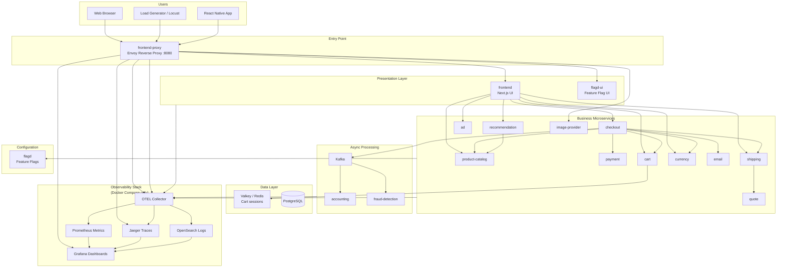

### Deployment modes in this project

```mermaid
flowchart LR
    subgraph Local["Local Development"]
        DC[Docker Compose<br/>26 services + full observability]
    end

    subgraph K8s["Kubernetes"]
        Helm[External Helm Chart<br/>open-telemetry/opentelemetry-demo]
        Manifests[Per-service YAML in kubernetes/]
        Ingress[AWS ALB Ingress stub]
    end

    subgraph Cloud["Cloud (NOT in this repo)"]
        EKS[EKS Cluster]
        ALB[AWS Load Balancer]
        TF[Terraform / IaC<br/>would live elsewhere]
    end

    DC -->|make start| Laptop[Your Machine]
    Helm -->|make generate-kubernetes-manifests| Manifests
    Manifests -->|kubectl apply| EKS
    Ingress --> ALB
    TF -.->|enterprise would add| EKS
```

---

## 3. Foundational Concepts Primer

Before diving into this project, here are the core technologies explained from first principles.

### 3.1 AWS (Amazon Web Services)

#### What it is

AWS is a cloud provider — a company that rents you computers, networks, and storage over the internet instead of buying physical servers.

#### Why it exists

Running your own data center is expensive and slow. Cloud providers let you create infrastructure in minutes and pay only for what you use.

#### Why this project references AWS

The file `kubernetes/frontendproxy/ingress.yaml` uses **AWS ALB** (Application Load Balancer) annotations. This tells Kubernetes: "When deployed on AWS EKS, create an internet-facing load balancer that routes traffic to the frontend-proxy service."

#### How it works internally (simplified)

1. You create an **EKS cluster** (managed Kubernetes on AWS).
2. You install the **AWS Load Balancer Controller** in the cluster.
3. You apply an **Ingress** resource with ALB annotations.
4. The controller calls AWS APIs to create an ALB, target groups, and security rules.
5. Internet traffic hits the ALB → routes to pod IPs.

#### Real-world analogy

An ALB is like a **receptionist at a hotel**. Guests (users) arrive at one front door. The receptionist checks their request and directs them to the correct room (service/pod). Guests never need to know the internal room numbers.

#### Common interview questions

- What is the difference between ALB, NLB, and CLB?
- What is EKS and how does it differ from self-managed Kubernetes?
- How does the AWS Load Balancer Controller work?

#### Common beginner mistakes

- Applying ALB Ingress on a non-AWS cluster (it will fail or do nothing).
- Forgetting security groups — ALB must reach pod subnets.
- Using `target-type: instance` vs `target-type: ip` incorrectly.

#### Troubleshooting tips

- `kubectl describe ingress frontend-proxy` — check events for ALB creation errors.
- Verify the AWS Load Balancer Controller pods are running.
- Check IAM permissions for the controller service account.

#### Best practices

- Use separate AWS accounts for dev/staging/prod.
- Tag all resources for cost tracking.
- Use HTTPS with ACM certificates on ALB.

#### Enterprise recommendations

- Provision EKS, VPC, subnets, and IAM roles with **Terraform** (not present in this repo).
- Use IRSA (IAM Roles for Service Accounts) for pod-level AWS permissions.
- Enable cluster autoscaling and pod disruption budgets.

---

### 3.2 Terraform

#### What it is

Terraform is an **Infrastructure as Code (IaC)** tool. You write configuration files (`.tf`) that describe cloud resources, and Terraform creates or updates them for you.

#### Why it exists

Manual clicking in the AWS Console is error-prone and not repeatable. Terraform makes infrastructure version-controlled, reviewable, and reproducible.

#### Why this project does NOT use it

This repository focuses on the **application** and its container/Kubernetes definitions. The upstream OpenTelemetry demo assumes you already have a cluster or use Docker Compose locally.

**There are zero `.tf` files in this repository.**

#### How it works internally (generic)

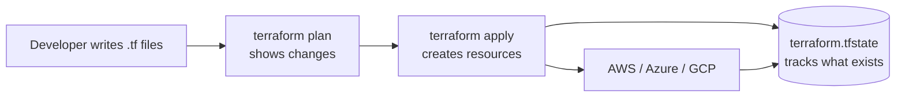

1. **Providers** — plugins that talk to AWS, Azure, etc.
2. **Resources** — things you create (`aws_eks_cluster`, `aws_vpc`).
3. **State file** — Terraform's memory of what it created.
4. **Plan/Apply** — preview changes, then execute them.

#### What you would typically add for this project (enterprise)

```hcl
# Example only — NOT in this repo
module "vpc" { ... }
module "eks" {
  cluster_name = "otel-demo"
  ...
}
resource "aws_acm_certificate" "demo" { ... }
# Helm provider to install AWS LB Controller
# IRSA for otel-collector to write to CloudWatch/X-Ray
```

#### Real-world analogy

Terraform is like an **architect's construction blueprint + automated builder**. You draw the building once; the builder constructs it exactly, and updates it when the blueprint changes.

#### Common interview questions

- What is Terraform state and why is remote state important?
- What is the difference between `terraform plan` and `terraform apply`?
- How do Terraform modules promote reusability?

#### Common beginner mistakes

- Committing `terraform.tfstate` with secrets to Git.
- Running `apply` without reviewing `plan`.
- Not using workspaces or separate state per environment.

#### Troubleshooting tips

- State drift: run `terraform plan` to see differences from reality.
- Lock issues: use remote state with locking (S3 + DynamoDB on AWS).

#### Best practices

- Store state remotely (S3, Terraform Cloud).
- Use modules for reusable patterns.
- Pin provider versions.

#### Enterprise recommendations

For production deployment of this demo on AWS, a typical Terraform layout would include:

| Module | Purpose |
|--------|---------|
| `vpc` | Network isolation, public/private subnets |
| `eks` | Kubernetes cluster |
| `iam` | Roles for nodes, ALB controller, app pods |
| `rds` | Managed PostgreSQL (replace in-cluster Postgres) |
| `msk` | Managed Kafka (replace in-cluster Kafka) |
| `elasticache` | Managed Valkey/Redis for cart |
| `ecr` | Private container registry |

---

### 3.3 Kubernetes (K8s)

#### What it is

Kubernetes is a **container orchestrator**. It runs Docker containers across multiple machines, restarts failed containers, scales them up/down, and routes network traffic between them.

#### Why it exists

Running 20+ microservices manually with `docker run` does not scale. Kubernetes automates deployment, health checks, networking, and rollouts.

#### Why this project uses it

The Astronomy Shop has 17+ services. Kubernetes lets you deploy them as a cohesive system with service discovery (services find each other by DNS name instead of hard-coded IPs).

#### How it works internally (simplified)

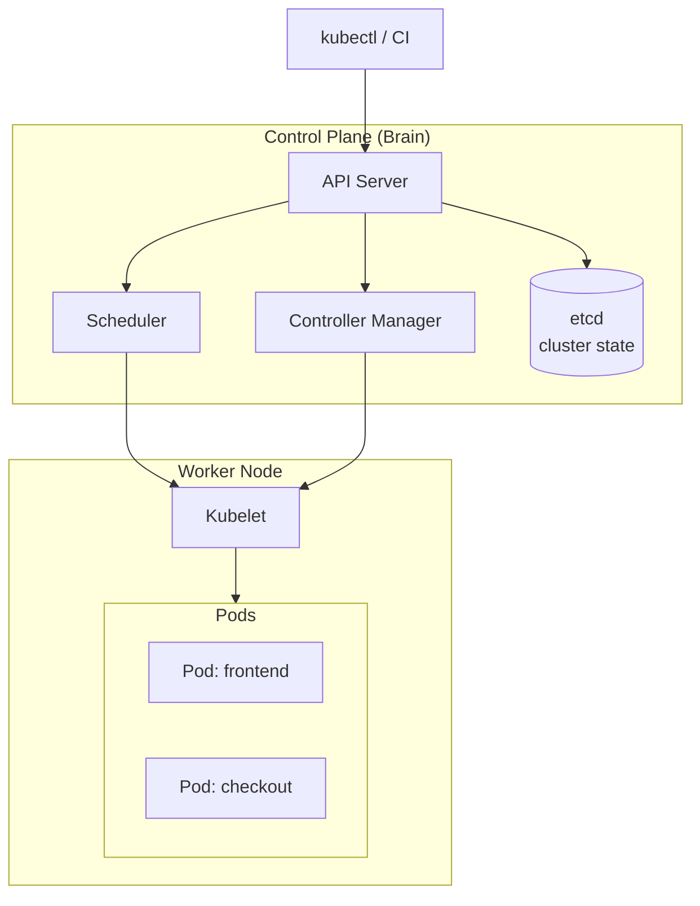

| Component | Role |
|-----------|------|
| **API Server** | Front door; all commands go through it |
| **Scheduler** | Decides which node runs each pod |
| **Controller Manager** | Ensures desired state (e.g., 3 replicas running) |
| **etcd** | Database storing cluster configuration |
| **Kubelet** | Agent on each node; starts/stops containers |
| **Pod** | Smallest deployable unit; one or more containers |

#### Real-world analogy

Kubernetes is like a **restaurant manager**. You (the developer) write a menu (YAML manifests) saying you need 2 chefs and 1 waiter. The manager hires, assigns shifts, replaces sick staff, and makes sure customers reach the right table.

#### Common interview questions

- What is a Pod vs a Deployment vs a Service?
- What happens when a pod crashes?
- What is a ClusterIP vs NodePort vs LoadBalancer service?

#### Common beginner mistakes

- Confusing `containerPort` with Service `port`.
- Not setting resource limits (pods get OOM-killed silently).
- Applying manifests without a namespace strategy.

#### Troubleshooting tips

```bash
kubectl get pods -n otel-demo
kubectl describe pod <pod-name> -n otel-demo
kubectl logs <pod-name> -c <container-name> -n otel-demo
kubectl get events -n otel-demo --sort-by='.lastTimestamp'
```

#### Best practices

- Always set `requests` and `limits` for CPU/memory.
- Use liveness and readiness probes.
- Use namespaces to isolate environments.

---

### 3.4 CI/CD (Continuous Integration / Continuous Delivery)

#### What it is

- **CI (Continuous Integration):** Automatically build and test code on every change.
- **CD (Continuous Delivery/Deployment):** Automatically deploy passing builds to environments.

#### Why it exists

Manual builds and deploys are slow and error-prone. CI/CD catches bugs early and delivers changes faster.

#### Why this project uses it

This fork adds a GitHub Actions workflow (`.github/workflows/ci.yaml`) that builds, tests, dockerizes, and deploys the `product-catalog` service.

#### How it works in this project

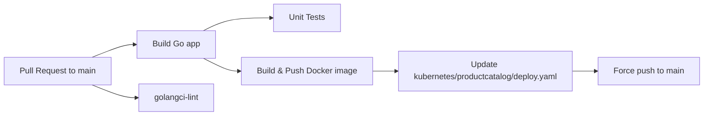

#### Real-world analogy

CI/CD is like a **factory assembly line with quality inspectors**. Every product (code change) goes through the same checks. Defective products never reach the customer (production).

---

### 3.5 OpenTelemetry

#### What it is

OpenTelemetry is a vendor-neutral standard for collecting observability data:

| Signal | What it captures | Example |
|--------|------------------|---------|
| **Traces** | Request path across services | User checkout took 450ms; slow in payment |
| **Metrics** | Numeric measurements over time | 500 requests/sec, 2% error rate |
| **Logs** | Text event records | `ERROR: payment declined` |

#### Why this project exists

This entire demo exists to show OTel instrumentation in Go, Java, C#, Python, Rust, PHP, Ruby, C++, and Node.js.

#### How it works internally

1. Each service has an **OTel SDK** or **auto-instrumentation agent**.
2. Services export data via **OTLP** (OpenTelemetry Protocol) to the **Collector**.
3. The Collector processes, batches, and routes data to backends (Jaeger, Prometheus, OpenSearch).

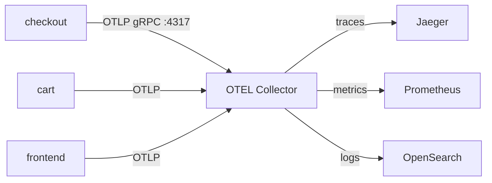

---

## 4. Application Architecture

### 4.1 Microservices overview

The shop is split into small services. Each service owns one business capability.

| Service | Language | Protocol | Port (Docker) | Port (K8s) | Purpose |
|---------|----------|----------|---------------|------------|---------|
| **frontend** | Next.js / TypeScript | HTTP | 8080 | 8080 | Web UI and REST API |
| **frontend-proxy** | Envoy | HTTP | 8080 | 8080 | Single entry point, routing |
| **ad** | Java 21 | gRPC | 9555 | 8080 | Contextual advertisements |
| **cart** | C# / .NET 8 | gRPC | 7070 | 8080 | Shopping cart state |
| **checkout** | Go 1.22 | gRPC | 5050 | 8080 | Order orchestration |
| **currency** | C++ | gRPC | 7001 | 8080 | Currency conversion |
| **email** | Ruby | gRPC/HTTP | 6060 | 8080 | Order confirmation emails |
| **payment** | Node.js | gRPC | 50051 | 8080 | Credit card charging (fake) |
| **product-catalog** | Go 1.22 | gRPC | 3550 | 8080 | Product listings |
| **quote** | PHP | HTTP JSON | 8090 | 8080 | Shipping cost quotes |
| **recommendation** | Python 3.12 | gRPC | 9001 | 8080 | Product recommendations |
| **shipping** | Rust | HTTP + gRPC | 50050 | 8080 | Shipping tracking |
| **accounting** | C# / .NET | Kafka consumer | — | — | Order accounting (async) |
| **fraud-detection** | Kotlin/Java | Kafka consumer | — | — | Fraud checks (async) |
| **image-provider** | Nginx + OTel | HTTP | 8081 | 8081 | Product images |
| **load-generator** | Python/Locust | HTTP | 8089 | 8089 | Synthetic traffic |
| **flagd** | flagd | gRPC/HTTP | 8013 | 8013 | Feature flags |
| **flagd-ui** | Next.js | HTTP | 4000 | 4000 | Flag management UI |

### 4.2 API contract — Protocol Buffers (gRPC)

#### What it is

**Protocol Buffers (protobuf)** is a language-neutral format for defining APIs. **gRPC** is a fast RPC framework that uses protobuf.

#### Why this project uses it

Microservices need a shared contract. The file `pb/demo.proto` defines all gRPC services (`CartService`, `CheckoutService`, etc.). Each language generates client/server code from this file.

#### Example from `pb/demo.proto`

```protobuf
service ProductCatalogService {
    rpc ListProducts(Empty) returns (ListProductsResponse) {}
    rpc GetProduct(GetProductRequest) returns (Product) {}
    rpc SearchProducts(SearchProductsRequest) returns (SearchProductsResponse) {}
}
```

#### How services communicate

| Pattern | Used between | Example |
|---------|--------------|---------|
| gRPC (sync) | Most business services | frontend → checkout |
| HTTP/REST | quote, some gateways | shipping → quote |
| Kafka (async) | checkout → accounting/fraud | Order placed event |

### 4.3 Service dependencies

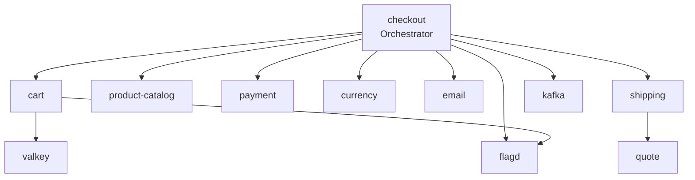

The **checkout** service is the most connected — it orchestrates the entire purchase flow, similar to a real e-commerce order service.

---

## 5. Docker and Docker Compose

### 5.1 Docker (quick recap)

You already know Docker packages an app and its dependencies into an **image**. Running an image creates a **container** — an isolated process on your machine.

### 5.2 Docker Compose

#### What it is

Docker Compose is a tool that reads a `docker-compose.yml` file and starts **multiple containers** as one application stack.

#### Why it exists

This demo has 26 services. Without Compose, you would run 26 separate `docker run` commands with complex networking.

#### Why this project uses it

`docker-compose.yml` is the primary local development path. Run `make start` and the entire shop plus observability stack comes up.

#### How it works internally

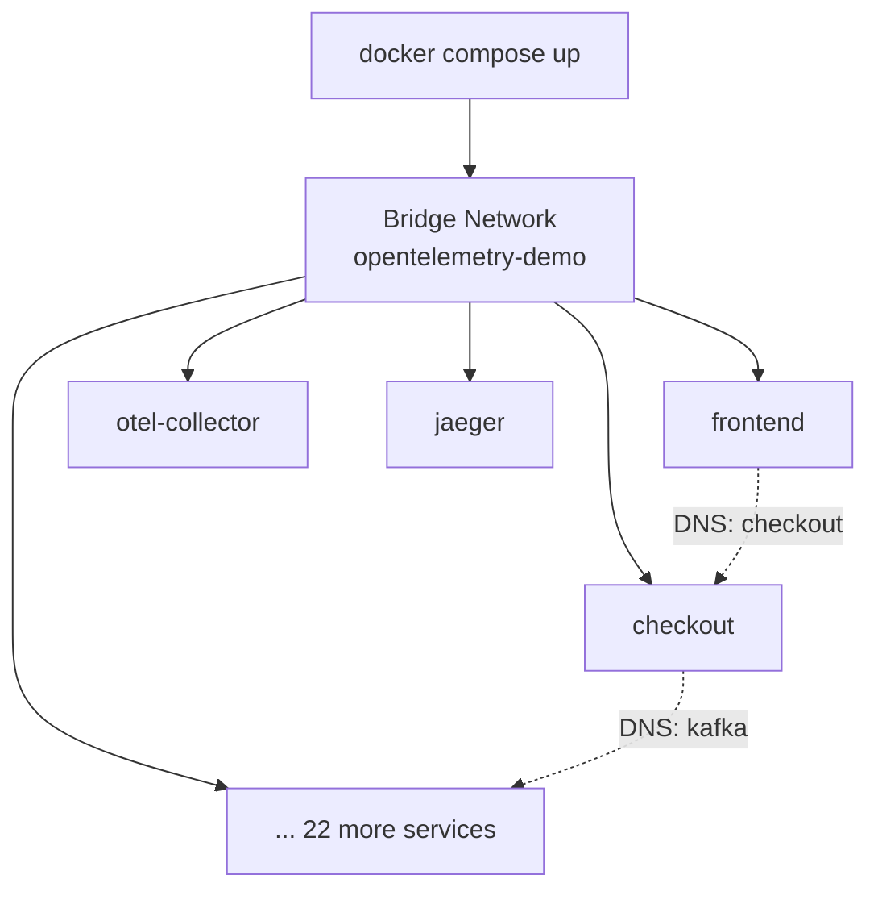

All services share the `opentelemetry-demo` bridge network. Docker provides **internal DNS** — containers reach each other by service name (e.g., `http://checkout:5050`).

#### Key files

| File | Purpose |
|------|---------|
| `docker-compose.yml` | Full 26-service stack |
| `docker-compose.minimal.yml` | Reduced stack (no flagd-ui) |
| `docker-compose-tests.yml` | Cypress + Tracetest integration tests |
| `.env` | Central configuration (ports, image versions) |
| `.env.override` | Local developer overrides |
| `Makefile` | `make start`, `make stop`, `make build` shortcuts |

#### Environment variable pattern

From `.env`:

```bash
IMAGE_NAME=ghcr.io/open-telemetry/demo
DEMO_VERSION=2.1.3
CHECKOUT_PORT=5050
OTEL_COLLECTOR_HOST=otel-collector
OTEL_COLLECTOR_PORT_GRPC=4317
```

Docker Compose substitutes `${VARIABLE}` in the YAML. This keeps configuration DRY (Don't Repeat Yourself).

#### Service dependencies

```yaml
checkout:
  depends_on:
    otel-collector:
      condition: service_started
    kafka:
      condition: service_healthy
```

`depends_on` controls startup order. `service_healthy` waits until Kafka passes its health check.

#### Real-world analogy

Docker Compose is like a **theater stage manager's cue sheet**. When the curtain rises (compose up), every actor (service) enters at the right time with the right props (environment variables).

#### Common interview questions

- What is the difference between `docker run` and `docker compose`?
- How does Docker networking work between containers?
- What are Docker volumes vs bind mounts?

#### Common beginner mistakes

- Editing `.env` but not restarting containers (`make stop && make start`).
- Port conflicts on host machine (8080 already in use).
- Running out of memory — 26 containers need ~8GB+ RAM.

#### Troubleshooting tips

```bash
docker compose ps                    # see running services
docker compose logs checkout         # view service logs
docker compose logs -f --tail=50 checkout  # follow logs
docker stats                         # check memory/CPU usage
make restart service=checkout        # restart one service
```

#### Best practices

- Use `.env.override` for local changes (don't commit secrets).
- Set memory limits in `deploy.resources.limits`.
- Use health checks for critical dependencies.

---

## 6. Container Images and Dockerfiles

### 6.1 Image strategy

| Aspect | This project |
|--------|--------------|
| Registry | `ghcr.io/open-telemetry/demo` (GitHub Container Registry) |
| Tag format | `2.1.3-<service-name>` (e.g., `2.1.3-checkout`) |
| Fork exception | `abhishekf5/product-catalog:<run-id>` (custom CI) |
| Build tool | `docker compose build` or `docker buildx bake` |

### 6.2 Multi-stage builds (example: product-catalog)

From `src/product-catalog/Dockerfile`:

```dockerfile
# Stage 1: Build
FROM golang:1.22-alpine AS builder
WORKDIR /usr/src/app/
COPY go.mod go.sum ./
RUN go mod download
COPY . .
RUN go build -o product-catalog .

# Stage 2: Runtime (smaller image)
FROM alpine AS release
WORKDIR /usr/src/app/
COPY ./products/ ./products/
COPY --from=builder /usr/src/app/product-catalog/ ./
ENTRYPOINT [ "./product-catalog" ]
```

#### What it is

A **multi-stage build** uses one container to compile code and a smaller container for runtime.

#### Why it exists

The Go compiler is ~800MB. The final Alpine image is ~20MB. Smaller images = faster deploys and smaller attack surface.

#### Real-world analogy

Multi-stage builds are like **cooking in a commercial kitchen but serving on a clean plate**. All the messy prep happens backstage; customers only see the final dish.

### 6.3 All Dockerfiles in this project

| Service | Dockerfile path |
|---------|-----------------|
| accounting | `src/accounting/Dockerfile` |
| ad | `src/ad/Dockerfile` |
| cart | `src/cart/src/Dockerfile` |
| checkout | `src/checkout/Dockerfile` |
| currency | `src/currency/Dockerfile` |
| email | `src/email/Dockerfile` |
| fraud-detection | `src/fraud-detection/Dockerfile` |
| frontend | `src/frontend/Dockerfile` |
| frontend-proxy | `src/frontend-proxy/Dockerfile` |
| image-provider | `src/image-provider/Dockerfile` |
| kafka | `src/kafka/Dockerfile` |
| load-generator | `src/load-generator/Dockerfile` |
| payment | `src/payment/Dockerfile` |
| product-catalog | `src/product-catalog/Dockerfile` |
| quote | `src/quote/Dockerfile` |
| recommendation | `src/recommendation/Dockerfile` |
| shipping | `src/shipping/Dockerfile` |
| opensearch | `src/opensearch/Dockerfile` |
| postgres | `src/postgres/Dockerfile` |
| flagd-ui | `src/flagd-ui/Dockerfile` |

### 6.4 Base images used

| Language | Base image |
|----------|------------|
| Go | `golang:1.22-alpine` → `alpine` |
| Java | `eclipse-temurin:21` |
| .NET | `mcr.microsoft.com/dotnet/sdk` → `aspnet` |
| Python | `python:3.12-slim` |
| Node.js | `node:20-alpine` |
| Rust | `rust:alpine` → `alpine` |
| C++ | Custom build with OpenTelemetry C++ |
| Envoy | `envoyproxy/envoy` with OTel extensions |
| Nginx | `nginx:1.27.0` with OTel module |

---

## 7. Kubernetes Architecture

This section explains each Kubernetes resource type generically, then how this project uses it.

### 7.1 Namespace

#### Generic concept

A **Namespace** is a virtual cluster inside a physical cluster. It isolates resources (like folders for dev/staging/prod).

#### In this project

Generated manifests use namespace `otel-demo` (via `make generate-kubernetes-manifests`). Per-service manifests in `kubernetes/` do not always include a Namespace resource — you may need to create it:

```bash
kubectl create namespace otel-demo
```

---

### 7.2 Deployment

#### What it is

A **Deployment** declares how many copies (replicas) of an application to run and which container image to use. Kubernetes keeps the desired number of pods running.

#### Why it exists

Pods are ephemeral (they die and get new IPs). Deployments manage pod lifecycle and enable rolling updates.

#### Why this project uses it

Every microservice has a Deployment. Example: `kubernetes/productcatalog/deploy.yaml`.

#### How it works internally

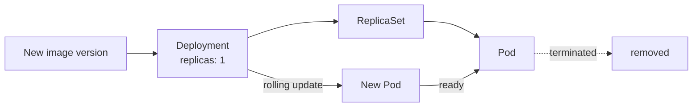

#### Key fields in this project

```yaml
spec:
  replicas: 1
  selector:
    matchLabels:
      opentelemetry.io/name: opentelemetry-demo-productcatalogservice
  template:
    spec:
      serviceAccountName: opentelemetry-demo
      containers:
        - name: productcatalogservice
          image: abhishekf5/product-catalog:13134113508
          ports:
            - containerPort: 8080
          env:
            - name: OTEL_EXPORTER_OTLP_ENDPOINT
              value: http://$(OTEL_COLLECTOR_NAME):4317
          resources:
            limits:
              memory: 20Mi
```

| Field | Purpose |
|-------|---------|
| `replicas: 1` | Run one pod (demo only; production would use 3+) |
| `serviceAccountName` | Identity for RBAC and cloud IAM |
| `containerPort: 8080` | K8s standardizes all services on 8080 |
| `resources.limits.memory` | Prevent memory hogging |
| `env` | Service discovery via K8s DNS names |

#### All Deployments in this project

| Service | File |
|---------|------|
| accounting | `kubernetes/accounting/deploy.yaml` |
| ad | `kubernetes/ad/deploy.yaml` |
| cart | `kubernetes/cart/deploy.yaml` |
| checkout | `kubernetes/checkout/deploy.yaml` |
| currency | `kubernetes/currency/deploy.yaml` |
| email | `kubernetes/email/deploy.yaml` |
| fraud-detection | `kubernetes/frauddetection/deploy.yaml` |
| frontend | `kubernetes/frontend/deploy.yaml` |
| frontend-proxy | `kubernetes/frontendproxy/deploy.yaml` |
| image-provider | `kubernetes/imageprovider/deploy.yaml` |
| kafka | `kubernetes/kafka/deploy.yaml` |
| load-generator | `kubernetes/loadgenerator/deploy.yaml` |
| payment | `kubernetes/payment/deploy.yaml` |
| product-catalog | `kubernetes/productcatalog/deploy.yaml` |
| quote | `kubernetes/quote/deploy.yaml` |
| recommendation | `kubernetes/recommendation/deploy.yaml` |
| shipping | `kubernetes/shipping/deploy.yaml` |
| valkey | `kubernetes/valkey/deploy.yaml` |
| flagd | `kubernetes/flagd/deploy.yaml` |
| **Monolithic** | `kubernetes/complete-deploy.yaml` (~1900 lines, all services) |

#### Real-world analogy

A Deployment is like a **shift manager at a coffee shop**. "We need 3 baristas on duty." If one calls in sick, the manager hires a replacement automatically.

#### Common interview questions

- What is the difference between a Deployment and a StatefulSet?
- How does a rolling update work?
- What is `revisionHistoryLimit`?

#### Common beginner mistakes

- Changing the image tag without a pull policy strategy.
- Not using readiness probes (traffic sent to unready pods).
- Setting memory limits too low (this project uses very low limits for demo — 20Mi for product-catalog).

#### Troubleshooting tips

```bash
kubectl rollout status deployment/opentelemetry-demo-productcatalogservice -n otel-demo
kubectl rollout history deployment/opentelemetry-demo-productcatalogservice -n otel-demo
kubectl rollout undo deployment/opentelemetry-demo-productcatalogservice -n otel-demo
```

#### Best practices

- Use readiness and liveness probes.
- Set realistic resource requests/limits.
- Use `PodDisruptionBudget` for HA services.

#### Enterprise recommendations

- Minimum 2 replicas for stateless services.
- Use Horizontal Pod Autoscaler (HPA) based on CPU or custom metrics.
- Use GitOps (ArgoCD/Flux) instead of `sed` + `git push` for manifest updates.

---

### 7.3 Service

#### What it is

A **Service** is a stable network endpoint (DNS name + IP) that routes traffic to pods matching a label selector.

#### Why it exists

Pods get new IPs when they restart. Services provide a permanent address.

#### Why this project uses it

Each exposed microservice has a ClusterIP Service. Example: `kubernetes/productcatalog/svc.yaml`.

#### How it works internally

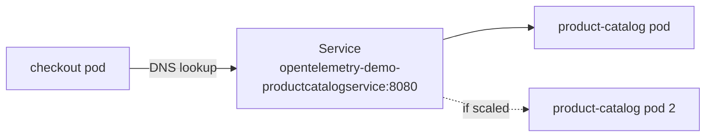

#### Key fields

```yaml
spec:
  type: ClusterIP
  ports:
    - port: 8080
      targetPort: 8080
  selector:
    opentelemetry.io/name: opentelemetry-demo-productcatalogservice
```

| Field | Meaning |
|-------|---------|
| `type: ClusterIP` | Internal only (not reachable from internet) |
| `port: 8080` | Port other services connect to |
| `targetPort: 8080` | Port on the pod container |
| `selector` | Which pods receive traffic |

#### Service naming convention

Kubernetes DNS format: `<service-name>.<namespace>.svc.cluster.local`

Example: `opentelemetry-demo-cartservice.otel-demo.svc.cluster.local:8080`

In practice, pods use the short name: `opentelemetry-demo-cartservice:8080`

#### All Services in this project

| Service | File |
|---------|------|
| ad | `kubernetes/ad/svc.yaml` |
| cart | `kubernetes/cart/svc.yaml` |
| checkout | `kubernetes/checkout/svc.yaml` |
| currency | `kubernetes/currency/svc.yaml` |
| email | `kubernetes/email/svc.yaml` |
| frontend | `kubernetes/frontend/svc.yaml` |
| frontend-proxy | `kubernetes/frontendproxy/svc.yaml` (**LoadBalancer** — public ELB) |
| image-provider | `kubernetes/imageprovider/svc.yaml` |
| kafka | `kubernetes/kafka/svc.yaml` |
| load-generator | `kubernetes/loadgenerator/svc.yaml` |
| payment | `kubernetes/payment/svc.yaml` |
| product-catalog | `kubernetes/productcatalog/svc.yaml` |
| quote | `kubernetes/quote/svc.yaml` |
| recommendation | `kubernetes/recommendation/svc.yaml` |
| shipping | `kubernetes/shipping/svc.yaml` |
| valkey | `kubernetes/valkey/svc.yaml` |
| flagd | `kubernetes/flagd/svc.yaml` |

> **Note:** All Services above are `ClusterIP` **except** frontend-proxy, which
> was changed to `type: LoadBalancer` so the shop UI is reachable at
> `http://<elb-hostname>:8080` without port-forward. See
> [ISSUES_AND_FIXES.md](./ISSUES_AND_FIXES.md) issue 29.


#### Common interview questions

- ClusterIP vs NodePort vs LoadBalancer?
- How does kube-proxy implement Services?
- What is headless service (`clusterIP: None`)?

#### Common beginner mistakes

- Selector labels not matching pod labels (service routes nowhere).
- Wrong `targetPort` (connection refused errors).

---

### 7.4 Ingress

#### What it is

An **Ingress** exposes HTTP/HTTPS routes from outside the cluster to internal Services.

#### Why it exists

You don't want a LoadBalancer per service (expensive). Ingress provides one entry point with path-based routing.

#### Why this project uses it

`kubernetes/frontendproxy/ingress.yaml` exposes the Envoy proxy to the internet via AWS ALB.

```yaml
apiVersion: networking.k8s.io/v1
kind: Ingress
metadata:
  name: frontend-proxy
  annotations:
    alb.ingress.kubernetes.io/scheme: internet-facing
    alb.ingress.kubernetes.io/target-type: ip
spec:
  ingressClassName: alb
  rules:
    - host: example.com
      http:
        paths:
          - path: "/"
            pathType: Prefix
            backend:
              service:
                name: opentelemetry-demo-frontendproxy
                port:
                  number: 8080
```

| Annotation | Meaning |
|------------|---------|
| `scheme: internet-facing` | Public ALB (not internal-only) |
| `target-type: ip` | Route directly to pod IPs (required for Fargate/some CNI setups) |
| `ingressClassName: alb` | Use AWS Load Balancer Controller |

#### How it interacts with other components

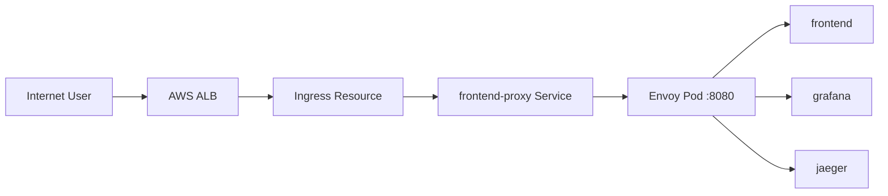

#### Common beginner mistakes

- Applying ALB Ingress without AWS Load Balancer Controller installed.
- Forgetting to update `host: example.com` to your real domain.
- Not configuring TLS/HTTPS.

#### Enterprise recommendations

- Use cert-manager with Let's Encrypt or ACM for TLS.
- Add WAF (Web Application Firewall) in front of ALB.
- Use external-dns to automate DNS records.

---

### 7.5 ConfigMap

#### What it is

A **ConfigMap** stores non-sensitive configuration data as key-value pairs.

#### Why this project uses it

`kubernetes/flagd/cm.yaml` stores feature flag definitions as JSON:

```yaml
apiVersion: v1
kind: ConfigMap
metadata:
  name: opentelemetry-demo-flagd-config
data:
  demo.flagd.json: |
    {
      "flags": {
        "productCatalogFailure": {
          "description": "Fail product catalog service on a specific product",
          "defaultVariant": "off"
        }
      }
    }
```

The flagd Deployment mounts this ConfigMap as a file.

#### Real-world analogy

A ConfigMap is like a **printed menu board** in a restaurant. You can change the menu without rebuilding the kitchen (container image).

#### Common interview questions

- ConfigMap vs Secret?
- How do you mount a ConfigMap as a volume vs environment variable?
- What happens when you update a ConfigMap?

#### Common beginner mistakes

- Storing secrets in ConfigMaps (use Secrets or external vault).
- Expecting live reload without restarting pods (depends on app).

---

### 7.6 ServiceAccount

#### What it is

A **ServiceAccount** is an identity for pods to authenticate with the Kubernetes API and external cloud services.

#### In this project

`kubernetes/serviceaccount.yaml`:

```yaml
apiVersion: v1
kind: ServiceAccount
metadata:
  name: opentelemetry-demo
```

All Deployments reference `serviceAccountName: opentelemetry-demo`.

#### Why it matters

In enterprise AWS EKS, you bind ServiceAccounts to IAM roles (IRSA) so pods can access S3, SQS, etc. without hard-coded credentials.

---

### 7.7 Kubernetes vs Docker Compose differences

| Aspect | Docker Compose | Kubernetes |
|--------|----------------|------------|
| Service discovery | Container name (`checkout:5050`) | DNS (`opentelemetry-demo-checkoutservice:8080`) |
| Ports | Varied per service (5050, 7070, etc.) | Standardized to 8080 |
| Scaling | `deploy.replicas` (limited) | Deployment `replicas` + HPA |
| Networking | Single bridge network | ClusterIP Services + CNI |
| Config | `.env` file | ConfigMaps, Secrets, env in YAML |
| Ingress | Host port mapping `:8080:8080` | Ingress + Load Balancer |
| Observability stack | Included in compose | Requires full Helm chart |

---

## 8. Helm Charts

### 8.1 What Helm is

**Helm** is a package manager for Kubernetes — like `apt` for Ubuntu or `npm` for Node.js, but for K8s YAML manifests.

| Concept | Meaning |
|---------|---------|
| **Chart** | A package of templated Kubernetes YAML |
| **Release** | A deployed instance of a chart |
| **Values** | Configuration parameters that customize the chart |

### 8.2 Why this project uses Helm

The upstream project maintains an official chart at `open-telemetry/opentelemetry-demo`. It templates all 26+ services, observability stack, and configuration.

### 8.3 How it works in this project

The chart source is **not in this repository**. Instead, the Makefile generates static YAML:

```makefile
# From Makefile
generate-kubernetes-manifests:
    helm repo add open-telemetry https://open-telemetry.github.io/opentelemetry-helm-charts
    helm template opentelemetry-demo open-telemetry/opentelemetry-demo --namespace otel-demo \
      >> kubernetes/opentelemetry-demo.yaml
```

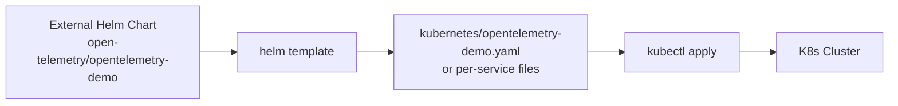

### 8.4 Per-service split manifests

The `kubernetes/` directory contains individual `deploy.yaml` and `svc.yaml` files per service. These were likely split from a Helm render for easier customization (e.g., the product-catalog CI pipeline updates only one file).

### 8.5 Real-world analogy

Helm is like a **cookie cutter**. The chart is the cutter shape; values.yaml lets you choose frosting color and size. Every cookie (deployment) has the same structure but different details.

### 8.6 Common interview questions

- What is the difference between `helm install` and `helm template`?
- How do Helm hooks work?
- Helm vs Kustomize — when to use each?

### 8.7 Common beginner mistakes

- Editing generated YAML instead of chart values (changes get overwritten).
- Not pinning chart versions in production.
- Confusing `helm upgrade` with `helm rollback`.

### 8.8 Enterprise recommendations

- Use `helm upgrade --install` with version-pinned charts in CI/CD.
- Store values per environment (`values-dev.yaml`, `values-prod.yaml`).
- Prefer GitOps (ArgoCD) over manual `helm install`.

---

## 9. Terraform and Cloud Infrastructure

### 9.1 Status in this repository

> **There is no Terraform in this project.**  
> Searched: zero `.tf`, `.tfvars`, or `terraform/` directories.

### 9.2 What the project does include

| Component | Location | Cloud implication |
|-----------|----------|-------------------|
| AWS ALB Ingress | `kubernetes/frontendproxy/ingress.yaml` | Expects EKS + AWS LB Controller |
| Container images | `ghcr.io`, Docker Hub | Any registry works |
| No VPC, no IAM, no EKS definition | — | You must provide the cluster |

### 9.3 Recommended enterprise Terraform layout (not in repo)

If you were deploying this demo to AWS in production, a typical module structure would be:

```
infrastructure/
├── environments/
│   ├── dev/
│   │   └── main.tf
│   └── prod/
│       └── main.tf
├── modules/
│   ├── vpc/
│   ├── eks/
│   ├── rds/
│   ├── msk/          # Managed Kafka
│   ├── elasticache/  # Managed Valkey/Redis
│   └── alb/
└── backend.tf        # S3 remote state
```

### 9.4 How Terraform would interact with this repo

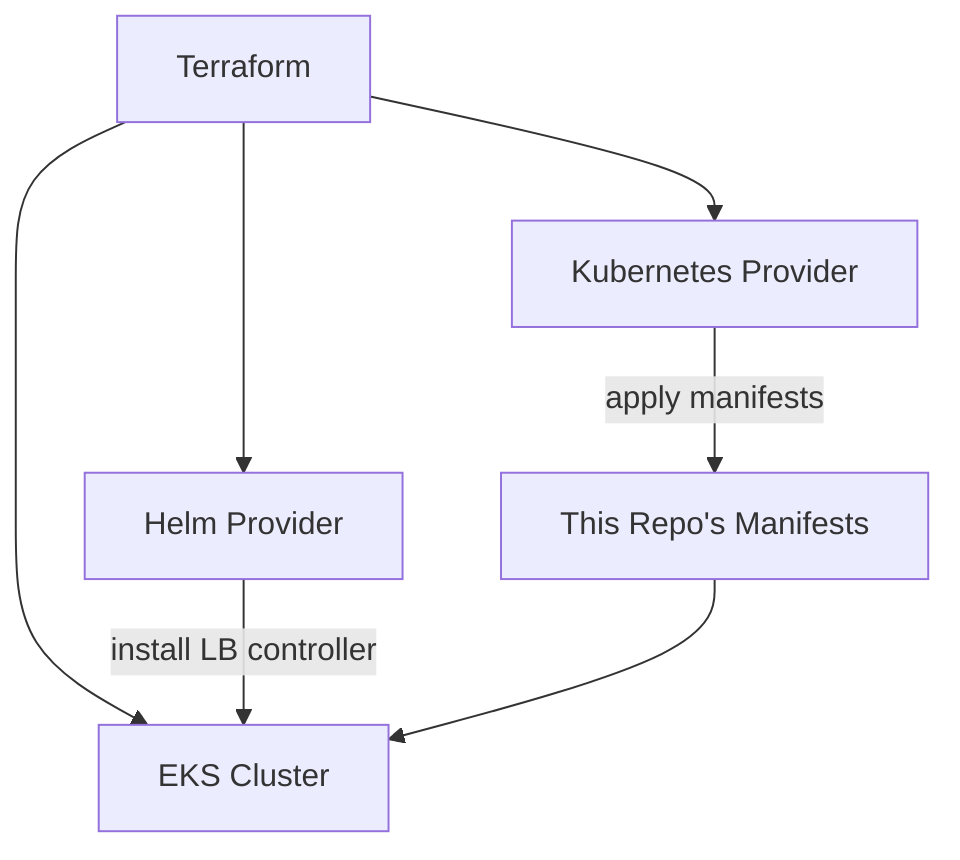

**Workflow:**
1. Terraform creates VPC, EKS, RDS, MSK.
2. Terraform configures `kubectl` access.
3. CI/CD applies `kubernetes/` manifests or runs `helm upgrade`.
4. Ingress creates ALB automatically.

---

## 10. CI/CD Pipelines

### 10.1 Pipeline overview

This fork has one workflow: `.github/workflows/ci.yaml` — scoped to the **product-catalog** service only.

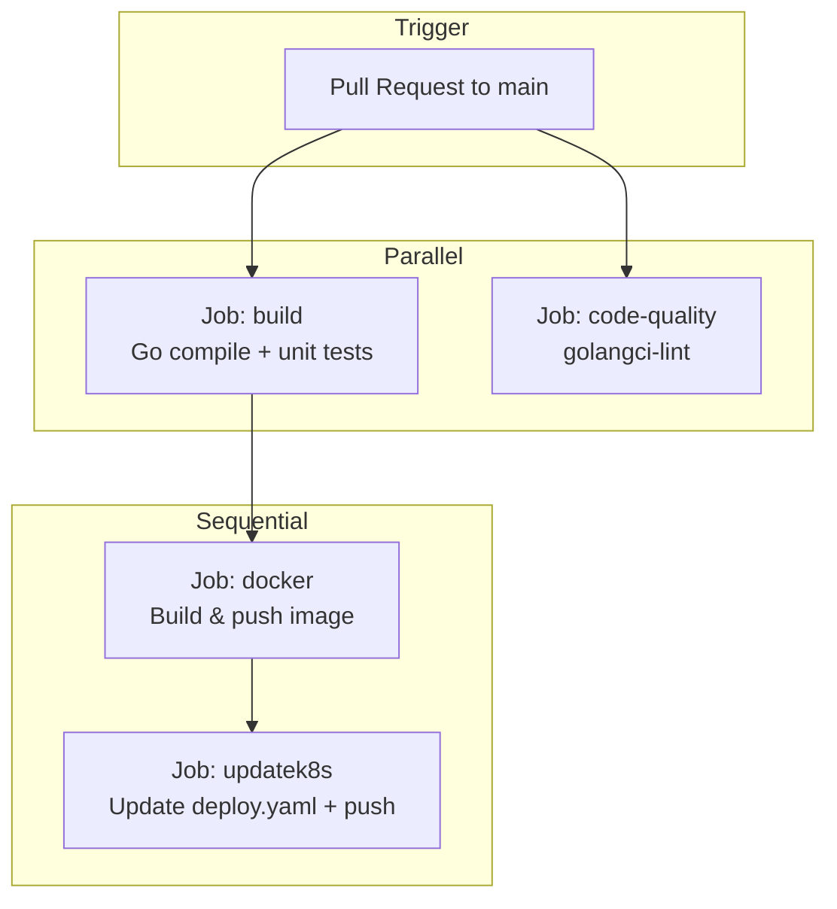

### 10.2 Job details

#### Job: `build`

| Step | Action |
|------|--------|
| Checkout | `actions/checkout@v4` |
| Setup Go | Go 1.22 |
| Build | `go build` in `src/product-catalog` |
| Test | `go test ./...` |

#### Job: `code-quality`

| Step | Action |
|------|--------|
| Lint | `golangci-lint` on `src/product-catalog` |

#### Job: `docker`

| Step | Action |
|------|--------|
| Buildx | Docker multi-platform builder |
| Login | Docker Hub (`secrets.DOCKER_USERNAME`, `secrets.DOCKER_TOKEN`) |
| Push | Image: `$DOCKER_USERNAME/product-catalog:$GITHUB_RUN_ID` |

#### Job: `updatek8s`

| Step | Action |
|------|--------|
| Update manifest | `sed` replaces image in `kubernetes/productcatalog/deploy.yaml` |
| Commit & push | Force push to `main` |

### 10.3 CI/CD anti-patterns in this fork (learning opportunities)

| Issue | Why it matters | Enterprise fix |
|-------|----------------|------------------|
| Force push to `main` | Overwrites history; bypasses branch protection | Use a deploy branch or GitOps PR |
| `sed` to update YAML | Fragile; can break formatting | Use `yq`, Kustomize, or Helm values |
| Only product-catalog has CI | Other services use pre-built images | Extend pipeline to all services |
| No staging environment | Changes go directly to prod manifest | Add dev → staging → prod promotion |
| No image vulnerability scan | Security risk | Add Trivy or Snyk scan step |

### 10.4 GitHub Actions concepts for beginners

| Term | Meaning |
|------|---------|
| **Workflow** | YAML file defining automation |
| **Job** | Set of steps that run on one runner |
| **Step** | Single action (shell command or marketplace action) |
| **Runner** | Virtual machine that executes jobs (`ubuntu-latest`) |
| **Secret** | Encrypted variable (passwords, tokens) |
| **`needs`** | Job dependency (docker waits for build) |

### 10.5 Common interview questions

- What is the difference between CI and CD?
- How do you store secrets in CI/CD?
- What is a deployment strategy (blue-green, canary, rolling)?
- What is GitOps?

---

## 11. Observability Stack

### 11.1 Architecture (Docker Compose)

The full observability stack runs in Docker Compose, not in the per-service Kubernetes manifests.

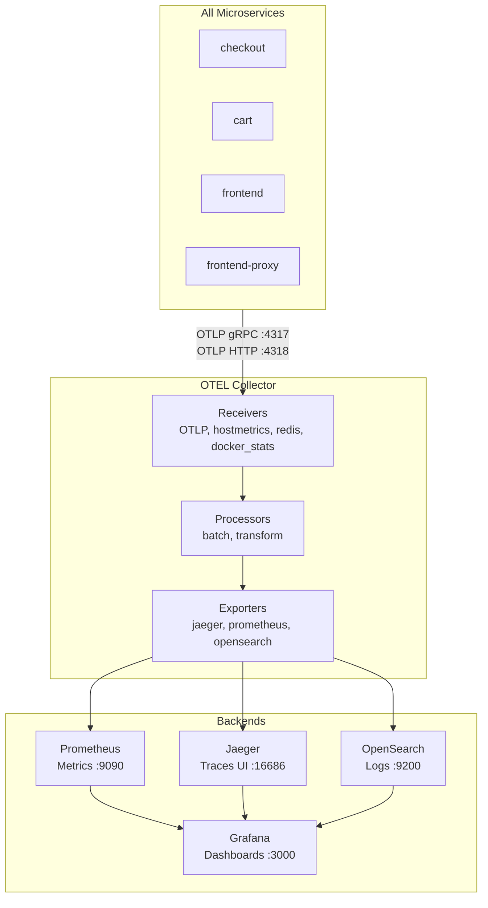

### 11.2 OpenTelemetry Collector

#### What it is

The Collector is a vendor-agnostic telemetry router. It receives, processes, and exports observability data.

#### Configuration files

| File | Purpose |
|------|---------|
| `src/otel-collector/otelcol-config.yml` | Main pipeline config |
| `src/otel-collector/otelcol-config-extras.yml` | Extension overrides |

#### Pipeline breakdown

From `otelcol-config.yml`:

| Pipeline | Receivers | Processors | Exporters |
|----------|-----------|------------|-----------|
| **traces** | otlp | transform, batch | jaeger, spanmetrics |
| **metrics** | hostmetrics, docker_stats, redis, otlp, prometheus, spanmetrics | batch | prometheus |
| **logs** | otlp | batch | opensearch |

#### Key receivers explained

| Receiver | What it collects |
|----------|------------------|
| `otlp` | Traces/metrics/logs from instrumented services |
| `hostmetrics` | CPU, memory, disk, network from the host |
| `docker_stats` | Container resource usage |
| `redis` | Valkey/Redis performance metrics |
| `httpcheck/frontend-proxy` | Health check on Envoy |

#### Spanmetrics connector

Generates RED metrics (Rate, Errors, Duration) from trace spans automatically — a powerful pattern for service-level dashboards without manual metric instrumentation.

### 11.3 Jaeger (Distributed Tracing)

| Aspect | Detail |
|--------|--------|
| Image | `jaegertracing/jaeger:2.10.0` |
| UI | `http://localhost:8080/jaeger/ui` (via Envoy) |
| Config | `src/jaeger/config.yml` |
| Storage | In-memory (25K trace limit — demo only) |

**What traces show:** A checkout request might create spans in frontend → checkout → cart → valkey → payment. You see exactly where time was spent.

### 11.4 Prometheus (Metrics)

| Aspect | Detail |
|--------|--------|
| Image | `quay.io/prometheus/prometheus:v3.5.0` |
| UI | `http://localhost:9090` (internal) |
| Config | `src/prometheus/prometheus-config.yaml` |
| Receives | OTLP metrics from Collector |

### 11.5 Grafana (Dashboards)

| Aspect | Detail |
|--------|--------|
| Image | `grafana/grafana:12.2.0` |
| UI | `http://localhost:8080/grafana/` |
| Config | `src/grafana/grafana.ini` |
| Datasources | Prometheus, Jaeger, OpenSearch (auto-provisioned) |
| Dashboards | 5 pre-built JSON dashboards in `src/grafana/provisioning/dashboards/demo/` |

### 11.6 OpenSearch (Logs)

| Aspect | Detail |
|--------|--------|
| Image | `opensearchproject/opensearch:3.2.0` |
| Index | `otel` |
| Access | Via Grafana logs datasource |

### 11.7 Accessing observability UIs locally

After `make start`:

| UI | URL |
|----|-----|
| Demo shop | http://localhost:8080 |
| Jaeger | http://localhost:8080/jaeger/ui |
| Grafana | http://localhost:8080/grafana/ |
| Load generator | http://localhost:8080/loadgen/ |
| Feature flags | http://localhost:8080/feature/ |

### 11.8 Common interview questions

- What is the three pillars of observability?
- What is distributed tracing and what is a span?
- What is the difference between push and pull metrics?
- What is tail-based vs head-based sampling?

### 11.9 Enterprise recommendations

- Replace in-memory Jaeger with Jaeger on Elasticsearch or Grafana Tempo.
- Use managed services (Datadog, Honeycomb, Grafana Cloud).
- Implement sampling (don't trace 100% of traffic in production).
- Set up alerting (Alertmanager, PagerDuty integration).

---

## 12. Networking and Ingress

### 12.1 Envoy reverse proxy (frontend-proxy)

#### What it is

**Envoy** is a high-performance proxy that sits in front of all services. It routes HTTP requests, terminates TLS, and generates its own telemetry.

#### Why this project uses it

One port (8080) exposes the entire demo — shop UI, Grafana, Jaeger, load generator, and feature flag UI.

#### Routing table

From `src/frontend-proxy/envoy.tmpl.yaml`:

| Path prefix | Backend service | Purpose |
|-------------|-----------------|---------|
| `/` | frontend | Main shop UI |
| `/loadgen/` | load-generator | Locust traffic generator |
| `/otlp-http/` | otel-collector | Browser trace export |
| `/jaeger` | jaeger | Trace UI |
| `/grafana` | grafana | Metrics dashboards |
| `/images/` | image-provider | Product images |
| `/flagservice/` | flagd | Feature flag API |
| `/feature` | flagd-ui | Flag management UI |

#### Request flow through Envoy

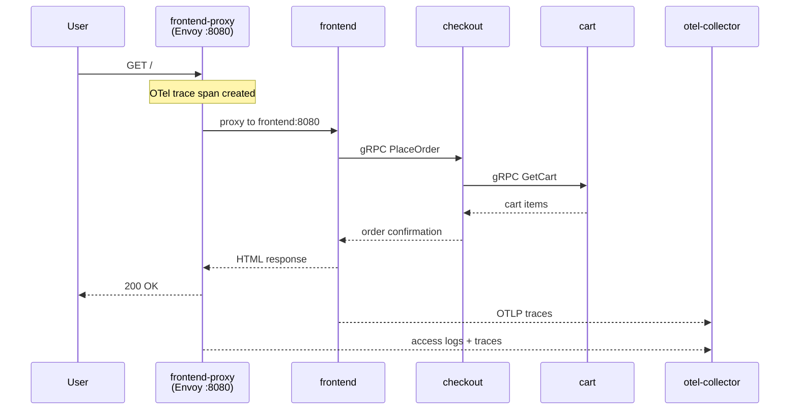

### 12.2 Docker networking

- **Network name:** `opentelemetry-demo`
- **Driver:** bridge
- **DNS:** Docker resolves service names to container IPs

### 12.3 Kubernetes networking

- **Most Service types:** ClusterIP (internal only) — cart, checkout, catalog, …
- **Public entry:** `frontendproxy` Service is **LoadBalancer**
  (`kubernetes/frontendproxy/svc.yaml`) → AWS ELB hostname on port `8080`
- **Optional Ingress:** `kubernetes/frontendproxy/ingress.yaml` exists but needs
  AWS Load Balancer Controller (not installed by this fork’s Terraform)
- **No NetworkPolicies** defined (all pods can talk to all pods — not production-safe)

### 12.4 Common beginner mistakes

- Trying to access gRPC services directly from browser (they're internal only).
- Confusing Envoy port 8080 with individual service ports.
- Forgetting that K8s services use port 8080, not Docker's varied ports.

---

## 13. Data Stores and Messaging

### 13.1 Valkey (Cart sessions)

#### What it is

**Valkey** is an open-source fork of Redis — an in-memory key-value store.

#### Why this project uses it

The cart service stores shopping cart data in Valkey. Carts persist across page refreshes but don't need a full database.

#### Configuration

| Environment | Service name | Image |
|-------------|--------------|-------|
| Docker Compose | `valkey-cart` | `valkey/valkey:8.1.3-alpine` |
| Kubernetes | `opentelemetry-demo-valkey` | `valkey/valkey:7.2-alpine` |

#### Real-world analogy

Valkey is like a **whiteboard in a meeting room**. Information is fast to read/write but erased when the room is cleared (restart without persistence).

#### Enterprise recommendation

Use AWS ElastiCache or a managed Valkey/Redis with persistence (AOF/RDB) and replication.

---

### 13.2 Kafka (Async messaging)

#### What it is

**Apache Kafka** is a distributed event streaming platform. Services publish events to **topics**; other services **consume** them asynchronously.

#### Why this project uses it

When checkout completes an order, it publishes an event to Kafka. Accounting and fraud-detection process the order in the background without blocking the user.

#### Flow

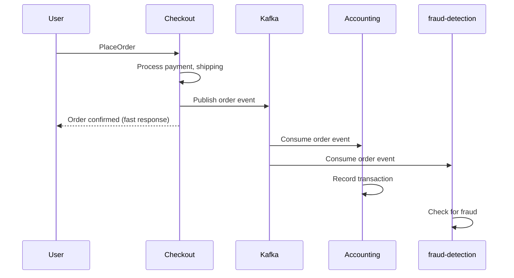

#### Configuration

| Setting | Value |
|---------|-------|
| Mode | KRaft (no Zookeeper) |
| Topic | orders |
| Docker image | Custom `ghcr.io/open-telemetry/demo:2.1.3-kafka` |
| K8s advertised listeners | `PLAINTEXT://opentelemetry-demo-kafka:9092` |

#### Common interview questions

- What is a Kafka topic, partition, and consumer group?
- At-least-once vs exactly-once delivery?
- Kafka vs RabbitMQ — when to use each?

#### Enterprise recommendation

Use Amazon MSK or Confluent Cloud. Enable encryption, ACLs, and monitoring.

---

### 13.3 PostgreSQL

| Aspect | Detail |
|--------|--------|
| Image | `postgres:17.6` |
| Docker only | Yes (not in K8s manifests) |
| Purpose | Configured for accounting (`DB_CONNECTION_STRING`) |
| Current usage | Accounting actually consumes Kafka only; Postgres is prepared for future use |

---

## 14. Feature Flags and Chaos Engineering

### 14.1 What feature flags are

A **feature flag** is a toggle that turns behavior on/off without redeploying code. This demo uses flags to **inject failures** for learning observability.

### 14.2 flagd

| Aspect | Detail |
|--------|--------|
| Image | `ghcr.io/open-feature/flagd:v0.12.9` |
| Config | `src/flagd/demo.flagd.json` / `kubernetes/flagd/cm.yaml` |
| Protocol | OpenFeature standard |

### 14.3 Example flags

| Flag | Effect |
|------|--------|
| `productCatalogFailure` | Product catalog returns errors |
| `cartServiceFailure` | Cart service fails |
| `paymentServiceFailure` | Payment processing fails |
| `adServiceHighCpu` | Ad service consumes high CPU |
| `kafkaQueueProblems` | Kafka consumer lag |
| `loadgeneratorFloodHomepage` | Load generator floods the homepage |
| `imageSlowLoad` | Images load slowly |

### 14.4 How to toggle flags

| Method | Steps |
|--------|-------|
| Web UI | http://localhost:8080/feature/ |
| API | `curl -X POST http://localhost:8080/flagservice/flagd.evaluation.v1.Service/ResolveBoolean` |
| Config file | Edit `demo.flagd.json` and restart flagd |

### 14.5 Why this matters for DevOps

Feature flags enable **chaos engineering** in a controlled way. Toggle a failure, observe traces in Jaeger, metrics in Grafana, and logs in OpenSearch — practice incident response without breaking production.

---

## 15. Fork-Specific Customizations

This section documents differences from the upstream `open-telemetry/opentelemetry-demo`.

| Customization | Details |
|---------------|---------|
| **CI/CD pipeline** | `.github/workflows/ci.yaml` for product-catalog only |
| **Custom Docker image** | `abhishekf5/product-catalog:<run-id>` instead of `ghcr.io` |
| **Auto manifest update** | CI `sed`-updates `kubernetes/productcatalog/deploy.yaml` |
| **AWS ALB Ingress** | `kubernetes/frontendproxy/ingress.yaml` added |
| **Version drift** | `.env` = 2.1.3, K8s manifests = 1.12.0 |

### Version drift warning

```
.env (Docker):     ghcr.io/open-telemetry/demo:2.1.3-*
Kubernetes:        ghcr.io/open-telemetry/demo:1.12.0-*
product-catalog:   abhishekf5/product-catalog:13134113508
```

Before deploying to Kubernetes, align versions by running `make generate-kubernetes-manifests` or updating image tags manually.

---

## 16. End-to-End Request Flows

### 16.1 Browse products

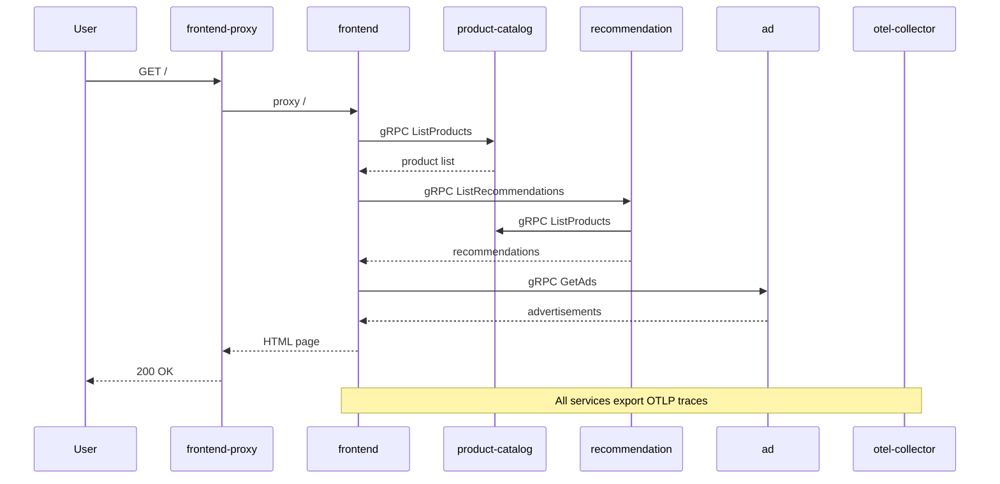

### 16.2 Add to cart

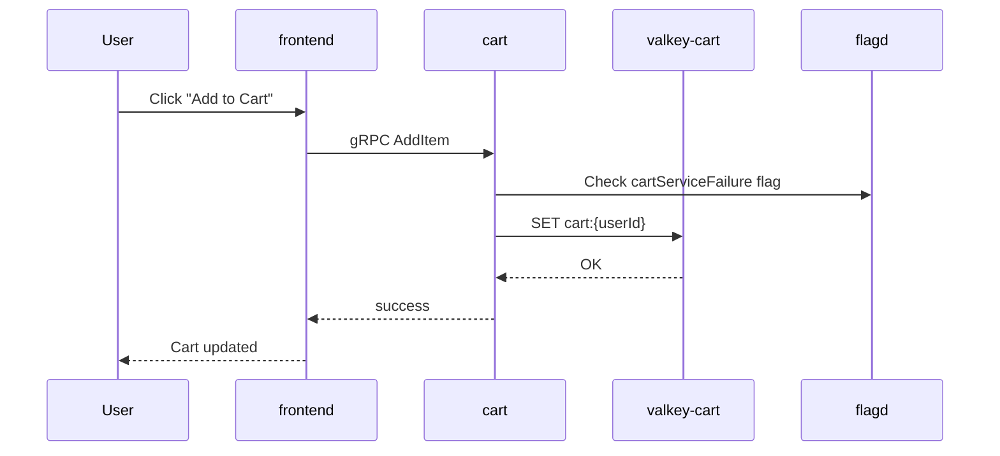

### 16.3 Complete checkout (full path)

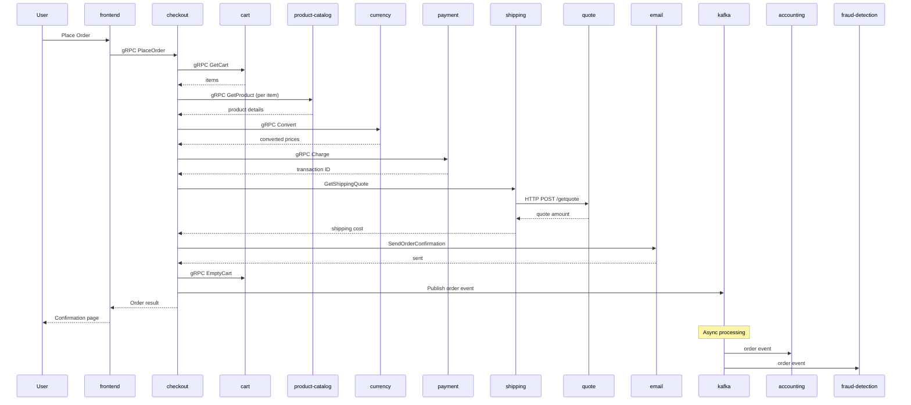

---

## 17. Troubleshooting Guide

### 17.1 Docker Compose issues

| Symptom | Likely cause | Fix |
|---------|--------------|-----|
| Port 8080 already in use | Another app using 8080 | `sudo lsof -i :8080` and stop conflicting process |
| Container keeps restarting | OOM (out of memory) | Increase Docker memory limit; check `docker stats` |
| Service can't reach another | Startup order | `docker compose ps`; wait for health checks |
| `make start` fails on ARM Mac | Java issue | `.env.arm64` is auto-loaded on ARM Darwin |
| Blank page at localhost:8080 | frontend not ready | `docker compose logs frontend`; wait 30-60s |

### 17.2 Kubernetes issues

| Symptom | Likely cause | Fix |
|---------|--------------|-----|
| Pod `CrashLoopBackOff` | App error or OOM | `kubectl logs <pod> --previous` |
| Pod `ImagePullBackOff` | Wrong image tag or no registry access | Verify image exists; check `imagePullSecrets` |
| Service unreachable | Selector mismatch | Compare Service selector with Pod labels |
| Ingress has no address | LB controller missing | Install AWS LB Controller; check `kubectl describe ingress` |
| OTEL traces missing | Collector not running | Verify `opentelemetry-demo-otelcol` pod is up |

### 17.3 CI/CD issues

| Symptom | Likely cause | Fix |
|---------|--------------|-----|
| Docker push fails | Invalid credentials | Check `DOCKER_USERNAME` and `DOCKER_TOKEN` secrets |
| `updatek8s` fails | Permission denied on push | Verify `GITHUB_TOKEN` has write access |
| Tests fail | Code regression | Run `go test ./...` locally in `src/product-catalog` |

### 17.4 Observability issues

| Symptom | Likely cause | Fix |
|---------|--------------|-----|
| No traces in Jaeger | Collector pipeline misconfigured | Check `otel-collector` logs |
| Empty Grafana dashboards | Prometheus not scraping | Verify Prometheus targets at `:9090/targets` |
| No logs in OpenSearch | Index not created | Check Collector logs exporter section |

### 17.5 Useful diagnostic commands

```bash
# Docker
make start
docker compose ps
docker compose logs -f checkout
docker stats --no-stream

# Kubernetes
kubectl get all -n otel-demo
kubectl describe pod <name> -n otel-demo
kubectl logs -f deployment/opentelemetry-demo-checkoutservice -n otel-demo
kubectl get events -n otel-demo --sort-by='.lastTimestamp'

# Networking
kubectl exec -it <pod> -n otel-demo -- wget -qO- http://opentelemetry-demo-cartservice:8080
```

---

## 18. Best Practices and Enterprise Recommendations

### 18.1 Development workflow

| Practice | This project | Enterprise |
|----------|--------------|------------|
| Local dev | `make start` with Docker Compose | Same, or use Tilt/Skaffold for K8s |
| Config management | `.env` files | Vault, AWS SSM Parameter Store |
| Secret management | Not implemented | Kubernetes Secrets + External Secrets Operator |
| Testing | Tracetest + Cypress | Add contract tests, load tests, security scans |

### 18.2 Deployment checklist for production

- [ ] Provision infrastructure with Terraform (VPC, EKS, managed data stores)
- [ ] Pin all image versions; avoid `latest`
- [ ] Set up proper CI/CD for all services (not just one)
- [ ] Use GitOps (ArgoCD/Flux) instead of `sed` + force push
- [ ] Enable TLS on Ingress (cert-manager + ACM)
- [ ] Add NetworkPolicies to restrict pod-to-pod traffic
- [ ] Replace in-cluster Kafka/Valkey/Postgres with managed services
- [ ] Configure resource requests/limits based on load testing
- [ ] Set up HPA for frontend, checkout, and cart
- [ ] Implement trace sampling (1-10% in production)
- [ ] Add alerting and on-call rotation
- [ ] Enable pod security standards (non-root, read-only filesystem)

### 18.3 Security recommendations

| Area | Demo status | Production requirement |
|------|-------------|------------------------|
| TLS | Not configured | Required everywhere |
| Network isolation | Open mesh | NetworkPolicies |
| Secrets in env vars | Plain text in YAML | Sealed Secrets / Vault |
| Container user | Some run as non-root | All containers non-root |
| Image scanning | Not implemented | Trivy in CI pipeline |
| RBAC | Basic ServiceAccount | Least-privilege IAM via IRSA |

---

## 19. Interview Preparation

### 19.1 Architecture questions

**Q: Walk me through what happens when a user checks out.**  
A: User clicks Place Order in the Next.js frontend → gRPC call to checkout service → checkout orchestrates calls to cart (get items), product-catalog (validate), currency (convert), payment (charge), shipping (get quote via quote service), email (confirmation) → publishes order event to Kafka → cart is emptied → response returned. Accounting and fraud-detection consume the Kafka event asynchronously. All steps generate OTel traces exported to the Collector.

**Q: Why use both Docker Compose and Kubernetes?**  
A: Docker Compose provides fast local development with the full observability stack. Kubernetes provides production-like deployment with service discovery, scaling, and Ingress. This project uses both to support different audiences.

**Q: Why is there an Envoy proxy instead of hitting frontend directly?**  
A: Single entry point on port 8080 routes to shop, Grafana, Jaeger, load generator, and flag UI. Envoy also generates access logs and traces, demonstrating proxy-level observability.

### 19.2 Kubernetes questions

**Q: What happens if the checkout pod crashes?**  
A: The Deployment controller detects the pod is missing, schedules a new pod on a healthy node. The Service routes traffic to the new pod once it passes readiness checks. In-flight requests may fail unless retries are configured.

**Q: How do services find each other in Kubernetes?**  
A: Kubernetes DNS resolves Service names to ClusterIP. Checkout connects to `opentelemetry-demo-cartservice:8080` — kube-dns resolves this to the Service IP, which load-balances to cart pods.

### 19.3 CI/CD questions

**Q: Explain the CI pipeline in this project.**  
A: On PR to main: (1) build and unit test Go product-catalog, (2) lint with golangci-lint, (3) build and push Docker image tagged with `GITHUB_RUN_ID`, (4) update the Kubernetes deployment manifest image tag and push to main. Weakness: only one service, uses force push and sed.

**Q: How would you improve this pipeline?**  
A: Use GitOps with ArgoCD, Kustomize for image tag updates, add Trivy scanning, deploy to staging first, extend to all services, use proper branch protection instead of force push.

### 19.4 Observability questions

**Q: What are the three pillars of observability?**  
A: Traces (request flow), metrics (numeric aggregates), logs (event records). This project implements all three via OpenTelemetry.

**Q: What is the role of the OTel Collector?**  
A: It decouples applications from backends. Services send OTLP to the Collector; the Collector batches, processes, and routes to Jaeger, Prometheus, and OpenSearch. This lets you change backends without modifying every service.

### 19.5 "What is NOT in this project" questions

**Q: Where is the Terraform code?**  
A: There is none. This is an application demo. Infrastructure would be provisioned separately.

**Q: How is the Kubernetes cluster created?**  
A: Not defined in this repo. You bring your own cluster (EKS, minikube, kind, etc.) and apply the manifests.

---

## 20. Quick Reference Tables

### 20.1 Start commands

| Task | Command |
|------|---------|
| Start full stack | `make start` |
| Start minimal stack | `make start-minimal` |
| Stop everything | `make stop` |
| Rebuild one service | `make redeploy service=checkout` |
| Generate K8s manifests | `make generate-kubernetes-manifests` |
| Run linters | `make check` |
| Generate protobuf | `make generate-protobuf` |

### 20.2 Key URLs (local Docker)

| Service | URL |
|---------|-----|
| Shop | http://localhost:8080 |
| Jaeger | http://localhost:8080/jaeger/ui |
| Grafana | http://localhost:8080/grafana/ |
| Load generator | http://localhost:8080/loadgen/ |
| Feature flags | http://localhost:8080/feature/ |

### 20.3 Repository structure

```
ultimate-devops-project-demo/
├── .env                          # Central configuration
├── .github/workflows/ci.yaml     # Product-catalog CI/CD
├── docker-compose.yml            # Full 26-service stack
├── Makefile                      # Build/start/generate commands
├── pb/demo.proto                 # Shared gRPC API definitions
├── docs/
│   └── ARCHITECTURE.md           # This document
├── kubernetes/                   # K8s manifests (per-service)
│   ├── complete-deploy.yaml      # All services in one file
│   ├── serviceaccount.yaml
│   ├── frontendproxy/ingress.yaml
│   ├── productcatalog/deploy.yaml  # Custom CI-managed image
│   └── ...                       # One folder per service
├── src/
│   ├── frontend/                 # Next.js UI
│   ├── frontend-proxy/           # Envoy config
│   ├── checkout/                 # Go orchestrator
│   ├── product-catalog/          # Go catalog (custom CI)
│   ├── otel-collector/           # Collector config
│   ├── grafana/                  # Dashboard provisioning
│   ├── jaeger/                   # Jaeger config
│   ├── prometheus/               # Prometheus config
│   └── ...                       # Other microservices
└── test/tracetesting/            # Trace-based integration tests
```

### 20.4 Port mapping (Docker vs Kubernetes)

| Service | Docker port | K8s port |
|---------|-------------|----------|
| frontend-proxy | 8080 | 8080 |
| frontend | 8080 | 8080 |
| checkout | 5050 | 8080 |
| cart | 7070 | 8080 |
| product-catalog | 3550 | 8080 |
| payment | 50051 | 8080 |
| currency | 7001 | 8080 |
| ad | 9555 | 8080 |
| quote | 8090 | 8080 |
| recommendation | 9001 | 8080 |
| shipping | 50050 | 8080 |
| email | 6060 | 8080 |
| image-provider | 8081 | 8081 |
| load-generator | 8089 | 8089 |
| kafka | 9092 | 9092 |
| valkey | 6379 | 6379 |
| otel-collector | 4317/4318 | 4317/4318 |
| jaeger UI | 16686 | 16686 |
| grafana | 3000 | 80 |
| prometheus | 9090 | 9090 |

---

## Glossary

| Term | Definition |
|------|------------|
| **ALB** | AWS Application Load Balancer — Layer 7 HTTP load balancer |
| **CI/CD** | Continuous Integration / Continuous Delivery |
| **ClusterIP** | Internal-only Kubernetes Service type |
| **ConfigMap** | K8s object for non-sensitive configuration |
| **Deployment** | K8s object that manages pod replicas |
| **EKS** | Amazon Elastic Kubernetes Service |
| **Envoy** | High-performance CNCF proxy |
| **gRPC** | Google Remote Procedure Call framework |
| **Helm** | Kubernetes package manager |
| **IaC** | Infrastructure as Code |
| **Ingress** | K8s object for external HTTP routing |
| **IRSA** | IAM Roles for Service Accounts (AWS EKS) |
| **Kafka** | Distributed event streaming platform |
| **OTel / OTLP** | OpenTelemetry / its wire protocol |
| **Pod** | Smallest deployable unit in Kubernetes |
| **Protobuf** | Protocol Buffers — language-neutral API schema |
| **Service** | Stable K8s network endpoint for pods |
| **ServiceAccount** | K8s identity for pods |
| **Valkey** | Open-source Redis fork |

---

## Further Reading

- [Official Demo Documentation](https://opentelemetry.io/docs/demo/)
- [Docker Deployment Guide](https://opentelemetry.io/docs/demo/docker_deployment/)
- [Kubernetes Deployment Guide](https://opentelemetry.io/docs/demo/kubernetes_deployment/)
- [Helm Chart on Artifact Hub](https://artifacthub.io/packages/helm/opentelemetry-helm/opentelemetry-demo)
- [OpenTelemetry Documentation](https://opentelemetry.io/docs/)
- [Kubernetes Documentation](https://kubernetes.io/docs/home/)
- [Terraform AWS Provider](https://registry.terraform.io/providers/hashicorp/aws/latest/docs)

---

*Document generated for the `ultimate-devops-project-demo` repository. Based on codebase analysis as of demo version 2.1.3.*
