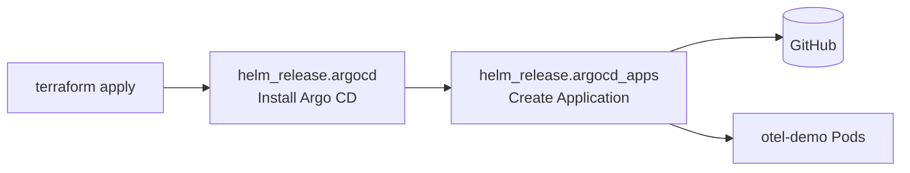
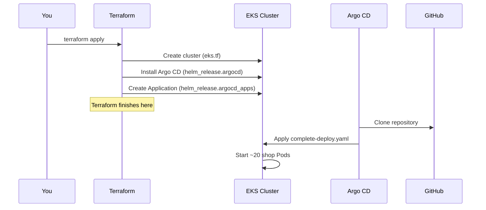

# Understanding `terraform/argocd.tf`

> **Audience:** Beginners learning Terraform, Helm, and Argo CD  
> **File:** `terraform/argocd.tf`  
> **Related:** [BEGINNER_DEVOPS_GUIDE.md](./BEGINNER_DEVOPS_GUIDE.md) · [TERRAFORM_ARGOCD_DEPLOYMENT.md](./TERRAFORM_ARGOCD_DEPLOYMENT.md)

This guide explains every line of `argocd.tf` — what it does, why it exists, and
how it fits into the overall deployment.

---

## Table of Contents

1. [What This File Does](#1-what-this-file-does)
2. [Big Picture Flow](#2-big-picture-flow)
3. [Part 1 — Local Variable](#3-part-1--local-variable)
4. [Part 2 — Install Argo CD](#4-part-2--install-argo-cd)
5. [Part 3 — Bootstrap the Application](#5-part-3--bootstrap-the-application)
6. [Inside the Application Definition](#6-inside-the-application-definition)
7. [End-to-End Order During `terraform apply`](#7-end-to-end-order-during-terraform-apply)
8. [How to Verify After Apply](#8-how-to-verify-after-apply)
9. [Beginner Analogy](#9-beginner-analogy)
10. [Common Questions](#10-common-questions)
11. [Related Files](#11-related-files)

---

## 1. What This File Does

`argocd.tf` runs **after** the EKS cluster exists. It does two jobs:

| Job | Terraform resource | Result |
|-----|-------------------|--------|
| 1. Install Argo CD | `helm_release.argocd` | Argo CD pods run in namespace `argocd` |
| 2. Give Argo CD a job | `helm_release.argocd_apps` | Application `otel-demo` watches Git and deploys the shop |

**Important:** Terraform does **not** deploy the shop Pods. Argo CD does that
by syncing `kubernetes/complete-deploy.yaml` from Git.

---

## 2. Big Picture Flow



```text
1. module.eks                → EKS cluster ready
2. helm_release.argocd       → Argo CD installed
3. helm_release.argocd_apps  → Application "otel-demo" created
4. Argo CD (not Terraform)   → clones Git → applies complete-deploy.yaml
5. Shop Pods appear in namespace "otel-demo"
```

---

## 3. Part 1 — Local Variable

```hcl
locals {
  argocd_namespace = "argocd"
}
```

| Piece | Meaning |
|-------|---------|
| `locals` | Values used only inside this Terraform folder |
| `argocd_namespace = "argocd"` | Namespace where Argo CD will live |

Using a local avoids repeating `"argocd"` in many places. Change it once here
if you rename the namespace.

---

## 4. Part 2 — Install Argo CD

```hcl
resource "helm_release" "argocd" {
  name             = "argocd"
  repository       = "https://argoproj.github.io/argo-helm"
  chart            = "argo-cd"
  version          = "~> 7.6"
  namespace        = local.argocd_namespace
  create_namespace = true

  wait    = true
  timeout = 600

  depends_on = [module.eks]
}
```

### What is `helm_release`?

Terraform’s Helm provider installs a **Helm chart** into the cluster. It is
equivalent to:

```bash
helm install argocd argo/argo-cd -n argocd --create-namespace
```

You do **not** need the Helm CLI. Terraform runs this during `apply`.

### Field-by-field

| Field | Value | Meaning |
|-------|-------|---------|
| `name` | `argocd` | Helm release name (label for this install) |
| `repository` | Argo Helm repo URL | Where Terraform downloads the chart |
| `chart` | `argo-cd` | Official Argo CD chart |
| `version` | `~> 7.6` | Accept chart versions `7.6.x` (not `8.x`) |
| `namespace` | `argocd` | Install into this namespace |
| `create_namespace` | `true` | Create the namespace if it does not exist |
| `wait` | `true` | Wait until Argo CD Pods are ready |
| `timeout` | `600` | Wait up to 10 minutes (seconds) |
| `depends_on` | `[module.eks]` | Run **only after** the EKS cluster exists |

### What gets installed inside the cluster?

| Component | Job |
|-----------|-----|
| `argocd-server` | UI and API |
| `argocd-repo-server` | Clones Git repositories |
| `argocd-application-controller` | Compares Git vs cluster and syncs |
| `argocd-redis` | Cache used by Argo CD |
| CRDs | Custom types such as `Application` |

Without this release, there is **no Argo CD** in the cluster.

---

## 5. Part 3 — Bootstrap the Application

```hcl
resource "helm_release" "argocd_apps" {
  name       = "argocd-apps"
  repository = "https://argoproj.github.io/argo-helm"
  chart      = "argocd-apps"
  version    = "~> 2.0"
  namespace  = local.argocd_namespace

  values = [ ... ]

  depends_on = [helm_release.argocd]
}
```

### Why a second Helm release?

| Chart | Purpose |
|-------|---------|
| `argo-cd` | Installs Argo CD itself |
| `argocd-apps` | Creates Argo CD **Application** objects |

Analogy:

1. Hire the robot manager (Argo CD)
2. Give the robot a job card (Application: “deploy otel-demo”)

`depends_on = [helm_release.argocd]` ensures Argo CD (and its CRDs) exist
before creating Applications.

### The `values` block

```hcl
  values = [
    yamlencode({
      applications = {
        otel-demo = {
          # Application definition
        }
      }
    })
  ]
```

| Piece | Meaning |
|-------|---------|
| `values` | Extra configuration passed into the Helm chart |
| `yamlencode({...})` | Converts a Terraform map into the YAML string Helm expects |
| `applications` | Map of Applications to create |
| `otel-demo` | Name of the Application |

This creates an Argo CD Application named **`otel-demo`**.

---

## 6. Inside the Application Definition

### Metadata and project

```hcl
otel-demo = {
  namespace  = local.argocd_namespace
  project    = "default"
  finalizers = ["resources-finalizer.argocd.argoproj.io"]
```

| Field | Meaning |
|-------|---------|
| `namespace` | The Application CR lives in the `argocd` namespace |
| `project` | Argo CD project (`default` is fine for beginners) |
| `finalizers` | On delete, Argo CD can clean up app resources first |

### Source — where to pull from

```hcl
source = {
  repoURL        = var.git_repo_url
  targetRevision = var.git_target_revision
  path           = var.git_manifest_path

  directory = {
    include = "complete-deploy.yaml"
  }
}
```

Defaults from `terraform/variables.tf`:

| Variable | Default | Meaning |
|----------|---------|---------|
| `git_repo_url` | Your GitHub repo URL | Which Git repository |
| `git_target_revision` | `main` | Which branch, tag, or commit |
| `git_manifest_path` | `kubernetes` | Folder path inside the repo |
| `directory.include` | `complete-deploy.yaml` | Sync **only** this file |

#### Why only `complete-deploy.yaml`?

The `kubernetes/` folder also contains per-service files (`cart/`, `ad/`, etc.).
Those are the **same** resources again. If Argo CD syncs the whole folder, you
get duplicates and conflicts. Including only `complete-deploy.yaml` deploys
everything once.

### Destination — where to deploy

```hcl
destination = {
  server    = "https://kubernetes.default.svc"
  namespace = var.app_namespace
}
```

| Field | Meaning |
|-------|---------|
| `server` | Same cluster Argo CD is running in (in-cluster Kubernetes API) |
| `namespace` | Default: `otel-demo` — shop Pods go here |

### Sync policy — how Argo CD behaves

```hcl
syncPolicy = {
  automated = {
    prune    = true
    selfHeal = true
  }
  syncOptions = [
    "CreateNamespace=true",
  ]
}
```

| Setting | Meaning |
|---------|---------|
| `automated` | Sync without clicking “Sync” in the UI |
| `prune = true` | If you remove something from Git, delete it from the cluster |
| `selfHeal = true` | If someone changes the cluster by hand, Argo CD reverts to Git |
| `CreateNamespace=true` | Create the `otel-demo` namespace if it is missing |

This is **GitOps**: Git is the source of truth; the cluster must match Git.

---

## 7. End-to-End Order During `terraform apply`



| Step | Who | What |
|------|-----|------|
| 1 | Terraform | Creates EKS (`eks.tf`) |
| 2 | Terraform | Installs Argo CD (`argocd.tf` part 1) |
| 3 | Terraform | Creates Application (`argocd.tf` part 2) |
| 4 | Argo CD | Clones Git and syncs manifests |
| 5 | Kubernetes | Starts shop Pods in `otel-demo` |

---

## 8. How to Verify After Apply

```bash
# Argo CD installed?
kubectl get pods -n argocd

# Application created?
kubectl get applications -n argocd

# Application status (Synced / Healthy)?
kubectl get application otel-demo -n argocd

# Shop deploying?
kubectl get pods -n otel-demo
```

Expected:

- `argocd` namespace: Argo CD Pods are `Running`
- Application `otel-demo`: `Synced` and `Healthy`
- `otel-demo` namespace: ~20 shop Pods are `Running`

---

## 9. Beginner Analogy

| Code piece | Analogy |
|------------|---------|
| `helm_release.argocd` | Hire the robot manager (Argo CD) |
| `helm_release.argocd_apps` | Give the robot a job card |
| `source` | “The blueprint is this Git repo / folder / file” |
| `destination` | “Build it in room `otel-demo`” |
| `automated` + `prune` + `selfHeal` | “Always keep the building matching the blueprint” |

---

## 10. Common Questions

### Does Terraform deploy the shop?

No. Terraform installs Argo CD and creates the Application. **Argo CD** deploys
the shop from Git.

### Why use Helm inside Terraform?

Helm packages Argo CD as a chart. Terraform’s Helm provider is a convenient
installer, so you do not need to run `helm install` manually.

### Can I change the Git repository or branch?

Yes. Edit `terraform.tfvars` (or the defaults in `variables.tf`):

```hcl
git_repo_url        = "https://github.com/your-org/your-repo.git"
git_target_revision = "main"
git_manifest_path   = "kubernetes"
app_namespace       = "otel-demo"
```

### What if Git does not have `complete-deploy.yaml` on `main`?

Argo CD sync fails. Push your manifests to the branch that Argo CD tracks
before (or right after) `terraform apply`.

### Do I need the Helm CLI or Argo CD CLI on my laptop?

No. Terraform installs Argo CD. Use `kubectl` (and optionally the Argo CD UI
via port-forward) to check status.

### How is this different from `kubectl apply`?

| Approach | Who deploys | Source of truth |
|----------|-------------|-----------------|
| `kubectl apply -f ...` | You, once | Local files at that moment |
| Argo CD (this file) | Argo CD, continuously | Git repository |

---

## 11. Related Files

| File | Role |
|------|------|
| `terraform/argocd.tf` | Installs Argo CD and bootstraps the Application |
| `terraform/eks.tf` | Creates the EKS cluster that Argo CD runs on |
| `terraform/variables.tf` | Git URL, branch, app namespace defaults |
| `terraform/providers.tf` | Helm and Kubernetes providers authenticate to EKS |
| `argocd/application.yaml` | Standalone Application (manual alternative) |
| `kubernetes/complete-deploy.yaml` | The shop manifests Argo CD syncs |
| [TERRAFORM_ARGOCD_DEPLOYMENT.md](./TERRAFORM_ARGOCD_DEPLOYMENT.md) | Full deploy runbook |
| [BEGINNER_DEVOPS_GUIDE.md](./BEGINNER_DEVOPS_GUIDE.md) | Concepts from basics to advanced |
| [CI_CD_PIPELINE.md](./CI_CD_PIPELINE.md) | Product-catalog GitHub Actions CI/CD and GitOps gap |
