# Beginner to Advanced DevOps Guide

> **Audience:** Complete beginners in AWS and DevOps (0 experience)  
> **Goal:** Understand what this project is, how the infrastructure is built, how
> deployment works, and what every technology does — with architecture diagrams.

---

## Table of Contents

1. [What Is This Project?](#1-what-is-this-project)
2. [Learning Path Overview](#2-learning-path-overview)
3. [Level 1 — Foundations](#3-level-1--foundations)
4. [Level 2 — AWS Basics](#4-level-2--aws-basics)
5. [Level 3 — Kubernetes Basics](#5-level-3--kubernetes-basics)
6. [Level 4 — Amazon EKS](#6-level-4--amazon-eks)
7. [Level 5 — Helm](#7-level-5--helm)
8. [Level 6 — Argo CD and GitOps](#8-level-6--argo-cd-and-gitops)
9. [Level 7 — Terraform (Infrastructure as Code)](#9-level-7--terraform-infrastructure-as-code)
10. [Full Infrastructure Architecture](#10-full-infrastructure-architecture)
11. [Full Deployment Flow](#11-full-deployment-flow)
12. [Application Architecture](#12-application-architecture)
13. [How Everything Connects in This Project](#13-how-everything-connects-in-this-project)
14. [Hands-On: Step-by-Step Deployment](#14-hands-on-step-by-step-deployment)
15. [Glossary](#15-glossary)
16. [What to Learn Next](#16-what-to-learn-next)

---

## 1. What Is This Project?

### In one sentence

This is a **fake online shop** built from ~20 small programs (microservices),
packaged as containers, deployed on **AWS EKS** (Kubernetes), and managed with
**Terraform** (infrastructure) and **Argo CD** (application deployment).

### What you will learn

| Topic | What you practice |
|-------|-------------------|
| AWS | VPC, subnets, EC2, EKS |
| Kubernetes | Pods, Deployments, Services, Namespaces |
| EKS | Managed Kubernetes on AWS |
| Helm | Package manager for Kubernetes |
| Argo CD | GitOps — deploy from Git automatically |
| Terraform | Create cloud resources from code |
| DevOps | Automate build, deploy, and monitor |

### Repository layout

```text
ultimate-devops-project-demo/
├── src/                    # Application source code (Go, Python, Node.js, etc.)
├── kubernetes/             # Kubernetes YAML manifests (how the app runs on K8s)
│   └── complete-deploy.yaml  # All services in one file
├── terraform/              # Infrastructure as Code (creates AWS resources)
│   ├── vpc.tf              # Network (VPC, subnets, NAT)
│   ├── eks.tf              # EKS cluster + worker nodes
│   └── argocd.tf           # Installs Argo CD + bootstraps the app
├── argocd/
│   └── application.yaml    # Argo CD Application definition (GitOps)
└── docs/                   # Guides (you are reading one now)
```

---

## 2. Learning Path Overview

Think of this as climbing a ladder. Each level builds on the previous one.

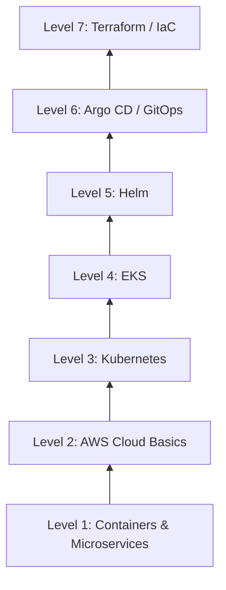

| Level | Concept | Analogy |
|-------|---------|---------|
| 1 | Containers, microservices | Shipping containers for code |
| 2 | AWS (VPC, EC2, IAM) | Renting a building and rooms |
| 3 | Kubernetes | Building manager that places containers |
| 4 | EKS | AWS runs the building manager for you |
| 5 | Helm | IKEA instruction booklet for K8s apps |
| 6 | Argo CD | Robot that keeps the shop matching the blueprint |
| 7 | Terraform | Architect who draws and builds the building |

---

## 3. Level 1 — Foundations

### 3.1 What is a container?

A **container** packages an application with everything it needs (code,
libraries, runtime) so it runs the same everywhere.

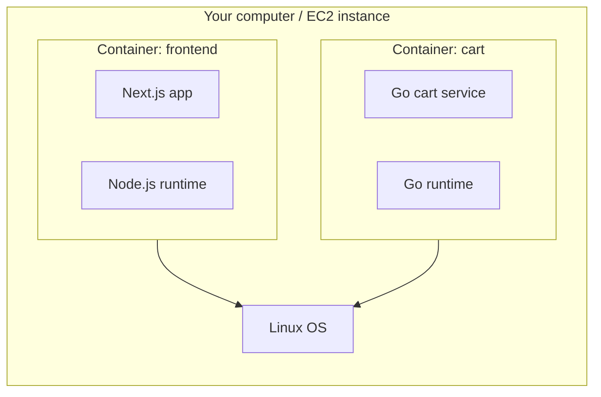

**Where it is used:** Every service in this project runs in a container.
Docker builds the images; Kubernetes runs them.

### 3.2 What is a microservice?

Instead of one big program doing everything, the shop is split into small
independent services:

| Service | Job |
|---------|-----|
| `frontend` | Shows the website UI |
| `cart` | Manages shopping cart |
| `checkout` | Processes orders |
| `product-catalog` | Lists products |
| `payment` | Handles payments |
| `shipping` | Calculates shipping costs |
| `kafka` | Message queue between services |
| `valkey` | In-memory cache (cart sessions) |

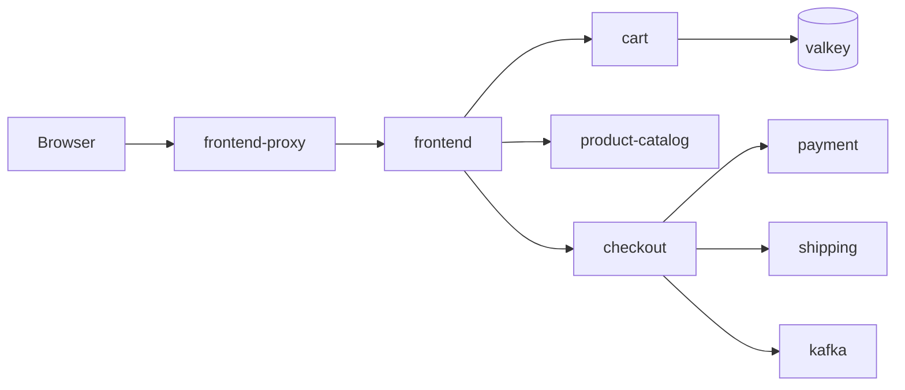

**Why microservices?** Each team can develop, deploy, and scale one service
independently. If the payment service breaks, the product page still works.

### 3.3 What is DevOps?

**DevOps** = Development + Operations. The idea is to automate everything
between writing code and running it in production:

```text
Code → Build → Test → Package (Docker image) → Deploy (Kubernetes) → Monitor
```

In this project:
- **CI/CD** (`.github/workflows/ci.yaml`) builds and pushes the product-catalog
  Docker image automatically.
- **Terraform** creates the cloud infrastructure.
- **Argo CD** deploys the application from Git.

---

## 4. Level 2 — AWS Basics

### 4.1 What is AWS?

**Amazon Web Services (AWS)** is a cloud provider. Instead of buying physical
servers, you rent virtual ones over the internet and pay per hour.

### 4.2 Key AWS concepts used in this project

| Concept | What it is | Analogy | Used where |
|---------|-----------|---------|------------|
| **Region** | A geographic area (e.g. `us-east-1`) | A city | All resources live in one region |
| **VPC** | Your private network in AWS | A fenced campus | `terraform/vpc.tf` |
| **Subnet** | A section of the VPC | A building on campus | Public and private subnets |
| **EC2** | A virtual server (VM) | A computer you rent | EKS worker nodes are EC2 |
| **IAM** | Permissions (who can do what) | Employee badges | EKS cluster access |
| **NAT Gateway** | Lets private servers reach the internet | A mail room with one exit | Nodes pull Docker images |
| **EKS** | Managed Kubernetes on AWS | AWS runs K8s for you | `terraform/eks.tf` |

### 4.3 VPC architecture in this project

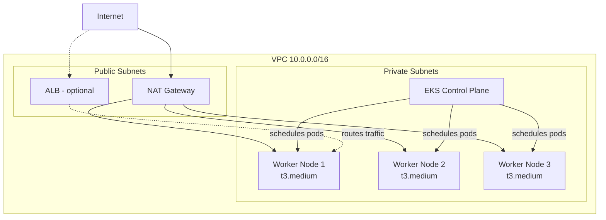

**Why private subnets?** Worker nodes (where your app runs) are not directly
exposed to the internet. They reach out through the NAT gateway to pull Docker
images. This is a security best practice.

**Public vs private:**
- **Public subnet** — has a route to the internet gateway (NAT, load balancers).
- **Private subnet** — no direct internet access; uses NAT gateway for outbound
  traffic only.

---

## 5. Level 3 — Kubernetes Basics

### 5.1 What is Kubernetes?

**Kubernetes (K8s)** is a system that runs and manages containers across many
servers. It handles:

- Starting and stopping containers
- Restarting crashed containers
- Load balancing between copies
- Rolling updates (zero-downtime deploys)
- Service discovery (how services find each other)

**Analogy:** Kubernetes is a **building manager**. You say "I need 3 copies of
the cart service running," and it finds room on available servers, places them,
monitors their health, and replaces any that crash.

### 5.2 Core Kubernetes objects

| Object | What it is | Analogy | In this project |
|--------|-----------|---------|-----------------|
| **Pod** | Smallest unit; 1+ containers | One apartment | Each service runs in Pods |
| **Deployment** | Manages Pod replicas | "Keep 1 cart Pod running" | `kubernetes/*/deploy.yaml` |
| **Service** | Stable network endpoint for Pods | Apartment building address | `kubernetes/*/svc.yaml` |
| **Namespace** | Logical grouping | A floor in the building | `otel-demo`, `argocd` |
| **ConfigMap** | Configuration data | A notice board | `kubernetes/flagd/cm.yaml` |
| **ServiceAccount** | Identity for Pods | An employee ID | `kubernetes/serviceaccount.yaml` |
| **Ingress** | External HTTP routing | Building reception desk | `kubernetes/frontendproxy/ingress.yaml` |

### 5.3 How Kubernetes objects relate

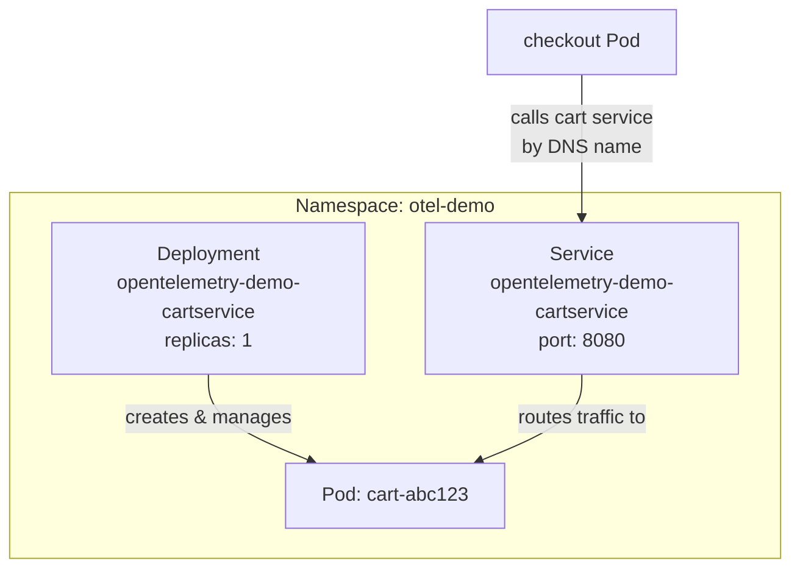

**Key idea:** Pods get random IP addresses that change when they restart. A
**Service** gives a stable DNS name (`opentelemetry-demo-cartservice`) so other
services always know where to connect.

### 5.4 How services talk to each other

Inside Kubernetes, services find each other by **DNS name**, not IP address:

```text
checkout service needs cart service
  → calls: opentelemetry-demo-cartservice:8080
  → Kubernetes DNS resolves to the cart Service
  → Service forwards to a healthy cart Pod
```

This is defined in the manifests at `kubernetes/complete-deploy.yaml`.

---

## 6. Level 4 — Amazon EKS

### 6.1 What is EKS?

**Amazon Elastic Kubernetes Service (EKS)** is AWS's managed Kubernetes. AWS
runs the Kubernetes control plane (the "brain"); you manage the worker nodes
(where Pods actually run).

### 6.2 EKS vs plain Kubernetes

| | Self-managed K8s | EKS |
|--|-----------------|-----|
| Control plane | You install and maintain | AWS manages |
| Worker nodes | Your EC2 instances | Your EC2 instances (managed node group) |
| Upgrades | Manual | AWS handles control plane |
| Cost | EC2 only | EC2 + ~$0.10/hr per cluster |
| Best for | Full control, on-prem | AWS-native, less ops burden |

### 6.3 EKS architecture in this project

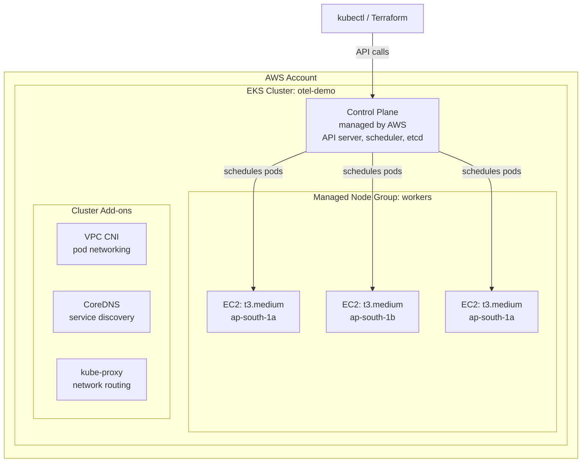

### 6.4 What Terraform creates for EKS

From `terraform/eks.tf`:

| Setting | Value | Why |
|---------|-------|-----|
| Cluster name | `otel-demo` | Identifies your cluster |
| Kubernetes version | `1.30` | Recent stable version |
| Node type | `t3.medium` (4 GiB RAM) | Fits the app with 3 nodes |
| Node count | 3 (min 3, max 4) | Enough memory for ~20 services |
| Subnets | Private subnets only | Security best practice |
| Add-ons | CoreDNS, kube-proxy, VPC CNI | Required for networking and DNS |

### 6.5 How you interact with EKS

```bash
# Point kubectl at your cluster
aws eks update-kubeconfig --name otel-demo --region us-east-1

# See your worker nodes
kubectl get nodes

# See running application pods
kubectl get pods -n otel-demo
```

`kubectl` is the command-line tool for talking to any Kubernetes cluster,
including EKS.

---

## 7. Level 5 — Helm

### 7.1 What is Helm?

**Helm** is the **package manager for Kubernetes** — like `apt` for Ubuntu or
`npm` for Node.js, but for K8s applications.

| Without Helm | With Helm |
|-------------|-----------|
| Apply 50 YAML files manually | `helm install my-app ./chart` |
| Edit YAML for every environment | Change `values.yaml` per environment |
| No version tracking | Charts are versioned packages |

### 7.2 Helm concepts

| Concept | What it is | Analogy |
|---------|-----------|---------|
| **Chart** | A package of K8s templates + defaults | A recipe book |
| **Release** | A deployed instance of a chart | A cooked meal |
| **values.yaml** | Configuration you customize | Ingredient substitutions |
| **Template** | YAML with variables | Recipe with blanks to fill |

### 7.3 Where Helm is used in this project

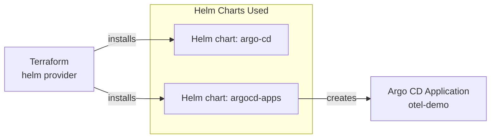

| Chart | Installed by | What it deploys |
|-------|-------------|-----------------|
| `argo-cd` | Terraform (`argocd.tf`) | Argo CD server, controller, repo-server |
| `argocd-apps` | Terraform (`argocd.tf`) | The `otel-demo` Argo CD Application |

**Important:** You do **not** need the Helm CLI installed. Terraform's Helm
*provider* installs charts for you during `terraform apply`.

The application's own Kubernetes manifests (`kubernetes/complete-deploy.yaml`)
were originally generated from the upstream
[opentelemetry-demo Helm chart](https://github.com/open-telemetry/opentelemetry-helm-charts),
but are stored as plain YAML in this repo.

---

## 8. Level 6 — Argo CD and GitOps

### 8.1 What is GitOps?

**GitOps** means **Git is the source of truth** for what runs in your cluster.

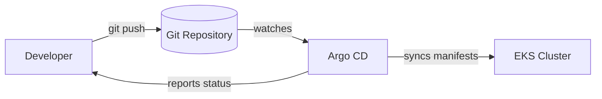

**Traditional deployment:**
```text
Developer → builds image → runs kubectl apply → cluster updated
```

**GitOps deployment:**
```text
Developer → edits YAML → git push → Argo CD detects change → cluster updated
```

### 8.2 What is Argo CD?

**Argo CD** is a GitOps tool that runs inside Kubernetes. It:

1. Watches a Git repository for changes
2. Compares what's in Git with what's running in the cluster
3. Automatically applies differences (sync)
4. Shows you a visual dashboard of app health

**Analogy:** Argo CD is a **robot manager** that constantly checks the
blueprint (Git) against the actual building (cluster) and fixes any differences.

### 8.3 Argo CD concepts

| Concept | What it is |
|---------|-----------|
| **Application** | "Deploy this Git path to this namespace" |
| **Sync** | Apply Git manifests to the cluster |
| **Self-heal** | If someone changes the cluster manually, Argo CD reverts it |
| **Prune** | Delete resources that were removed from Git |
| **Health** | Is the app running correctly? (Pods ready, etc.) |

### 8.4 Argo CD in this project

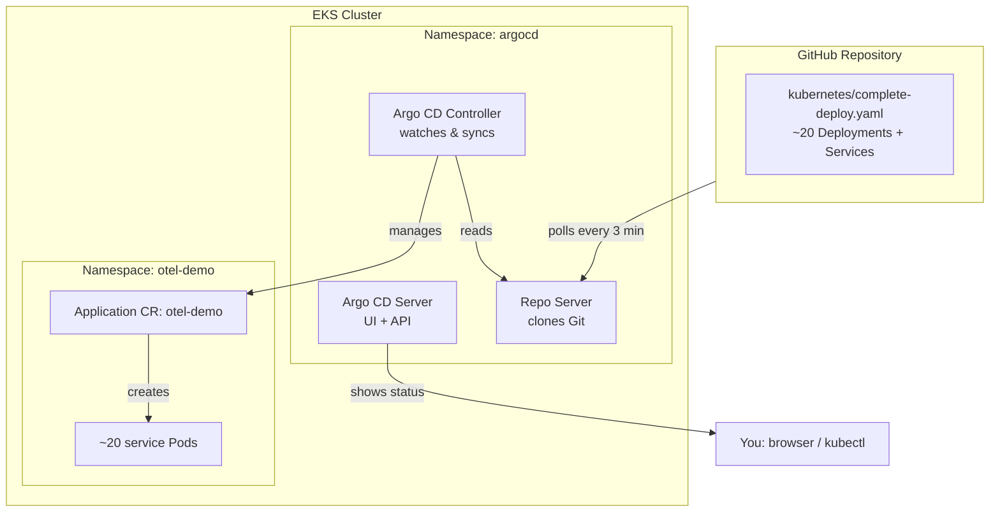

The Application is defined in `terraform/argocd.tf` (and mirrored in
`argocd/application.yaml`):

| Setting | Value |
|---------|-------|
| Git repo | `durgaprasadraju/ultimate-devops-project-demo` |
| Branch | `main` |
| Path | `kubernetes/` (only `complete-deploy.yaml`) |
| Destination namespace | `otel-demo` |
| Auto-sync | Yes (prune + self-heal enabled) |

---

## 9. Level 7 — Terraform (Infrastructure as Code)

### 9.1 What is Terraform?

**Terraform** lets you define cloud infrastructure in `.tf` files instead of
clicking in the AWS Console. You run `terraform apply` and it creates everything.

**Analogy:** Instead of calling a contractor for each room, you give an
architect a blueprint. The architect builds the entire building from the
blueprint, and you can tear it down with one command (`terraform destroy`).

### 9.2 Why use Terraform?

| Manual (Console) | Terraform (IaC) |
|----------------|-------------------|
| Click 100 buttons | One `terraform apply` |
| "What did I create?" | Code is documentation |
| Hard to reproduce | Same code = same infra |
| No version history | Git tracks all changes |
| Teammates can't see setup | Team reviews `.tf` files in PRs |

### 9.3 Terraform concepts

| Concept | What it is |
|---------|-----------|
| **Provider** | Plugin for a cloud (e.g. `aws`, `helm`, `kubernetes`) |
| **Resource** | One thing to create (e.g. `helm_release`, `module`) |
| **Module** | Reusable group of resources (e.g. VPC module) |
| **Variable** | Input you can customize (e.g. `region`, `cluster_name`) |
| **Output** | Value printed after apply (e.g. `cluster_endpoint`) |
| **State** | Terraform's record of what exists (`.tfstate` file) |

### 9.4 Terraform files in this project

```text
terraform/
├── versions.tf     # Terraform and provider version constraints
├── providers.tf    # AWS, Kubernetes, and Helm provider config
├── variables.tf    # Inputs (region, node size, git repo URL)
├── vpc.tf          # VPC, subnets, NAT gateway
├── eks.tf          # EKS cluster + managed node group
├── argocd.tf       # Argo CD + Application bootstrap
└── outputs.tf      # Helpful commands after apply
```

### 9.5 What `terraform apply` creates

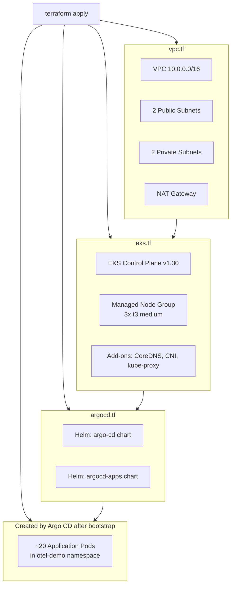

---

## 10. Full Infrastructure Architecture

This is the complete picture of everything that exists after
`terraform apply` finishes.

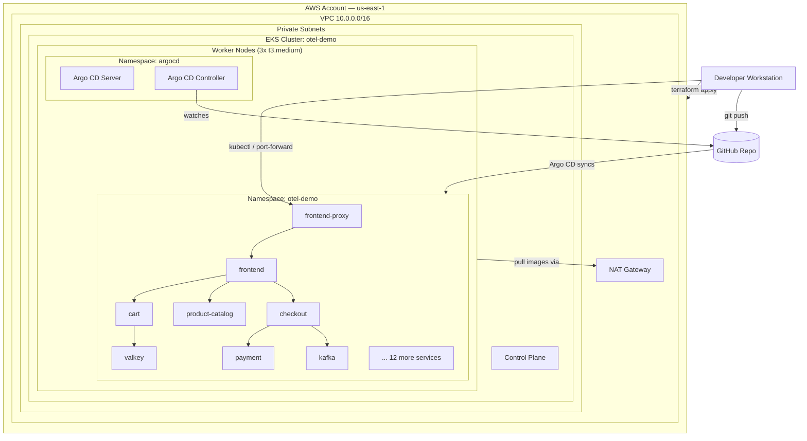

---

## 11. Full Deployment Flow

### Phase 1: Infrastructure (Terraform)

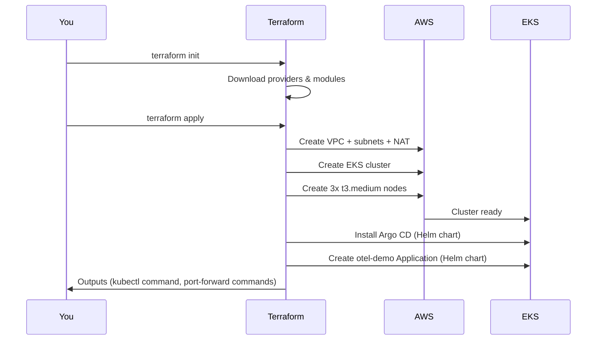

### Phase 2: Application (Argo CD)

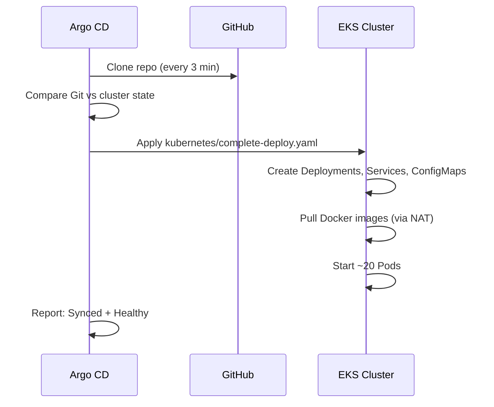

### Phase 3: Access the shop

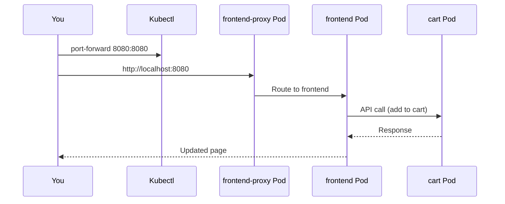

---

## 12. Application Architecture

### 12.1 All services in the shop

| Service | Language | Port | Purpose |
|---------|----------|------|---------|
| frontend-proxy | Envoy | 8080 | Entry point / reverse proxy |
| frontend | Next.js (TypeScript) | 8080 | Web UI |
| cart | Go | 8080 | Shopping cart |
| checkout | Go | 8080 | Order processing |
| product-catalog | Go | 8080 | Product listings |
| payment | Node.js | 8080 | Payment processing |
| shipping | Go | 8080 | Shipping quotes |
| currency | C++ | 8080 | Currency conversion |
| email | Ruby | 8080 | Order emails |
| ad | Java | 8080 | Advertisement service |
| recommendation | Python | 8080 | Product recommendations |
| quote | PHP | 8080 | Shipping quotes |
| image-provider | Python | 8080 | Product images |
| accounting | .NET | 8080 | Order accounting |
| fraud-detection | Kotlin | 8080 | Fraud checks |
| kafka | Java | 9092 | Message broker |
| valkey | C (Redis fork) | 6379 | Session cache |
| flagd | Go | 8013 | Feature flags |
| load-generator | Python | 8089 | Simulates user traffic |

### 12.2 Request flow: "Add to cart"

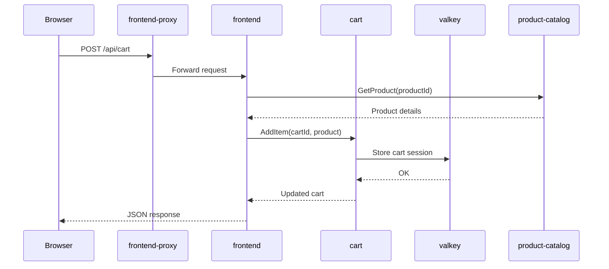

---

## 13. How Everything Connects in This Project

### The big picture (one diagram)

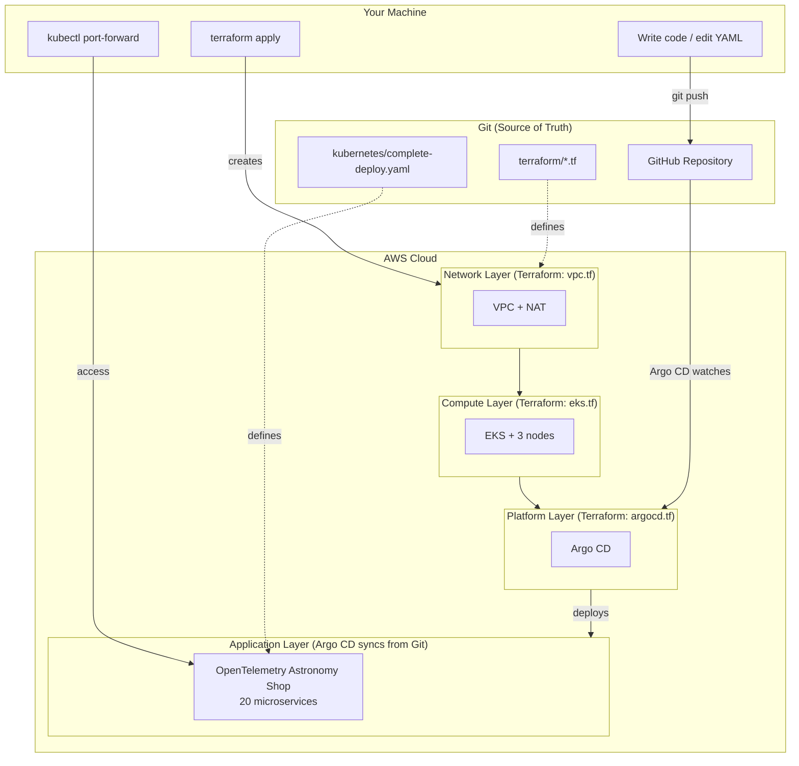

### Who does what?

| Layer | Tool | Creates | File |
|-------|------|---------|------|
| Network | Terraform | VPC, subnets, NAT | `terraform/vpc.tf` |
| Compute | Terraform | EKS cluster, EC2 nodes | `terraform/eks.tf` |
| Platform | Terraform + Helm | Argo CD installation | `terraform/argocd.tf` |
| Application | Argo CD + Git | Shop microservices | `kubernetes/complete-deploy.yaml` |
| CI/CD | GitHub Actions | Product-catalog image builds | `.github/workflows/ci.yaml` |

### Two deployment paths in this repo

| Path | When to use | Steps |
|------|------------|-------|
| **Full (Terraform + Argo CD)** | Learning GitOps, sandbox with 8 hrs | `terraform apply` → Argo CD syncs app |
| **Quick (kubectl only)** | Cluster already exists, just deploy app | `kubectl apply -f complete-deploy.yaml` |

---

## 14. Hands-On: Step-by-Step Deployment

### Prerequisites checklist

- [ ] AWS sandbox credentials (Access Key, Secret Key, Session Token)
- [ ] Tools installed: `aws`, `terraform`, `kubectl`
- [ ] This repo cloned and manifests pushed to GitHub

### Step 1: Set credentials

```bash
export AWS_ACCESS_KEY_ID=...
export AWS_SECRET_ACCESS_KEY=...
export AWS_SESSION_TOKEN=...
export AWS_REGION=us-east-1
aws sts get-caller-identity
```

### Step 2: Configure Terraform

```bash
cd terraform
cp terraform.tfvars.example terraform.tfvars
# Edit if your region or git repo differs
```

### Step 3: Create everything

```bash
terraform init
terraform apply
# Type "yes" — takes ~20-25 minutes
```

### Step 4: Connect and verify

```bash
aws eks update-kubeconfig --name otel-demo --region us-east-1
kubectl get nodes                    # 3 nodes Ready
kubectl get pods -n argocd           # Argo CD running
kubectl get applications -n argocd   # otel-demo Synced
kubectl get pods -n otel-demo        # ~20 pods Running
```

### Step 5: Open the shop

```bash
kubectl -n otel-demo port-forward svc/opentelemetry-demo-frontendproxy 8080:8080
# Visit http://localhost:8080
```

### Step 6: Try GitOps

```bash
# Edit a manifest, push to Git, watch Argo CD sync
# Example: change a replica count in complete-deploy.yaml
git add kubernetes/complete-deploy.yaml
git commit -m "scale cart to 2 replicas"
git push
kubectl get applications -n argocd -w
```

For detailed runbooks, see:
- [TERRAFORM_ARGOCD_DEPLOYMENT.md](./TERRAFORM_ARGOCD_DEPLOYMENT.md) — full Terraform + Argo CD guide
- [ARGOCD_TF_EXPLAINED.md](./ARGOCD_TF_EXPLAINED.md) — line-by-line explanation of `terraform/argocd.tf`
- [CI_CD_PIPELINE.md](./CI_CD_PIPELINE.md) — GitHub Actions CI/CD for product-catalog
- [EKS_SANDBOX_8HR_RUNBOOK.md](./EKS_SANDBOX_8HR_RUNBOOK.md) — 8-hour sandbox timeline
- [ARCHITECTURE.md](./ARCHITECTURE.md) — deep technical reference

---

## 15. Glossary

| Term | Definition |
|------|-----------|
| **AWS** | Amazon Web Services — cloud provider |
| **VPC** | Virtual Private Cloud — your isolated network in AWS |
| **EC2** | Elastic Compute Cloud — virtual servers in AWS |
| **EKS** | Elastic Kubernetes Service — managed Kubernetes on AWS |
| **Kubernetes (K8s)** | Container orchestration platform |
| **Pod** | Smallest deployable unit in Kubernetes (1+ containers) |
| **Deployment** | K8s object that manages Pod replicas |
| **Service** | Stable network endpoint for a set of Pods |
| **Namespace** | Logical partition inside a Kubernetes cluster |
| **Helm** | Package manager for Kubernetes (charts) |
| **Chart** | Helm package containing K8s templates |
| **Argo CD** | GitOps continuous delivery tool for Kubernetes |
| **GitOps** | Using Git as the source of truth for deployments |
| **Terraform** | Infrastructure as Code tool |
| **IaC** | Infrastructure as Code — define infra in files, not clicks |
| **CI/CD** | Continuous Integration / Continuous Deployment |
| **Microservice** | Small, independent, deployable service |
| **Container** | Packaged application with its dependencies |
| **Docker** | Tool to build and run containers |
| **kubectl** | Command-line tool for Kubernetes |
| **Ingress** | K8s object for external HTTP/HTTPS routing |
| **NAT Gateway** | Allows private subnets to reach the internet |
| **Manifest** | YAML file describing a K8s resource |
| **Sync** | Argo CD applying Git state to the cluster |
| **Node** | A worker machine (EC2) in the Kubernetes cluster |
| **Control Plane** | The "brain" of Kubernetes (scheduler, API server) |

---

## 16. What to Learn Next

### Beginner → Intermediate

| Topic | Resource | Why |
|-------|----------|-----|
| Linux basics | `man` pages, file permissions | Everything runs on Linux |
| Docker | [Docker getting started](https://docs.docker.com/get-started/) | Understand containers first |
| kubectl | [K8s kubectl cheat sheet](https://kubernetes.io/docs/reference/kubectl/quick-reference/) | Daily K8s interaction |
| AWS free tier | Create a VPC + EC2 manually in Console | Understand what Terraform automates |

### Intermediate → Advanced

| Topic | Resource | Why |
|-------|----------|-----|
| Helm charts | Write a chart for one service | Package management |
| Argo CD | App-of-apps pattern, multiple environments | Production GitOps |
| Terraform modules | Split into reusable modules | Enterprise IaC |
| Observability | Jaeger, Prometheus, Grafana (Docker Compose mode) | Full OTel stack |
| CI/CD | Extend GitHub Actions to all services | Complete automation |
| Security | IRSA, network policies, secrets management | Production hardening |

### Suggested learning order for this project

```text
Week 1:  Read this guide + run docker-compose locally (make start)
Week 2:  Deploy to EKS with kubectl only (EKS_SANDBOX_DEPLOYMENT.md)
Week 3:  Deploy with Terraform + Argo CD (TERRAFORM_ARGOCD_DEPLOYMENT.md)
Week 4:  Explore GitOps loop, CI/CD pipeline, observability
Week 5+: Read ARCHITECTURE.md for deep dives, practice troubleshooting
```
