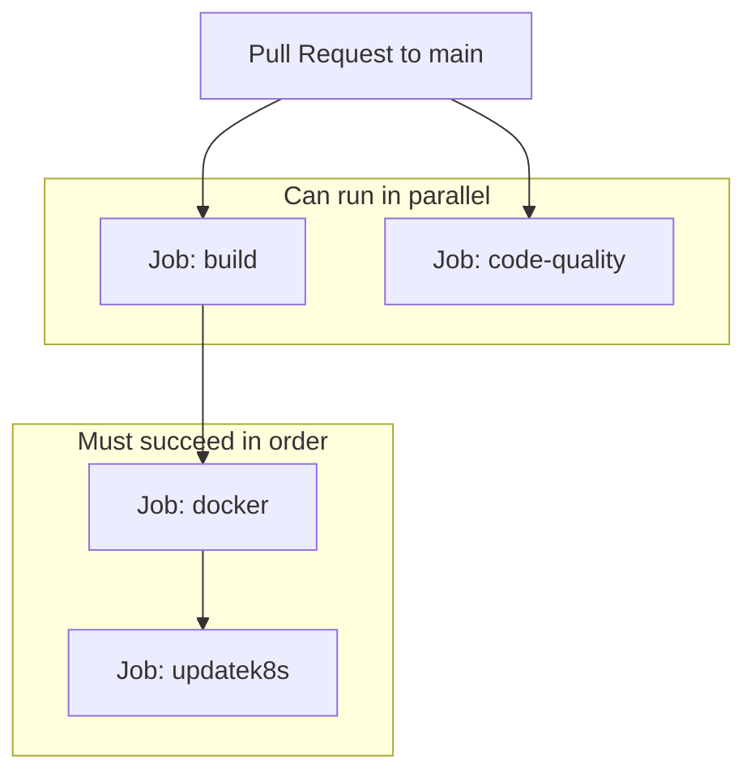

# CI/CD Pipeline Guide — Product Catalog

> **Audience:** Beginners learning CI/CD, GitHub Actions, and GitOps  
> **Workflow file:** `.github/workflows/ci.yaml`  
> **Related:** [BEGINNER_DEVOPS_GUIDE.md](./BEGINNER_DEVOPS_GUIDE.md) · [ARGOCD_TF_EXPLAINED.md](./ARGOCD_TF_EXPLAINED.md) · [ARCHITECTURE.md](./ARCHITECTURE.md)

This guide explains the CI/CD pipeline in this project comprehensively: what CI
and CD mean, how the GitHub Actions workflow works job-by-job, how it relates to
Argo CD / GitOps, and what gaps exist.

---

## Table of Contents

1. [What CI and CD Mean](#1-what-ci-and-cd-mean)
2. [What Exists in This Project](#2-what-exists-in-this-project)
3. [When the Pipeline Runs](#3-when-the-pipeline-runs)
4. [Pipeline Architecture (Jobs)](#4-pipeline-architecture-jobs)
5. [Job-by-Job Breakdown](#5-job-by-job-breakdown)
6. [Full Flow Diagram](#6-full-flow-diagram)
7. [CI vs CD vs GitOps in This Project](#7-ci-vs-cd-vs-gitops-in-this-project)
8. [Traditional vs This Repo vs Full GitOps](#8-traditional-vs-this-repo-vs-full-gitops)
9. [What Is Not in the Pipeline](#9-what-is-not-in-the-pipeline)
10. [Secrets and Permissions](#10-secrets-and-permissions)
11. [Beginner Mental Model](#11-beginner-mental-model)
12. [End-to-End Example](#12-end-to-end-example)
13. [Anti-Patterns (Interview Talking Points)](#13-anti-patterns-interview-talking-points)
14. [How This Fits the Whole Architecture](#14-how-this-fits-the-whole-architecture)
15. [Summary](#15-summary)

---

## 1. What CI and CD Mean

| Term | Full name | Meaning |
|------|-----------|---------|
| **CI** | Continuous Integration | Automatically **build, test, and package** every code change |
| **CD** | Continuous Delivery / Deployment | Automatically **get that package into an environment** (here: update K8s manifests / deploy) |

```text
Developer writes code
        ↓
   CI: build + test + lint + Docker image
        ↓
   CD: put new image into Kubernetes somehow
        ↓
   App runs with new version
```

In this repo, **CI/CD exists only for one service**: `product-catalog`.

---

## 2. What Exists in This Project

| Piece | Location | Role |
|-------|----------|------|
| Pipeline definition | `.github/workflows/ci.yaml` | GitHub Actions workflow |
| Source code | `src/product-catalog/` | Go microservice |
| Dockerfile | `src/product-catalog/Dockerfile` | How the image is built |
| Manifest CI updates | `kubernetes/productcatalog/deploy.yaml` | Image tag written here |
| Other ~19 services | No CI in this fork | Use pre-built upstream images |

**There is no CI for frontend, cart, checkout, payment, etc.** — only
product-catalog.

---

## 3. When the Pipeline Runs

From `.github/workflows/ci.yaml`:

```yaml
on:
  pull_request:
    branches:
      - main
```

The workflow runs on a **pull request targeting `main`**.

Implications:

- Opening or updating a PR to `main` starts the workflow
- It does **not** (by this config alone) run on a direct push to `main` unless a
  PR event fires
- The last job force-pushes to `main`, which is unusual and risky (see
  [Anti-Patterns](#13-anti-patterns-interview-talking-points))

---

## 4. Pipeline Architecture (Jobs)



| Job | Needs | Purpose |
|-----|-------|---------|
| `build` | — | Compile + unit tests |
| `code-quality` | — | Lint (runs in parallel with build) |
| `docker` | `build` | Build and push Docker image |
| `updatek8s` | `docker` | Update YAML image tag and push to Git |

`code-quality` is **not** a requirement for `docker`. Only `build` is. So lint
can fail while the image still gets pushed (a design weakness).

---

## 5. Job-by-Job Breakdown

### Job 1: `build` (CI)

```text
checkout → setup Go 1.22 → go mod download → go build → go test
```

| Step | What it does |
|------|----------------|
| Checkout | Clones the PR branch |
| Setup Go | Installs Go 1.22 |
| Build | Compiles `src/product-catalog` |
| Unit tests | Runs `go test ./...` |

If build or tests fail, the pipeline stops before the Docker path continues.

### Job 2: `code-quality` (CI)

```text
checkout → setup Go → golangci-lint on src/product-catalog
```

Catches style issues, unused code, and common bugs. Runs **in parallel** with
`build`, but does **not** block the docker job.

### Job 3: `docker` (CI → artifact)

```text
checkout → Docker Buildx → login to Docker Hub → build and push image
```

| Detail | Value |
|--------|--------|
| Context | `src/product-catalog` |
| Dockerfile | `src/product-catalog/Dockerfile` |
| Registry | Docker Hub |
| Image name | `$DOCKER_USERNAME/product-catalog` |
| Tag | `$GITHUB_RUN_ID` (unique per workflow run) |

Example image:

```text
abhishekf5/product-catalog:13134113508
```

That matches the style of image currently referenced in
`kubernetes/productcatalog/deploy.yaml`.

**Secrets required for this job:**

| Secret | Purpose |
|--------|---------|
| `DOCKER_USERNAME` | Docker Hub username |
| `DOCKER_TOKEN` | Docker Hub access token / password |

Without these, the docker job fails.

### Job 4: `updatek8s` (CD bridge → Git)

```text
checkout → sed replaces image line → git commit → force push to main
```

What `sed` does conceptually:

```bash
sed -i "s|image: .*|image: $DOCKER_USERNAME/product-catalog:$GITHUB_RUN_ID|" \
  kubernetes/productcatalog/deploy.yaml
```

It rewrites the `image:` line in the Deployment to the newly pushed tag.

Then the workflow commits and force-pushes:

```bash
git add kubernetes/productcatalog/deploy.yaml
git commit -m "[CI]: Update product catalog image tag"
git push origin HEAD:main -f
```

This is the **CD-ish** part: it does **not** run `kubectl apply`. It updates
**Git**, so something else (a human, Argo CD, or another pipeline) can deploy
from Git.

---

## 6. Full Flow Diagram

```mermaid
sequenceDiagram
    participant Dev as Developer
    participant GH as GitHub
    participant GHA as GitHub Actions
    participant DH as Docker Hub
    participant Git as Git main branch
    participant Cluster as EKS / Argo CD

    Dev->>GH: Open PR to main (product-catalog code)
    GH->>GHA: Trigger product-catalog-ci
    GHA->>GHA: build + test (+ lint parallel)
    GHA->>DH: Push image :RUN_ID
    GHA->>Git: Update productcatalog/deploy.yaml + force push main
    Note over Cluster: Deploy only if something applies that YAML
    Git -.->|If Argo watches this file| Cluster
    Git -.->|Or kubectl apply| Cluster
```

---

## 7. CI vs CD vs GitOps in This Project

| Stage | Style | What happens here |
|-------|--------|-------------------|
| Build / test / lint | **CI** | GitHub Actions |
| Build and push image | **CI** (artifact) | Docker Hub |
| Update K8s YAML in Git | **CD bridge** | `updatek8s` job |
| Apply YAML to cluster | **Not done by this pipeline** | You / Argo CD / kubectl |

So this pipeline is best described as:

> **CI + “update Git manifest” CD**, not full “deploy to cluster” CD.

### With the Terraform + Argo CD setup in this repo

| File | Who updates it | Does Argo CD sync it? |
|------|----------------|------------------------|
| `kubernetes/productcatalog/deploy.yaml` | CI `updatek8s` | **No** (Argo only includes `complete-deploy.yaml`) |
| `kubernetes/complete-deploy.yaml` | Not updated by CI | **Yes** |

Today:

```text
Code change → CI builds image → CI updates productcatalog/deploy.yaml
→ Argo CD does NOT pick that up automatically
→ Cluster keeps old image from complete-deploy.yaml
```

That is the **CI → GitOps gap** in this project.

See [ARGOCD_TF_EXPLAINED.md](./ARGOCD_TF_EXPLAINED.md) for how Argo CD is
configured to sync only `complete-deploy.yaml`.

---

## 8. Traditional vs This Repo vs Full GitOps

### Traditional CD

```text
CI builds image → CI runs kubectl/helm against cluster
```

### This fork

```text
CI builds image → CI edits YAML in Git → (hoped-for) GitOps / manual deploy
```

### Full GitOps (ideal)

```text
CI builds image → CI opens PR updating manifests → merge → Argo CD syncs
```

This fork is **closer to GitOps** than pure traditional CD (it writes to Git),
but:

- Uses force push to `main` (anti-pattern)
- Updates a file Argo CD currently ignores
- Only covers one service

---

## 9. What Is Not in the Pipeline

| Missing | Impact |
|---------|--------|
| CI for other microservices | Only product-catalog is automated |
| Security scan (Trivy, etc.) | Images are not scanned |
| Deploy to staging first | Goes straight toward “prod-like” manifests |
| Blocking on lint | Lint can fail; docker still runs |
| Update of `complete-deploy.yaml` | Breaks GitOps with the current Argo CD config |
| Real CD to EKS from Actions | No `kubectl` / `helm` deploy job |
| Path filters | A PR touching only docs may still run full CI |

---

## 10. Secrets and Permissions

| Secret / permission | Used by |
|---------------------|---------|
| `DOCKER_USERNAME` | Docker login and image name |
| `DOCKER_TOKEN` | Docker login |
| `GITHUB_TOKEN` | Checkout and push (default; force-push to main may need extra permissions) |

Also: Docker Hub rate limits or private-repo access apply if the image is
private. EKS worker nodes must be able to pull the image (via NAT egress in the
Terraform VPC setup).

---

## 11. Beginner Mental Model

```text
┌─────────────────────────────────────────────────────────┐
│  CI/CD in THIS project (product-catalog only)           │
│                                                         │
│  You change Go code                                     │
│       ↓                                                 │
│  GitHub Actions: prove it builds and tests              │
│       ↓                                                 │
│  GitHub Actions: ship Docker image to Docker Hub        │
│       ↓                                                 │
│  GitHub Actions: write new image tag into a YAML file   │
│       ↓                                                 │
│  STOP — cluster is NOT updated by this workflow alone   │
│                                                         │
│  Extra step needed:                                     │
│  • Argo CD syncs that YAML, OR                          │
│  • kubectl apply, OR                                    │
│  • update complete-deploy.yaml (for current Argo setup) │
└─────────────────────────────────────────────────────────┘
```

---

## 12. End-to-End Example

1. Change `src/product-catalog/main.go`.
2. Open a PR to `main`.
3. Job `build` compiles and tests.
4. Job `code-quality` lints (in parallel).
5. Job `docker` pushes `youruser/product-catalog:987654321`.
6. Job `updatek8s` sets that tag in `kubernetes/productcatalog/deploy.yaml` and
   force-pushes `main`.
7. **For the cluster to use it**, something must apply that Deployment — or you
   must also change `complete-deploy.yaml` if using the current Argo CD
   Application (which syncs only that file).

---

## 13. Anti-Patterns (Interview Talking Points)

| Practice in this fork | Why it is weak | Better approach |
|-----------------------|----------------|-----------------|
| `git push -f` to `main` | Rewrites history; unsafe | Open a PR to update manifests |
| `sed` on YAML | Brittle string replace | Kustomize / Helm / yq |
| Lint not required for docker | Bad code can ship | `needs: [build, code-quality]` |
| Only one service | Incomplete platform | Pipeline per service or monorepo matrix |
| CI updates file Argo does not sync | Broken GitOps loop | Align manifest path with Argo CD |

---

## 14. How This Fits the Whole Architecture

```text
Application code (src/)
        ↓ CI (GitHub Actions) — product-catalog only
Docker image (Docker Hub)
        ↓ CD bridge (update YAML in Git)
Kubernetes manifests (kubernetes/)
        ↓ GitOps (Argo CD) — if configured to watch the right file
EKS cluster (Terraform-created)
```

| Layer | Tool in this project |
|-------|----------------------|
| Infrastructure | Terraform (`vpc.tf`, `eks.tf`) |
| GitOps platform | Argo CD (`argocd.tf`) |
| App CI/CD | GitHub Actions (`ci.yaml`) — product-catalog only |
| App runtime | Kubernetes manifests |

---

## 15. Summary

| Question | Answer |
|----------|--------|
| Where is CI/CD? | `.github/workflows/ci.yaml` |
| What does it cover? | **Only** product-catalog |
| What is CI here? | Build, test, lint, Docker push |
| What is CD here? | Update `productcatalog/deploy.yaml` and push to Git |
| Does it deploy to EKS? | **No** — not by itself |
| Is it GitOps? | Partially (writes Git); full GitOps needs Argo CD watching that file |
| With the current Argo CD setup? | Syncs `complete-deploy.yaml` only → CI change may **not** roll out |

**One sentence:** This project’s pipeline is a **product-catalog CI factory**
that builds an image and stamps the new tag into Git; deploying that into EKS
is a **separate** step (Argo CD or kubectl), and the current Argo CD config does
not watch the file CI updates.

---

## Related Docs

- [BEGINNER_DEVOPS_GUIDE.md](./BEGINNER_DEVOPS_GUIDE.md) — concepts from basics to advanced
- [ARGOCD_TF_EXPLAINED.md](./ARGOCD_TF_EXPLAINED.md) — how Argo CD is installed and what it syncs
- [TERRAFORM_ARGOCD_DEPLOYMENT.md](./TERRAFORM_ARGOCD_DEPLOYMENT.md) — deploy infra + Argo CD
- [ARCHITECTURE.md](./ARCHITECTURE.md) — section 10: CI/CD Pipelines (deep reference)
