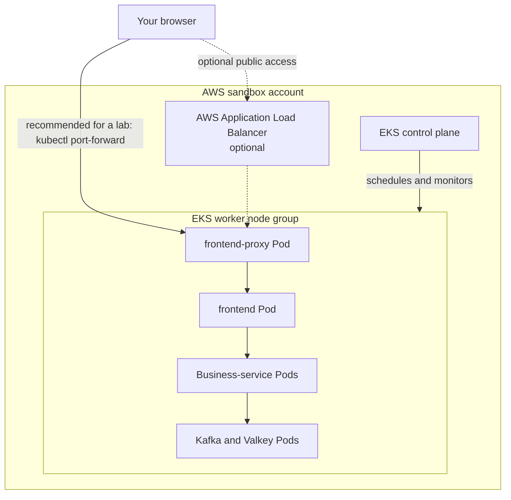

# Beginner Deployment Architecture — AWS Sandbox EKS

This guide explains how to deploy the OpenTelemetry Astronomy Shop application to an **existing AWS EKS sandbox cluster**.

> This repository does not create an EKS cluster, VPC, IAM roles, or node groups. Ask your lab administrator for the cluster name and AWS region.

## 1. What You Are Deploying

The application contains about 20 Kubernetes Deployments. They include:

- Customer-facing components: frontend and frontend-proxy
- Business services: cart, checkout, catalog, payment, shipping, currency, email, recommendations, ads, quotes, and image provider
- Supporting components: Kafka, Valkey, feature flags, load generator, accounting, and fraud detection

The easiest deployment file is:

```text
kubernetes/complete-deploy.yaml
```

It contains the application's Kubernetes Deployments, Services, configuration, and ServiceAccount.

## 2. Beginner Architecture Diagram



### What each part means

- **EKS control plane:** AWS-managed Kubernetes API and scheduler.
- **Worker nodes:** EC2 instances where the application Pods run.
- **Pod:** One running instance of a containerized service.
- **Deployment:** Tells Kubernetes how to create and maintain Pods.
- **Service:** Gives Pods a stable internal DNS name and port.
- **frontend-proxy:** The application's entry point on port `8080`.
- **ALB Ingress:** Optional public entry point. It needs extra AWS setup.
- **Namespace:** A logical folder inside Kubernetes. This guide uses `otel-demo`.

## 3. Request Flow

When you open the shop, the request follows this path:

```text
Browser
  -> localhost:8080 (kubectl port-forward)
  -> frontend-proxy Service
  -> frontend Pod
  -> checkout, cart, catalog, payment, and other Services
  -> Kafka or Valkey when required
```

Kubernetes Services use internal DNS. For example, application Pods can reach the frontend proxy using the name:

```text
opentelemetry-demo-frontendproxy
```

Pod IP addresses can change, but the Service name remains stable.

## 4. Sandbox Requirements

Before deployment, confirm that you have:

- An AWS sandbox account and an existing EKS cluster
- AWS CLI, `kubectl`, and permission to access the cluster
- The cluster name and AWS region
- Worker nodes in the `Ready` state
- Internet access from worker nodes to pull public container images
- Enough capacity for the application

The manifest defines approximately **4.24 GiB of total container memory limits**. Kubernetes and EKS system Pods also need memory. For a learning environment, use at least **8 GiB of total allocatable worker-node memory** when possible. A single 4 GiB node is normally too small.

Check the tools:

```bash
aws --version
kubectl version --client
```

Check your AWS identity:

```bash
aws sts get-caller-identity
```

## 5. Connect kubectl to EKS

Replace the placeholder values:

```bash
export CLUSTER_NAME="<your-cluster-name>"
export AWS_REGION="<your-aws-region>"

aws eks update-kubeconfig \
  --name "$CLUSTER_NAME" \
  --region "$AWS_REGION"
```

Confirm that the connection works:

```bash
kubectl cluster-info
kubectl get nodes -o wide
```

Do not continue until every required worker node reports `Ready`.

## 6. Deploy the Application

Run these commands from the repository root:

```bash
kubectl create namespace otel-demo
kubectl apply \
  --namespace otel-demo \
  --filename kubernetes/complete-deploy.yaml
```

If the namespace already exists, Kubernetes will report an `AlreadyExists` error. That is safe; continue with `kubectl apply`.

Watch the Pods start:

```bash
kubectl get pods --namespace otel-demo --watch
```

Press `Ctrl+C` to stop watching. Starting every image can take several minutes.

Check the Deployments:

```bash
kubectl get deployments --namespace otel-demo
kubectl get services --namespace otel-demo
```

## 7. Open the Shop

For a restricted or temporary sandbox, use port forwarding. It avoids ALB permissions and cost:

```bash
kubectl port-forward \
  --namespace otel-demo \
  service/opentelemetry-demo-frontendproxy \
  8080:8080
```

Keep that terminal open and visit:

```text
http://localhost:8080
```

The connection ends when you stop the command.

## 8. Optional ALB Access

The repository includes:

```text
kubernetes/frontendproxy/ingress.yaml
```

Do not apply it unless the sandbox already has:

- AWS Load Balancer Controller
- Correct controller IAM permissions
- Correct public-subnet tags
- Permission to create ALBs, target groups, and security groups

The file currently uses the placeholder host `example.com`. Replace it with a DNS name you control, or deliberately configure a hostless rule, before using it.

If all prerequisites are available:

```bash
kubectl apply \
  --namespace otel-demo \
  --filename kubernetes/frontendproxy/ingress.yaml

kubectl get ingress --namespace otel-demo
kubectl describe ingress frontend-proxy --namespace otel-demo
```

Creating an ALB can take several minutes and may incur AWS charges. Port forwarding is the safer beginner option.

## 9. Verify and Troubleshoot

### Find Pods that are not running

```bash
kubectl get pods --namespace otel-demo
kubectl get events \
  --namespace otel-demo \
  --sort-by=.metadata.creationTimestamp
```

### A Pod is Pending

Inspect it:

```bash
kubectl describe pod <pod-name> --namespace otel-demo
```

Common cause: the worker nodes do not have enough free CPU or memory.

### ImagePullBackOff

```bash
kubectl describe pod <pod-name> --namespace otel-demo
```

Common causes:

- Worker nodes cannot reach the image registry
- The image name or tag does not exist
- A registry is rate-limiting downloads

### CrashLoopBackOff

Read the current and previous container logs:

```bash
kubectl logs <pod-name> --namespace otel-demo
kubectl logs <pod-name> --namespace otel-demo --previous
```

For a multi-container Pod, add `--container <container-name>`.

### The page does not open

Confirm that the frontend-proxy Service and Pod exist:

```bash
kubectl get service opentelemetry-demo-frontendproxy \
  --namespace otel-demo

kubectl get pods \
  --namespace otel-demo \
  --selector opentelemetry.io/name=opentelemetry-demo-frontendproxy
```

Then restart the port-forward command.

### OpenTelemetry collector warning

The current Kubernetes manifests reference the DNS name `opentelemetry-demo-otelcol`, but they do **not** define an OpenTelemetry Collector Service or Deployment. The shop may run while telemetry export reports connection or DNS errors. The full local observability stack in `docker-compose.yml` is not automatically deployed to EKS.

## 10. Clean Up

Delete the application when the lab is finished:

```bash
kubectl delete namespace otel-demo
```

Deleting the namespace removes the namespaced application resources in it.

If you created an ALB Ingress, verify that AWS removed the ALB:

```bash
aws elbv2 describe-load-balancers --region "$AWS_REGION"
```

The EKS cluster and worker nodes are external to this repository. Deleting the namespace does not delete them.

## 11. Deployment Checklist

- [ ] AWS identity is correct
- [ ] `kubectl` is connected to the intended sandbox cluster
- [ ] Worker nodes are `Ready`
- [ ] Nodes have enough memory
- [ ] `otel-demo` namespace exists
- [ ] `complete-deploy.yaml` was applied
- [ ] Pods and Deployments were checked
- [ ] The shop opens through port forwarding
- [ ] The namespace is deleted after the lab

## 12. Files to Know

- `kubernetes/complete-deploy.yaml` — complete application manifest
- `kubernetes/<service>/deploy.yaml` — individual service Deployment
- `kubernetes/<service>/svc.yaml` — individual service Service
- `kubernetes/frontendproxy/ingress.yaml` — optional AWS ALB Ingress
- `docs/ARCHITECTURE.md` — detailed full-project architecture reference
