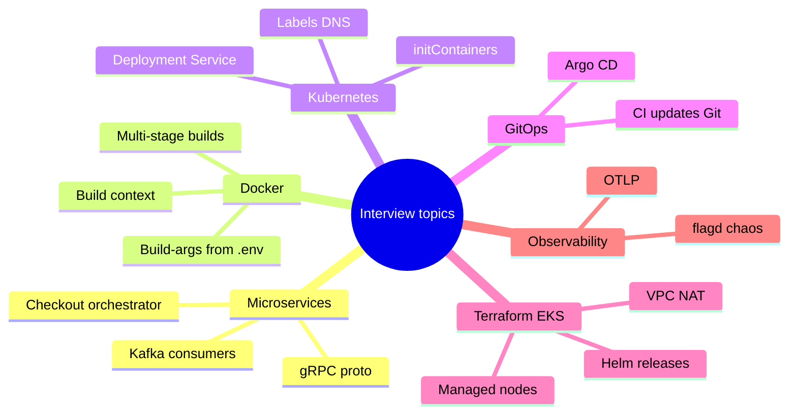
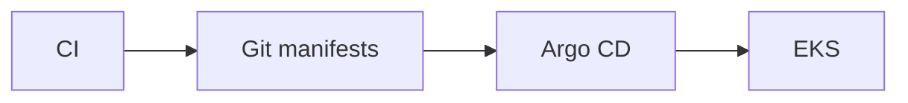
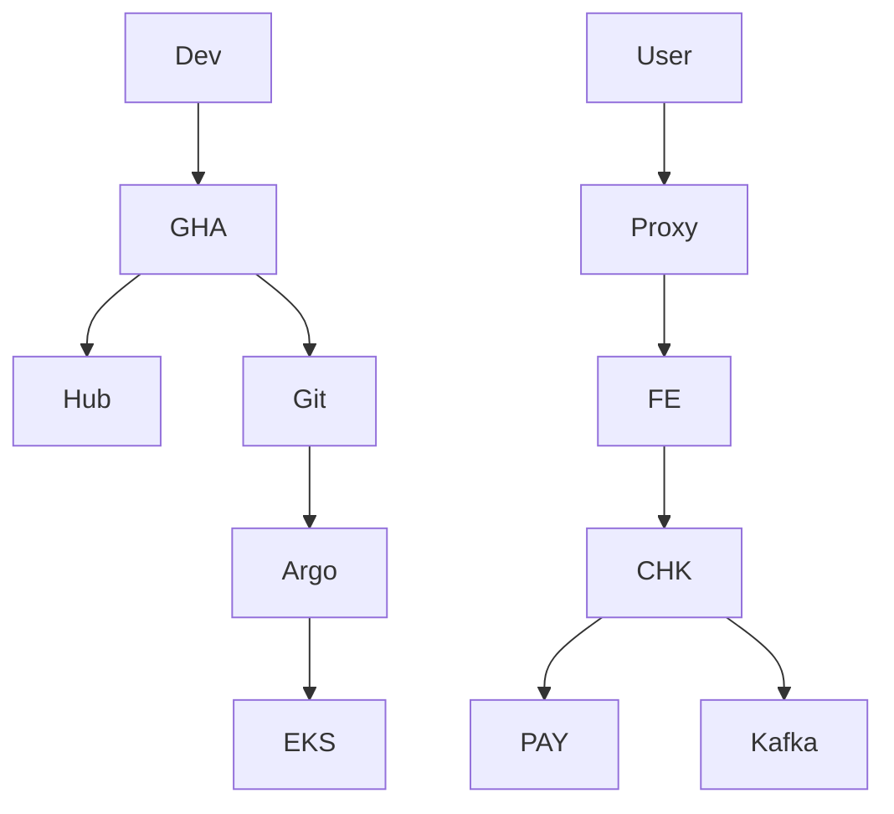

# Interview Questions — This Project (Terraform, EKS, Docker, K8s, GitOps)

> Practice **out loud**. Prefer answers that cite **files in this repo**.  
> Diagrams: [microservices/_SERVICE_MAP.md](./microservices/_SERVICE_MAP.md)

---

## A. Microservices & communication

**Q1. What is a microservice in this demo?**  
**A:** A small independently deployable service under `src/<name>/` with its own Dockerfile and usually `kubernetes/<name>/` manifests. Together they form the Astronomy Shop.

**Q2. How do services talk?**  
**A:** Mostly **gRPC** (contract `pb/demo.proto`). Some **HTTP** (email, quote, frontend). **Kafka** for async order events. **Valkey** for cart state.

**Q3. Why is checkout special?**  
**A:** It is the **orchestrator** — calls cart, catalog, currency, payment, shipping, email, and publishes to Kafka. See [checkout.md](./microservices/checkout.md) and the place-order sequence in `_SERVICE_MAP.md`.

**Q4. Why don’t accounting and fraud expose a Service?**  
**A:** They are **Kafka consumers**, not request/response APIs. No `svc.yaml`.

**Q5. How does frontend find product-catalog in the cluster?**  
**A:** Env like `PRODUCT_CATALOG_SERVICE_ADDR=opentelemetry-demo-productcatalogservice:8080` → CoreDNS → ClusterIP Service → Pods.

---

## B. Docker & images

**Q6. What does a multi-stage Dockerfile buy you?**  
**A:** Build tools in a builder stage; tiny runtime stage. Example: `src/product-catalog/Dockerfile`, `src/currency/Dockerfile`.

**Q7. Why did email CI fail with `COPY ./src/email` not found?**  
**A:** Dockerfile expects **repo root** context; CI had used `src/email`. Fixed by building with `context: .`.

**Q8. Why did currency fail with git clone exit 128?**  
**A:** Missing `OPENTELEMETRY_CPP_VERSION` build-arg → branch `v`. Fixed via Dockerfile default + CI reading `.env`.

**Q9. Why Java agent 404 (`.../download/v/...`)?**  
**A:** Empty `OTEL_JAVA_AGENT_VERSION` for fraud-detection/kafka. Same class of bug.

**Q10. Where do CI images go?**  
**A:** Docker Hub `DOCKER_USERNAME/<service>:<github.run_id>` via `reusable-service-ci.yaml`.

**Q11. Secrets: password in chat?**  
**A:** Never. Use GitHub Actions secrets `DOCKER_USERNAME` / `DOCKER_TOKEN` (PAT with write scope).

---

## C. Kubernetes YAML

**Q12. Deployment vs Service?**  
**A:** Deployment manages Pods; Service gives stable DNS/IP and load-balances to Pods selected by labels.

**Q13. What happens if Service selector ≠ Pod labels?**  
**A:** Endpoints empty → connection refused/timeouts.

**Q14. What is ClusterIP?**  
**A:** Internal-only virtual IP — default for shop Services here.

**Q15. Explain `imagePullPolicy: IfNotPresent`.**  
**A:** Use local image if present; otherwise pull. With unique tags (`:run_id`) you still get new images.

**Q16. What does `fieldRef` on `OTEL_SERVICE_NAME` do?**  
**A:** Reads Pod label into env at runtime — no hardcoding service name string twice.

**Q17. Why initContainer wait-for-kafka?**  
**A:** Delay main container until Kafka port is open — dependency ordering without app changes.

**Q18. Why are memory limits so low (e.g. 20Mi)?**  
**A:** Demo defaults from upstream chart render — **not** production sizing. Call that out.

**Q19. Namespace?**  
**A:** Argo destination `otel-demo` (`var.app_namespace`).

**Q20. ServiceAccount?**  
**A:** `kubernetes/serviceaccount.yaml` → `serviceAccountName: opentelemetry-demo` on Deployments.

---

## D. Helm

**Q21. Chart vs values vs release?**  
**A:** Chart = templates; values = config; release = installed instance.

**Q22. Does this repo deploy the shop with Helm?**  
**A:** **No** for the shop app — it applies **rendered YAML**. Helm **is** used in Terraform to install **Argo CD**.

**Q23. What does `# Source: opentelemetry-demo/templates/component.yaml` mean?**  
**A:** File came from `helm template` of upstream chart.

**Q24. Pros/cons of storing rendered manifests?**  
**A:** Pros: exact GitOps diffs. Cons: harder bulk config changes vs values.yaml.

---

## E. Argo CD & GitOps

**Q25. What is GitOps?**  
**A:** Git is desired state; a controller (Argo) reconciles the cluster to match.

**Q26. Application name?**  
**A:** `otel-demo` (`terraform/argocd.tf`, `argocd/application.yaml`).

**Q27. Why exclude `complete-deploy.yaml`?**  
**A:** Same Deployments/Services exist in per-folder YAML — syncing both duplicates resources.

**Q28. What is selfHeal?**  
**A:** If someone `kubectl edit`s away from Git, Argo reverts.

**Q29. What is prune?**  
**A:** Objects removed from Git are deleted from cluster.

**Q30. Does CI run kubectl?**  
**A:** No — CI updates Git; Argo applies.

**Q31. How do you bootstrap Argo?**  
**A:** `terraform apply` installs Argo Helm chart + Application via `argocd-apps` chart.

---

## F. Terraform & EKS (this repo)

**Q32. What does Terraform create here?**  
**A:** VPC (public/private subnets, NAT), EKS cluster + node group, Argo CD Helm releases. See `terraform/vpc.tf`, `eks.tf`, `argocd.tf`.

**Q33. Why private nodes + NAT?**  
**A:** Nodes without public IPs; NAT for outbound pulls (Docker Hub, APIs).

**Q34. How do providers auth to the cluster?**  
**A:** `providers.tf` uses `aws eks get-token` exec plugin for Helm/Kubernetes providers.

**Q35. Important variables?**  
**A:** `git_repo_url`, `git_target_revision`, `git_manifest_path`, `app_namespace`, node sizes — `variables.tf`.

**Q36. EKS vs self-managed Kubernetes?**  
**A:** EKS = AWS-managed control plane; you manage node groups/addons.

**Q37. How do you destroy safely?**  
**A:** Follow `TERRAFORM_ARGOCD_DEPLOYMENT.md` / sandbox runbooks — destroy Argo apps carefully, then Terraform destroy (watch for stuck finalizers/ELBs).

**Q38. Is ALB Ingress installed by this Terraform?**  
**A:** `frontendproxy/ingress.yaml` may exist, but AWS Load Balancer Controller is **not** fully provisioned by these TF files — use port-forward for demos unless you add the controller.

---

## G. CI/CD (GitHub Actions)

**Q39. product-catalog vs others?**  
**A:** `ci.yaml` adds Go build/test/lint; `microservices-ci.yaml` matrices other services; both call `reusable-service-ci.yaml`.

**Q40. Why max-parallel: 1?**  
**A:** Avoid raced git commits when updating manifests on `main`.

**Q41. Why workflow_dispatch?**  
**A:** Manual “build all services” bootstrap.

**Q42. Why contents: write on caller?**  
**A:** Reusable workflows cannot escalate permissions; callers must grant write to commit tags.

**Q43. Why pull --rebase before push locally?**  
**A:** CI also commits to `main` — histories diverge otherwise. See `GIT_ISSUES_EXPLAINED.md`.

---

## H. Observability & flags

**Q44. What is OTLP?**  
**A:** OpenTelemetry Protocol — apps export traces/metrics/logs to a collector endpoint (`OTEL_EXPORTER_OTLP_ENDPOINT`).

**Q45. What is flagd for?**  
**A:** Open Feature flags — demos inject latency/errors without code changes (`FLAGD_HOST`).

**Q46. Honest gap?**  
**A:** Full Grafana/Jaeger/collector stack is richer in **Docker Compose** than in the Argo-synced per-service K8s tree — don’t claim the EKS path has every Compose observability component unless you added them.

---

## I. Troubleshooting scenarios

**Q47. New image in Docker Hub but Pods old?**  
**A:** Check: did CI commit `deploy.yaml`? Is Argo Healthy/Synced? Is Application excluding the file you edited? ImagePullErrors?

**Q48. CrashLoop on cart?**  
**A:** Valkey reachable? `VALKEY_ADDR`? initContainer wait? logs.

**Q49. Checkout can’t reach payment?**  
**A:** Service name/port env; endpoints; network policies (none here); DNS.

**Q50. Build OOM on currency?**  
**A:** C++ + opentelemetry-cpp compile is heavy on GHA runners — expect long builds; may need larger runners.

---

## J. Whiteboard challenge (ask yourself)

Draw in 5 minutes:

Then narrate place-order from `_SERVICE_MAP.md`.

---

## Study order for interviews

1. [microservices/README.md](./microservices/README.md)  
2. [microservices/_SERVICE_MAP.md](./microservices/_SERVICE_MAP.md) *(diagrams)*  
3. [microservices/_KUBERNETES_YAML_HELM_ARGOCD.md](./microservices/_KUBERNETES_YAML_HELM_ARGOCD.md)  
4. [microservices/product-catalog.md](./microservices/product-catalog.md) + [checkout.md](./microservices/checkout.md)  
5. `terraform/*.tf` + [ARGOCD_TF_EXPLAINED.md](./ARGOCD_TF_EXPLAINED.md)  
6. Re-answer this file without looking  

**Confidence check:** If you can explain CI → Git → Argo → Pod and checkout’s fan-out without notes, you are interview-ready for this project’s DevOps story.
