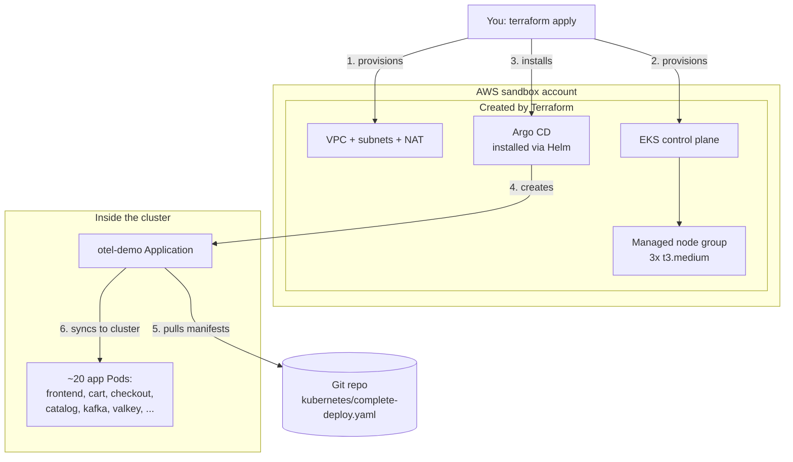

# Deploy with Terraform + Argo CD (GitOps)

This guide provisions the entire AWS infrastructure with **Terraform** and
deploys the OpenTelemetry Astronomy Shop with **Argo CD** using GitOps.

- Terraform builds: VPC, subnets, NAT gateway, EKS control plane, either a
  managed EC2 node group **or** Fargate profiles (`compute_type` in tfvars),
  AWS Load Balancer Controller, and Argo CD.
- Argo CD deploys the application from Git by syncing the per-service manifests
  under `kubernetes/` (not only `complete-deploy.yaml`).

> Designed for an 8-hour AWS sandbox. Because the sandbox auto-shuts down, manual
> cleanup is optional (see the last section).

## Architecture



## Compute mode (EC2 vs Fargate)

Set in `terraform/terraform.tfvars`:

```hcl
compute_type = "ec2"      # managed node group (default)
# compute_type = "fargate"  # serverless pods — no EC2 workers
```

| Mode | What Terraform creates | Notes |
|------|------------------------|--------|
| `ec2` | Managed node group (`node_*` vars) | Cheaper for always-on demos; Classic/NLB via AWS LB Controller |
| `fargate` | Fargate profiles for `kube-system`, `argocd`, and `otel-demo` | CoreDNS `computeType=Fargate`; no EC2 nodes; NLB with IP targets required |

**Do not flip `compute_type` on a live cluster** without a destroy — replacing
nodes with Fargate (or the reverse) is disruptive. Prefer:

```bash
terraform destroy
# edit compute_type in terraform.tfvars
terraform apply
```

`frontendproxy` uses NLB annotations (`aws-load-balancer-type: external`,
`nlb-target-type: ip`) so the same Service works on Fargate and EC2 once the
AWS Load Balancer Controller (installed by Terraform) is ready.

## How It Works

1. Terraform creates the network and the EKS cluster with a `t3.medium` node
   group (3 nodes, autoscaling to 4).
2. Terraform installs Argo CD via its Helm chart.
3. Terraform installs the `argocd-apps` Helm release, which creates one Argo CD
   `Application` named `otel-demo`.
4. That Application watches the Git repo and syncs
   `kubernetes/complete-deploy.yaml` into the `otel-demo` namespace.
5. Argo CD keeps the cluster matching Git (`selfHeal` and `prune` are on).

## Files

```text
terraform/
  versions.tf              # Terraform and provider version constraints
  providers.tf             # aws, kubernetes, and helm providers
  variables.tf             # Inputs (compute_type, region, sizes, git repo, …)
  locals.tf                # EC2 vs Fargate conditional maps
  vpc.tf                   # VPC module
  eks.tf                   # EKS cluster + node group OR Fargate profiles
  aws_lb_controller.tf     # AWS LB Controller (NLB IP targets for Fargate/EC2)
  cleanup.tf               # Destroy-time wait for leftover ELBs
  argocd.tf                # Installs Argo CD + bootstraps the Application
  outputs.tf               # Helpful commands and cluster info
  terraform.tfvars.example # Copy to terraform.tfvars and edit
argocd/
  application.yaml         # Standalone Application (manual alternative)
```

For a line-by-line beginner explanation of `argocd.tf`, see
[ARGOCD_TF_EXPLAINED.md](./ARGOCD_TF_EXPLAINED.md).

For how the product-catalog GitHub Actions pipeline relates to Argo CD / GitOps,
see [CI_CD_PIPELINE.md](./CI_CD_PIPELINE.md).

## Prerequisites

- AWS CLI, Terraform >= 1.5, and kubectl installed
- Sandbox AWS credentials exported, with permission to create VPC, EKS, IAM, and
  EC2 resources
- The manifests pushed to a Git branch Argo CD can reach (defaults to
  `durgaprasadraju/ultimate-devops-project-demo`, branch `main`)

## Do I Need to Install Helm and Argo CD?

**Short answer:** Argo CD must run inside the EKS cluster, but you do **not**
need to install Helm or Argo CD manually when using this Terraform setup.

### On your laptop

| Tool | Required? | Why |
|------|-----------|-----|
| **Terraform** | Yes | Creates VPC, EKS, and installs Argo CD |
| **AWS CLI** | Yes | Authenticates to AWS and EKS |
| **kubectl** | Yes | Check pods, port-forward, debug |
| **Helm CLI** | **No** | Terraform's Helm provider installs charts for you |
| **Argo CD CLI** | No | Optional; the UI or kubectl is enough |

### Inside the EKS cluster (automatic)

When you run `terraform apply`, Terraform handles everything via
`terraform/argocd.tf`:

1. **Installs Argo CD** into the `argocd` namespace (Helm chart `argo-cd`)
2. **Creates the `otel-demo` Application** (Helm chart `argocd-apps`)
3. **Argo CD deploys the shop** by syncing `kubernetes/complete-deploy.yaml`
   from Git

You do **not** need to run commands like:

```bash
helm install argocd ...
kubectl apply -f argocd/application.yaml
```

Those are only needed if you skip Terraform and install Argo CD by hand.

### Helm vs Argo CD — what's the difference?

- **Helm** is a packaging tool. It does not run as a permanent service inside
  the cluster. Terraform uses the Helm *provider* to install charts.
- **Argo CD** is a GitOps controller. It **does** run inside EKS (server,
  repo-server, and controller pods) and keeps your application in sync with Git.

### End-to-end flow

```text
terraform apply
  → creates EKS
  → installs Argo CD (inside cluster)
  → Argo CD syncs the app from Git
  → ~20 shop pods start running
```

After `terraform apply`, verify with:

```bash
kubectl get pods -n argocd
kubectl get applications -n argocd
kubectl get pods -n otel-demo
```

## 8-Hour Timeline

| Time | Phase |
|------|-------|
| 0:00–0:20 | Export credentials, edit `terraform.tfvars` |
| 0:20–0:40 | `terraform init` |
| 0:40–1:10 | `terraform apply` starts (VPC + EKS) |
| 1:10–1:30 | Cluster finishes, Argo CD installs |
| 1:30–2:15 | Argo CD syncs the app; wait for Pods |
| 2:15–3:00 | Access the shop and Argo CD UI |
| 3:00–7:30 | Explore GitOps: change Git, watch auto-sync |
| 7:30–8:00 | Optional `terraform destroy` before shutdown |

## Step 1 — Credentials

```bash
export AWS_ACCESS_KEY_ID=...
export AWS_SECRET_ACCESS_KEY=...
export AWS_SESSION_TOKEN=...
export AWS_REGION=us-east-1

aws sts get-caller-identity
```

## Step 2 — Configure Variables

```bash
cd terraform
cp terraform.tfvars.example terraform.tfvars
# Edit region, cluster_name, and git_repo_url / git_target_revision if needed.
```

Argo CD pulls manifests from Git, so make sure your changes are pushed to the
branch named in `git_target_revision`.

## Step 3 — Provision Everything

```bash
terraform init
terraform apply
```

Type `yes` when prompted. Creating the VPC and EKS cluster takes about 15–25
minutes. Terraform then installs Argo CD and creates the Application.

## Step 4 — Connect kubectl

Use the command from the Terraform output:

```bash
aws eks update-kubeconfig --name otel-demo --region us-east-1
kubectl get nodes -o wide
```

## Step 5 — Watch Argo CD Sync the App

```bash
kubectl get applications -n argocd
kubectl get pods -n otel-demo -w
```

Wait until the `otel-demo` Application reports `Synced` and `Healthy` and the
Pods are `Running`.

## Step 6 — Open the Argo CD UI (optional)

```bash
# Initial admin password:
kubectl -n argocd get secret argocd-initial-admin-secret \
  -o jsonpath="{.data.password}" | base64 -d; echo

# Port-forward the UI:
kubectl -n argocd port-forward svc/argocd-server 8081:443
```

Open `https://localhost:8081` and log in as `admin`.

## Step 7 — Open the Shop

### Preferred: public LoadBalancer URL

`kubernetes/frontendproxy/svc.yaml` is `type: LoadBalancer` (other services stay
`ClusterIP`). After sync, AWS assigns an ELB hostname:

```bash
kubectl get svc opentelemetry-demo-frontendproxy -n otel-demo \
  -o jsonpath='http://{.status.loadBalancer.ingress[0].hostname}:8080{"\n"}'
```

Open that `http://…elb.amazonaws.com:8080` URL in a browser (wait 1–2 minutes
after the Service becomes `LoadBalancer` for health checks).

### Alternative: port-forward (no public IP needed)

```bash
kubectl -n otel-demo port-forward \
  svc/opentelemetry-demo-frontendproxy 8080:8080
```

Open `http://localhost:8080`.

## Try the GitOps Loop

1. Edit something in `kubernetes/complete-deploy.yaml` (for example, a
   Deployment's replica count).
2. Commit and push to the tracked branch.
3. Argo CD detects the change and syncs it automatically. Watch it in the UI or
   with `kubectl get applications -n argocd`.

## Troubleshooting

Application not syncing:

```bash
kubectl describe application otel-demo -n argocd
```

Pods `Pending` (not enough node memory) — scale the node group:

```bash
aws eks update-nodegroup-config \
  --cluster-name otel-demo --nodegroup-name workers \
  --scaling-config minSize=3,maxSize=5,desiredSize=4 \
  --region us-east-1
```

Image pull failures usually mean the nodes lack egress; confirm the NAT gateway
came up in the VPC.

The Kubernetes manifests omit the OpenTelemetry Collector, so telemetry errors
pointing at `opentelemetry-demo-otelcol` are expected and safe to ignore.

## Cleanup

```bash
cd terraform
terraform destroy
```

**Destroy order (built into Terraform):**

1. Helm releases (Argo app finalizer deletes shop resources when possible).
2. EKS control plane / node groups / Fargate profiles.
3. `null_resource.wait_for_elb_cleanup` — **actively** deletes leftover Classic
   ELBs / NLBs in the VPC, waits for ENIs, then deletes `k8s-elb-*` security
   groups (these are not in Terraform state and previously blocked VPC delete).
4. VPC (subnets, IGW, NAT, …).

If destroy still fails on the VPC, run:

```bash
VPC_ID=vpc-xxxxxxxx
REGION=us-east-1
aws elb describe-load-balancers --region $REGION \
  --query "LoadBalancerDescriptions[?VPCId=='$VPC_ID'].LoadBalancerName" --output text
aws ec2 describe-security-groups --region $REGION --filters Name=vpc-id,Values=$VPC_ID \
  --query "SecurityGroups[?starts_with(GroupName,'k8s-')].[GroupId,GroupName]" --output table
```
