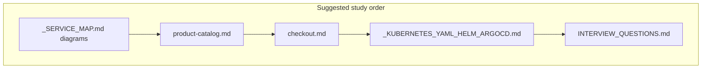
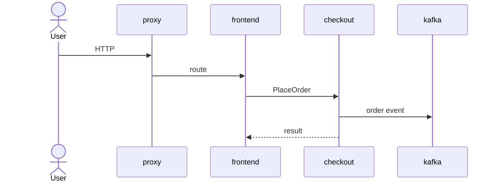
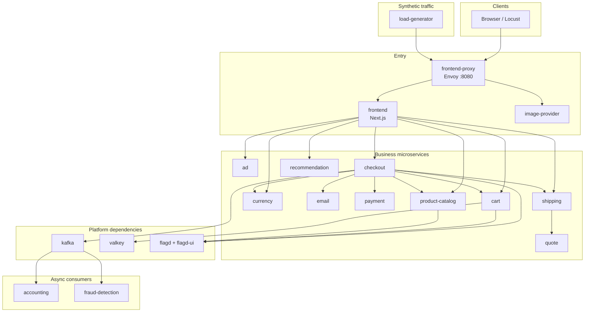

# Microservices Learning Path — Astronomy Shop (This Fork)

> **Audience:** Junior engineers preparing for mid-level DevOps interviews  
> **Mentor voice:** Treat this folder as a guided tour of a real polyglot shop, not a slide deck.  
> **Upstream:** Fork of [open-telemetry/opentelemetry-demo](https://github.com/open-telemetry/opentelemetry-demo) (Astronomy Shop)

This README is your **map**. Read it once end-to-end, then follow the learning path in order.

| Doc | Purpose |
|-----|---------|
| **[_SERVICE_MAP.md](./_SERVICE_MAP.md)** | **Start here for diagrams** — topology, place-order sequence, DNS, GitOps |
| [_KUBERNETES_YAML_HELM_ARGOCD.md](./_KUBERNETES_YAML_HELM_ARGOCD.md) | Line-by-line YAML + Helm + Argo CD |
| Per-service `*.md` | Architecture, deps diagrams, K8s, CI, quiz |
| [`../INTERVIEW_QUESTIONS.md`](../INTERVIEW_QUESTIONS.md) | 50+ Q&A with mindmap |

Deep Kubernetes/GitOps detail lives in [`_KUBERNETES_YAML_HELM_ARGOCD.md`](./_KUBERNETES_YAML_HELM_ARGOCD.md). Interview drill lives in [`../INTERVIEW_QUESTIONS.md`](../INTERVIEW_QUESTIONS.md).

---

## Visual first (diagrams)



**Place-order (short form)** — full version in [_SERVICE_MAP.md](./_SERVICE_MAP.md):



---

## 1. What you are studying

The Astronomy Shop is a fake e-commerce site built as **many small services** in different languages. The product goal is observability (OpenTelemetry). This fork’s engineering goal is **CI → Docker Hub → GitOps → EKS**.

| Layer | Where it lives | What to remember |
|-------|----------------|------------------|
| Application source | `src/<service>/` | One deployable unit per folder |
| Shared gRPC contract | `pb/demo.proto` | Language-neutral API definitions |
| Kubernetes manifests | `kubernetes/<svc>/` | Rendered Helm YAML (not the chart) |
| CI | `.github/workflows/` | Build, push, patch `deploy.yaml` image tags |
| Infra as code | `terraform/` | VPC, EKS, Argo CD Helm releases |
| Argo CD Application | `argocd/application.yaml` + `terraform/argocd.tf` | Syncs `kubernetes/` (excludes `complete-deploy.yaml`) |

---

## 2. Learning path (read in this order)

Do not skip steps. Each one builds vocabulary you will need in interviews.

### Step 1 — Big picture (30–45 min)

1. This file (architecture diagram + GitOps section below).
2. **[_SERVICE_MAP.md](./_SERVICE_MAP.md)** — all Mermaid diagrams (topology, place-order, cart, DNS, GitOps).
3. Skim [`../ARCHITECTURE.md`](../ARCHITECTURE.md) sections on services and request flows (ignore outdated “no Terraform” notes if you see them — this fork **does** have `terraform/`).
4. Open `pb/demo.proto` and find `ProductCatalogService`, `CheckoutService`, `CartService`.

**Exit check:** You can redraw the place-order sequence from memory.

### Step 2 — One service deeply (product-catalog) (1–2 hr)

1. `src/product-catalog/` — Go gRPC service, product JSON under `products/`.
2. `src/product-catalog/Dockerfile` — multi-stage build.
3. `kubernetes/productcatalog/deploy.yaml` + `svc.yaml` — **line-by-line** with [`_KUBERNETES_YAML_HELM_ARGOCD.md`](./_KUBERNETES_YAML_HELM_ARGOCD.md).
4. `.github/workflows/ci.yaml` + `reusable-service-ci.yaml` — how the image tag lands in Git.

**Exit check:** You can walk from a PR to a new Pod without saying “Kubernetes deploys itself.”

### Step 3 — Dependencies and patterns (1 hr)

1. **Cart + Valkey** — `kubernetes/cart/deploy.yaml` (`VALKEY_ADDR`, `wait-for-valkey` initContainer).
2. **Checkout + Kafka** — `kubernetes/checkout/deploy.yaml` (`KAFKA_SERVICE_ADDR`, `wait-for-kafka`).
3. **Feature flags** — `kubernetes/flagd/` (`FLAGD_HOST` / `FLAGD_PORT` on many services).
4. **Entry point** — `kubernetes/frontendproxy/` (Envoy) + optional `ingress.yaml`.

**Exit check:** You can explain ClusterIP DNS, label selectors, and why initContainers wait on ports.

### Step 4 — Platform (1–2 hr)

1. `terraform/vpc.tf` → `eks.tf` → `argocd.tf` → `providers.tf` / `variables.tf` / `outputs.tf`.
2. `argocd/application.yaml` (manual twin of the Terraform-managed Application).
3. `.github/workflows/microservices-ci.yaml` — change detection matrix for the rest of the shop.

**Exit check:** You can draw CI → Docker Hub → Git → Argo CD → EKS on a whiteboard.

### Step 5 — Interview drill (ongoing)

Work through [`../INTERVIEW_QUESTIONS.md`](../INTERVIEW_QUESTIONS.md) out loud. Prefer “in this repo, file X says…” over abstract buzzwords.

---

## 3. Architecture diagram (shop services + platform deps)



**Notes for interviews**

- **frontend-proxy** is the single HTTP front door on port `8080`. Its Service is
  `type: LoadBalancer` (`kubernetes/frontendproxy/svc.yaml`) so browsers can open
  the AWS ELB URL; all other microservices stay `ClusterIP` (internal only).
  Port-forward (`app_port_forward` Terraform output) still works as a fallback.
- **Valkey** (Redis-compatible) backs the cart.
- **Kafka** carries order events to accounting and fraud-detection.
- **flagd** serves Open Feature flags used to inject failures/latency for demos.
- Many Deployments set `OTEL_EXPORTER_OTLP_ENDPOINT` to `http://opentelemetry-demo-otelcol:4317`. The **per-service** tree under `kubernetes/` that Argo syncs does **not** include an OTel Collector Deployment (collector/Jaeger/Grafana are primarily a **Docker Compose** story in `src/otel-collector`, `src/jaeger`, etc.). Say that honestly in interviews.

---

## 4. Service docs index

Study services via source + manifests. Dedicated notes (when present) live beside this README. Start with product-catalog; then follow dependencies outward.

| Service | Language / role | Source | K8s | Service doc |
|---------|-----------------|--------|-----|-------------|
| product-catalog | Go — product listings (gRPC) | `src/product-catalog/` | `kubernetes/productcatalog/` | [product-catalog.md](./product-catalog.md) |
| cart | .NET — cart state (gRPC) | `src/cart/` | `kubernetes/cart/` | [cart.md](./cart.md) |
| checkout | Go — order orchestration (gRPC) | `src/checkout/` | `kubernetes/checkout/` | [checkout.md](./checkout.md) |
| payment | Node.js — fake charges (gRPC) | `src/payment/` | `kubernetes/payment/` | [payment.md](./payment.md) |
| shipping | Rust — shipping (HTTP/gRPC) | `src/shipping/` | `kubernetes/shipping/` | [shipping.md](./shipping.md) |
| currency | C++ — FX conversion (gRPC) | `src/currency/` | `kubernetes/currency/` | [currency.md](./currency.md) |
| email | Ruby — confirmation email | `src/email/` | `kubernetes/email/` | [email.md](./email.md) |
| recommendation | Python — recommendations (gRPC) | `src/recommendation/` | `kubernetes/recommendation/` | [recommendation.md](./recommendation.md) |
| ad | Java — ads (gRPC) | `src/ad/` | `kubernetes/ad/` | [ad.md](./ad.md) |
| quote | PHP — shipping quotes (HTTP) | `src/quote/` | `kubernetes/quote/` | [quote.md](./quote.md) |
| accounting | .NET — Kafka consumer | `src/accounting/` | `kubernetes/accounting/` | [accounting.md](./accounting.md) |
| fraud-detection | Kotlin/Java — Kafka consumer | `src/fraud-detection/` | `kubernetes/frauddetection/` | [fraud-detection.md](./fraud-detection.md) |
| frontend | Next.js / TypeScript — UI | `src/frontend/` | `kubernetes/frontend/` | [frontend.md](./frontend.md) |
| frontend-proxy | Envoy — reverse proxy | `src/frontend-proxy/` | `kubernetes/frontendproxy/` | [frontend-proxy.md](./frontend-proxy.md) |
| image-provider | Nginx — product images | `src/image-provider/` | `kubernetes/imageprovider/` | [image-provider.md](./image-provider.md) |
| load-generator | Python/Locust — traffic | `src/load-generator/` | `kubernetes/loadgenerator/` | [load-generator.md](./load-generator.md) |
| kafka | Kafka broker | `src/kafka/` | `kubernetes/kafka/` | [kafka.md](./kafka.md) |
| valkey | Valkey/Redis | (upstream image) | `kubernetes/valkey/` | [valkey.md](./valkey.md) |
| flagd | Open Feature flagd (+ UI sidecar) | `src/flagd/`, `src/flagd-ui/` | `kubernetes/flagd/` | [flagd.md](./flagd.md) |

**Shared platform objects**

| Object | Path | Why it matters |
|--------|------|----------------|
| ServiceAccount | `kubernetes/serviceaccount.yaml` | `serviceAccountName: opentelemetry-demo` on Deployments |
| Monolithic render | `kubernetes/complete-deploy.yaml` | Convenience dump; **excluded** from Argo sync |
| Ingress (optional ALB) | `kubernetes/frontendproxy/ingress.yaml` | Needs AWS Load Balancer Controller (not installed by this Terraform) |

---

## 5. How GitOps works in **this** fork

Memorize this pipeline. It is the story interviewers want.

```text
Developer merges to main (or workflow_dispatch)
        │
        ▼
GitHub Actions CI
  • product-catalog: .github/workflows/ci.yaml
  • other shop services: .github/workflows/microservices-ci.yaml
  • shared logic: .github/workflows/reusable-service-ci.yaml
        │
        ├─► docker build + push
        │     <DOCKER_USERNAME>/<image>:<github.run_id>
        │     → Docker Hub
        │
        └─► patch kubernetes/<svc>/deploy.yaml
              (container image: line for the named app container)
              git commit + push to main
        │
        ▼
Git is the desired state
        │
        ▼
Argo CD Application "otel-demo"
  • source.path = kubernetes
  • directory.recurse = true
  • directory.exclude = complete-deploy.yaml
  • automated sync + selfHeal + prune
  • destination.namespace = otel-demo (default)
        │
        ▼
EKS cluster (created by terraform/vpc.tf + terraform/eks.tf)
  Pods pull new image → rolling update
```

### 5.1 CI details (accurate to this repo)

| Workflow | Triggers | What it builds |
|----------|----------|----------------|
| `ci.yaml` (`product-catalog-ci`) | PR/push on `src/product-catalog/**`, plus `workflow_dispatch` | Go build/test/lint, then reusable Docker/GitOps job |
| `microservices-ci.yaml` | Path filters per `src/<svc>/**`, plus `workflow_dispatch` (all services) | Matrix of changed services only (`max-parallel: 1` on push) |
| `reusable-service-ci.yaml` | `workflow_call` | Buildx → Docker Hub → regex update of `image:` → commit |

On **pull_request**, `push_image` is `false` (build only). On **push to main** or **workflow_dispatch** on `main`, images are pushed and manifests updated.

### 5.2 Argo CD details (accurate to this repo)

Defined twice for the same intent:

1. **Terraform (preferred bootstrap):** `helm_release.argocd` + `helm_release.argocd_apps` in [`terraform/argocd.tf`](../../terraform/argocd.tf).
2. **Manual YAML:** [`argocd/application.yaml`](../../argocd/application.yaml) — use only if Argo was installed without Terraform.

Key Application settings:

| Setting | Value | Meaning |
|---------|-------|---------|
| `path` | `kubernetes` | Git folder Argo watches |
| `recurse` | `true` | Include nested `productcatalog/`, `cart/`, … |
| `exclude` | `complete-deploy.yaml` | Avoid duplicating every Deployment/Service |
| `automated.prune` | `true` | Delete cluster objects removed from Git |
| `automated.selfHeal` | `true` | Revert manual kubectl drift |
| `CreateNamespace=true` | sync option | Ensure `otel-demo` namespace exists |

Default repo URL / revision / path variables: `terraform/variables.tf` (`git_repo_url`, `git_target_revision`, `git_manifest_path`).

### 5.3 Helm provenance of the YAML

Almost every manifest starts with:

```yaml
# Source: opentelemetry-demo/templates/component.yaml
```

That comment means the file was originally produced by **`helm template`** (or an equivalent render) from the upstream OpenTelemetry Demo chart. **This repository stores the rendered manifests**, not the chart source. CI edits those rendered files (image tags). Argo CD applies them as plain Kubernetes YAML.

Why interviewers care: you should know the trade-off — Git shows exact desired objects (good for GitOps diffs), but you lose easy `values.yaml` knobs unless you re-introduce Helm or Kustomize.

---

## 6. Suggested whiteboard talk (2 minutes)

1. “Polyglot microservices shop; gRPC contract in `pb/demo.proto`.”
2. “Users hit frontend-proxy; frontend calls catalog/cart/checkout; checkout fans out and publishes to Kafka.”
3. “CI builds Docker images to Docker Hub and commits new tags under `kubernetes/<svc>/deploy.yaml`.”
4. “Argo CD Application `otel-demo` syncs `kubernetes/` recursively, excluding `complete-deploy.yaml`, onto EKS.”
5. “Terraform owns VPC (public/private subnets, single NAT), EKS managed node group, and Argo CD Helm releases.”

---

## 7. Related docs in this repo

| Doc | Use when |
|-----|----------|
| [`_KUBERNETES_YAML_HELM_ARGOCD.md`](./_KUBERNETES_YAML_HELM_ARGOCD.md) | Learning Deployments, Services, Helm, Argo, CI tag updates |
| [`../INTERVIEW_QUESTIONS.md`](../INTERVIEW_QUESTIONS.md) | Q&A drill |
| [`../CI_CD_PIPELINE.md`](../CI_CD_PIPELINE.md) | Longer CI narrative (may lag; prefer workflow YAML as source of truth) |
| [`../ARGOCD_TF_EXPLAINED.md`](../ARGOCD_TF_EXPLAINED.md) | Argo + Terraform walkthrough |
| [`../TERRAFORM_ARGOCD_DEPLOYMENT.md`](../TERRAFORM_ARGOCD_DEPLOYMENT.md) | Apply / destroy / access patterns |

When a guide disagrees with files under `terraform/` or `.github/workflows/`, **trust the files**.
