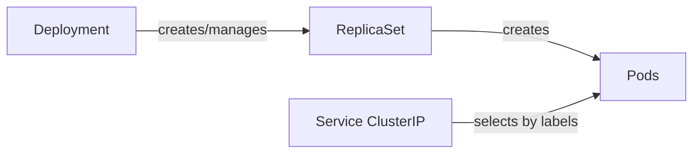
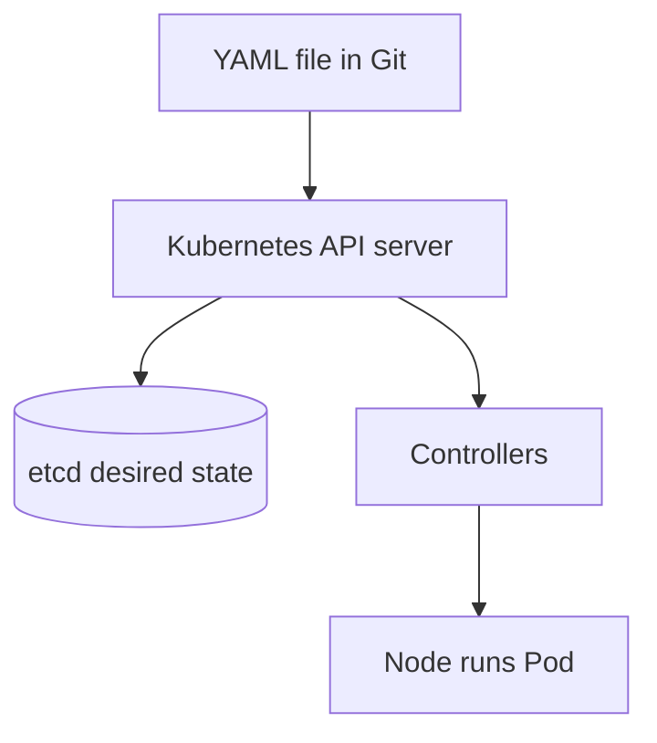
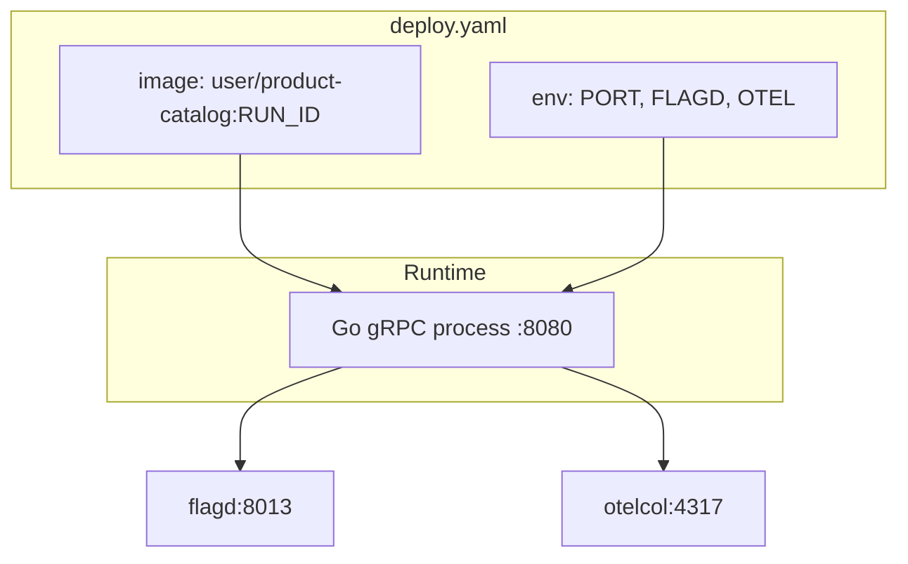
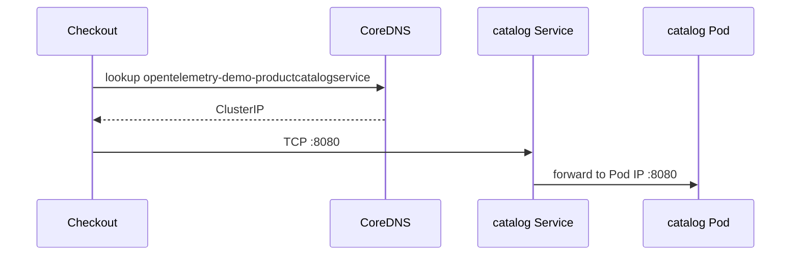
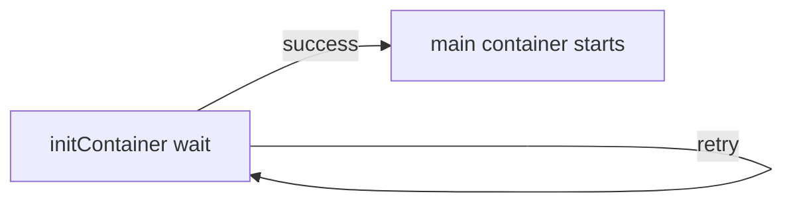
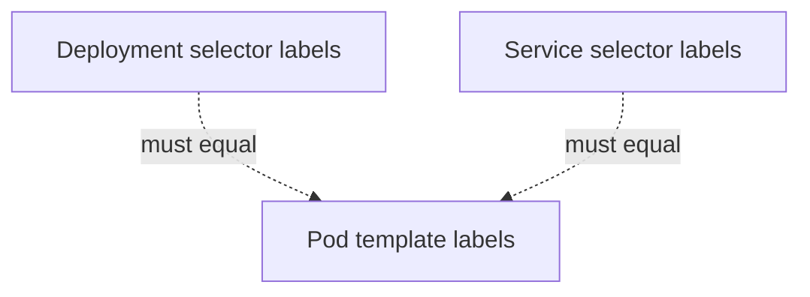
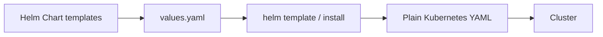
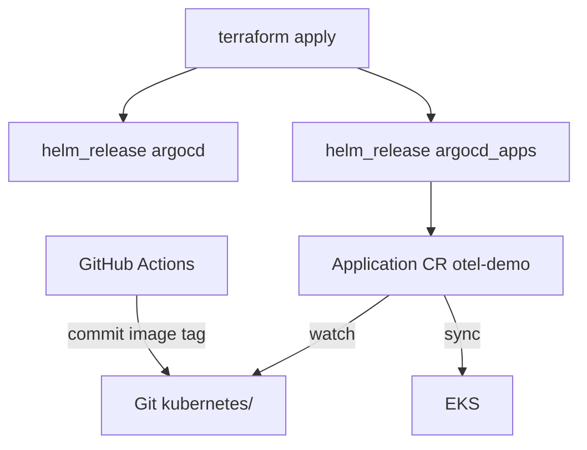
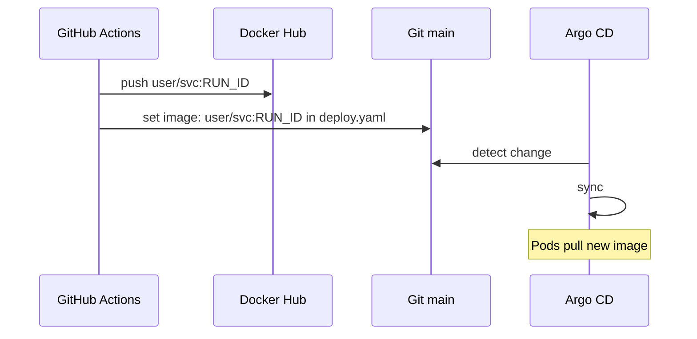
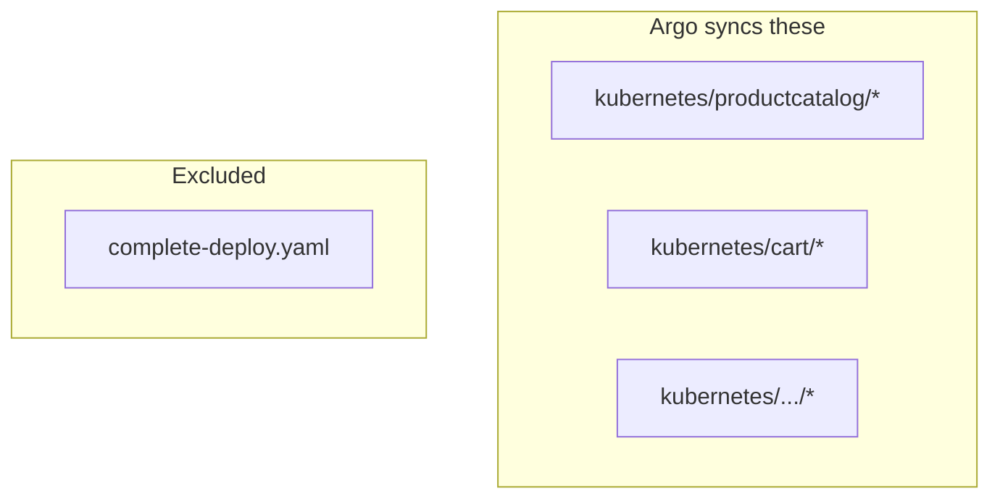

# Kubernetes YAML, Helm & Argo CD — Basics → Advanced

> Worked example: **product-catalog**. Open these files side-by-side while reading:  
> `kubernetes/productcatalog/deploy.yaml` · `kubernetes/productcatalog/svc.yaml`  
> Diagrams: [_SERVICE_MAP.md](./_SERVICE_MAP.md)

---

## 1. Mental model: three objects



| Object | Job |
|--------|-----|
| **Deployment** | Desired Pod template + replica count |
| **Pod** | Running container(s) |
| **Service** | Stable DNS name + virtual IP → Pods |

Argo CD applies YAML from Git. CI only changes the `image:` line.

---

## 2. Anatomy of any Kubernetes YAML

```yaml
apiVersion: apps/v1   # which API group/version understands this object
kind: Deployment      # what type of object
metadata:             # name, labels, namespace (often omitted → Argo destination ns)
  name: ...
spec:                 # desired state
  ...
```



---

## 3. Deployment — line-by-line (`productcatalog/deploy.yaml`)

Header comment:

```yaml
# Source: opentelemetry-demo/templates/component.yaml
```

Means: originally **Helm-rendered**. This repo keeps the rendered result.

| Lines / field | Meaning |
|---------------|---------|
| `apiVersion: apps/v1` | Deployments live in `apps` API |
| `kind: Deployment` | Controllers reconcile replica Pods |
| `metadata.name: opentelemetry-demo-productcatalogservice` | Unique name in namespace |
| `metadata.labels` | Metadata for tooling (Helm/OTel conventions) |
| `app.kubernetes.io/name` | Standard label — component identity |
| `app.kubernetes.io/part-of: opentelemetry-demo` | Belongs to the shop app |
| `app.kubernetes.io/version` | Chart/app version string |
| `spec.replicas: 1` | Want 1 Pod |
| `spec.revisionHistoryLimit: 10` | Keep last 10 ReplicaSets for rollback |
| `spec.selector.matchLabels` | Which Pods belong to this Deployment — **must match** pod template labels |
| `spec.template.metadata.labels` | Labels stamped on every Pod |
| `spec.template.spec.serviceAccountName` | Identity: `opentelemetry-demo` (`serviceaccount.yaml`) |
| `containers[].name: productcatalogservice` | Container name CI searches when updating image |
| `containers[].image` | `durganadimpalli/product-catalog:<tag>` — **GitOps source of truth** |
| `imagePullPolicy: IfNotPresent` | Don't re-pull if node already has digest/tag locally |
| `ports.containerPort: 8080` | Process listens here inside Pod |
| `env` | Injected config (ports, DNS names, OTEL) |
| `resources.limits.memory` | Memory cap (demo values are tiny — know that for prod interviews) |

### Env vars — what juniors must explain

| Env | Meaning |
|-----|---------|
| `OTEL_SERVICE_NAME` | From Pod label `app.kubernetes.io/component` via `fieldRef` |
| `OTEL_COLLECTOR_NAME` | Hostname fragment for collector Service |
| `OTEL_EXPORTER_OTLP_ENDPOINT` | `http://$(OTEL_COLLECTOR_NAME):4317` — OTLP gRPC |
| `OTEL_RESOURCE_ATTRIBUTES` | service.name / namespace / version for telemetry |
| `PRODUCT_CATALOG_SERVICE_PORT` | App listen port **8080** in K8s |
| `FLAGD_HOST` / `FLAGD_PORT` | Feature flag daemon DNS |



---

## 4. Service — line-by-line (`productcatalog/svc.yaml`)

| Field | Meaning |
|-------|---------|
| `kind: Service` | Stable network endpoint |
| `metadata.name: opentelemetry-demo-productcatalogservice` | **DNS name** inside cluster |
| `spec.type: ClusterIP` | Internal only (no public IP) |
| `spec.ports[].port: 8080` | Port other Pods dial |
| `spec.ports[].targetPort: 8080` | Port on the Pod |
| `spec.selector` | Must equal Pod labels |

**DNS form:**

```text
<object-name>.<namespace>.svc.cluster.local
opentelemetry-demo-productcatalogservice.otel-demo.svc.cluster.local
```

Short form (same namespace): `opentelemetry-demo-productcatalogservice:8080`



---

## 5. Advanced patterns in this repo

### 5.1 initContainer (checkout / cart)

```yaml
initContainers:
  - name: wait-for-kafka
    image: busybox:latest
    command: ["sh","-c","until nc -z ... kafka 9092; do sleep 2; done"]
```



**Interview line:** Init containers run to completion before app containers; used for dependency readiness without rewriting app code.

### 5.2 Label coupling



Mismatch = 0 endpoints = connection failures.

### 5.3 Why ports differ Docker vs K8s

Compose uses `.env` ports (catalog `3550`). K8s standardizes many services on **8080** via env `*_SERVICE_PORT=8080`. Always read the **manifest**, not only `.env`.

---

## 6. Helm — basics → how this repo uses it



| Concept | Meaning |
|---------|---------|
| Chart | Parameterized templates |
| values.yaml | Knobs (image tag, replicas) |
| Release | Installed instance of a chart |

**In this fork:**

1. **Shop manifests** under `kubernetes/` are **already rendered** (comment `Source: …/component.yaml`). CI edits them directly.
2. **Argo CD itself** is installed with Helm via Terraform (`helm_release.argocd`, `helm_release.argocd_apps` in `terraform/argocd.tf`).

**Trade-off:** Exact Git diffs (good for GitOps) vs fewer Helm knobs (you'd reintroduce Helm/Kustomize for richer config).

---

## 7. Argo CD — how deploy actually happens



From `argocd/application.yaml` / `terraform/argocd.tf`:

| Setting | Value | Meaning |
|---------|-------|---------|
| `path` | `kubernetes` | Root folder |
| `recurse` | `true` | Include `productcatalog/`, `cart/`, … |
| `exclude` | `complete-deploy.yaml` | Avoid duplicate objects |
| `automated.prune` | `true` | Delete removed resources |
| `automated.selfHeal` | `true` | Undo manual drift |
| `destination.namespace` | `otel-demo` | Target namespace |

**Critical interview fact:** CI does **not** talk to the cluster. Argo reconciles Git → cluster.

---

## 8. CI image tag update (GitOps bridge)



Workflows: `ci.yaml` (product-catalog), `microservices-ci.yaml` (others), `reusable-service-ci.yaml` (shared).

---

## 9. `complete-deploy.yaml` vs per-service folders



`complete-deploy.yaml` ≈ one-file dump of everything. Useful for `kubectl apply -f` demos; **dangerous to sync together** with per-service files (duplicate names).

---

## 10. Practice checklist

- [ ] Explain Deployment vs Service in 30 seconds  
- [ ] Trace DNS from `CART_SERVICE_ADDR` to a cart Pod  
- [ ] Explain why Argo excludes `complete-deploy.yaml`  
- [ ] Explain Helm render vs live chart in this repo  
- [ ] Walk CI → Docker Hub → Git → Argo → Pod  

Next: [product-catalog.md](./product-catalog.md) · [checkout.md](./checkout.md) · [../INTERVIEW_QUESTIONS.md](../INTERVIEW_QUESTIONS.md)
