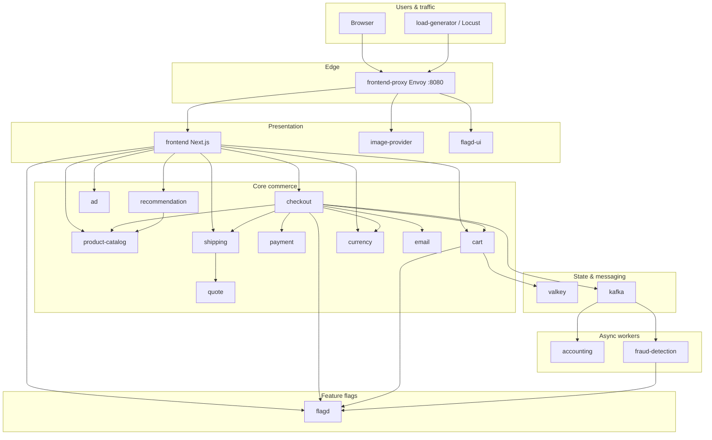
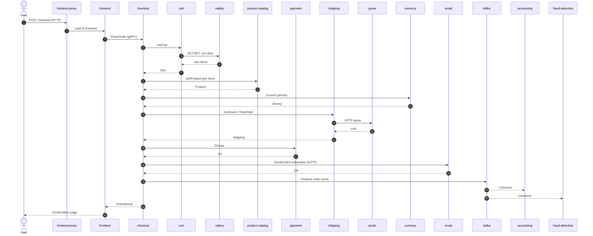
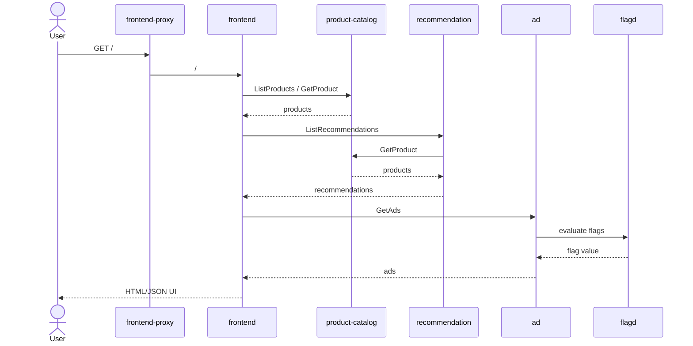
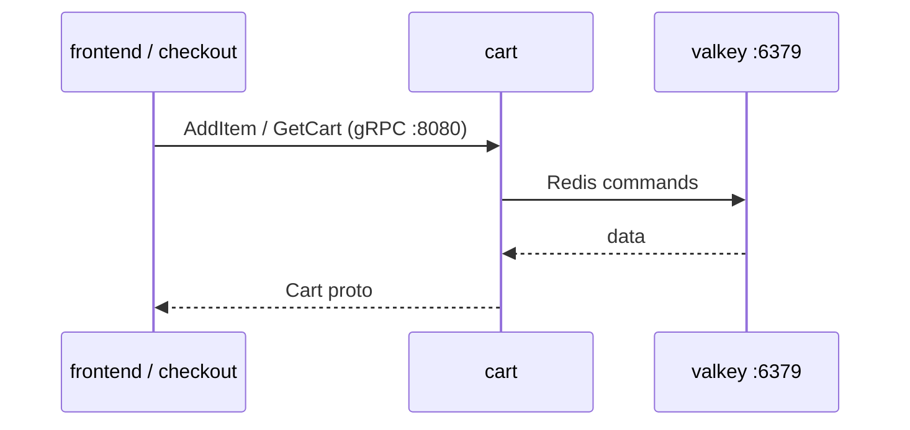
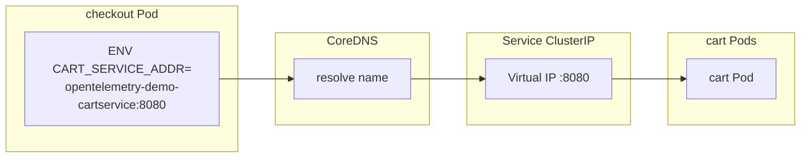
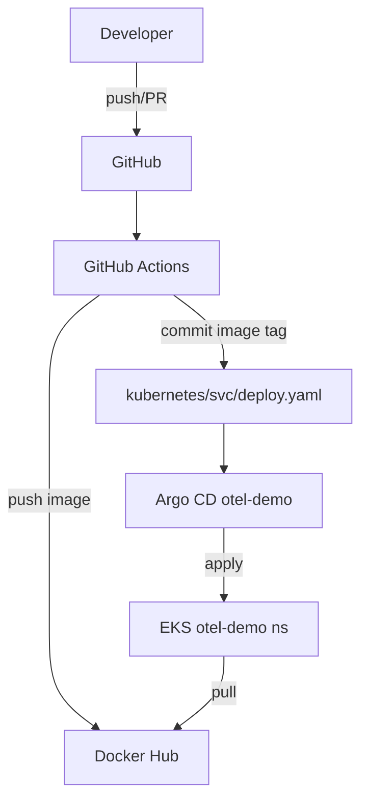

# Service Map & Request Flows (with diagrams)

> Study this file until you can redraw the diagrams on a whiteboard from memory.  
> Index: [README.md](./README.md)

---

## 1. Full shop topology



---

## 2. Place order — sequence (most important interview diagram)



**Say in interviews:** Checkout is the **orchestrator**. Kafka is **async fan-out** so accounting/fraud do not block the HTTP response path as hard as sync calls (still demo-scale).

---

## 3. Browse catalog — simpler path



---

## 4. Cart + Valkey



DNS in K8s: `VALKEY_ADDR` → typically `opentelemetry-demo-valkey:6379`.

---

## 5. Kubernetes discovery (how services find each other)



**Rule:** Service `selector` labels must match Pod template labels, or traffic goes nowhere.

---

## 6. GitOps deploy path (this fork)



---

## 7. Layers mentally (whiteboard)

```text
┌─────────────────────────────────────────────┐
│ Clients (browser, Locust)                   │
└─────────────────┬───────────────────────────┘
                  │ HTTP :8080
┌─────────────────▼───────────────────────────┐
│ frontend-proxy (Envoy)                      │
└─────────────────┬───────────────────────────┘
                  │
┌─────────────────▼───────────────────────────┐
│ frontend (Next.js)                          │
└─────────────────┬───────────────────────────┘
                  │ gRPC / HTTP
┌─────────────────▼───────────────────────────┐
│ Business services (catalog, cart, checkout…)│
└───────┬─────────────────────┬───────────────┘
        │                     │
   ┌────▼────┐          ┌─────▼─────┐
   │ Valkey  │          │   Kafka   │
   └─────────┘          └─────┬─────┘
                              │
                    ┌─────────┴─────────┐
                    ▼                   ▼
              accounting          fraud-detection
```

---

## 8. Which doc next?

| Goal | Open |
|------|------|
| Line-by-line YAML + Helm + Argo | [_KUBERNETES_YAML_HELM_ARGOCD.md](./_KUBERNETES_YAML_HELM_ARGOCD.md) |
| One service deep | e.g. [product-catalog.md](./product-catalog.md), [checkout.md](./checkout.md) |
| Interview drill | [../INTERVIEW_QUESTIONS.md](../INTERVIEW_QUESTIONS.md) |
