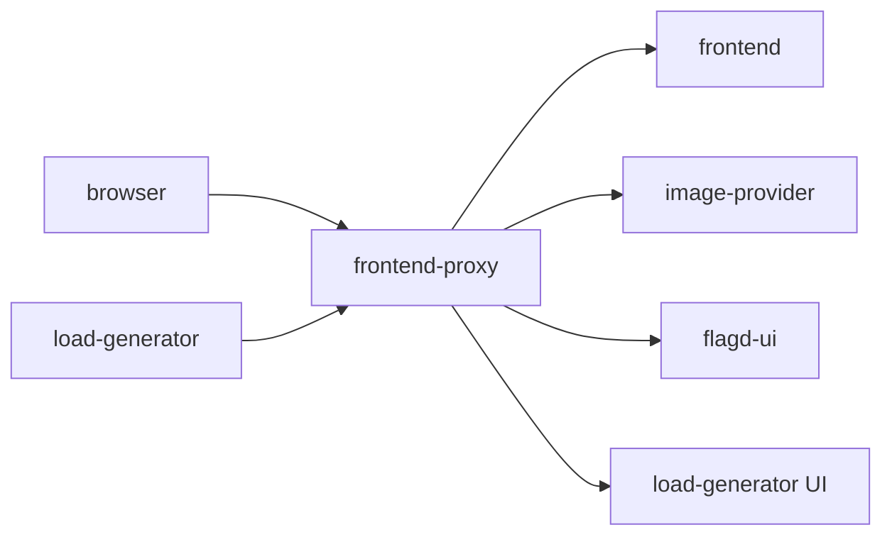
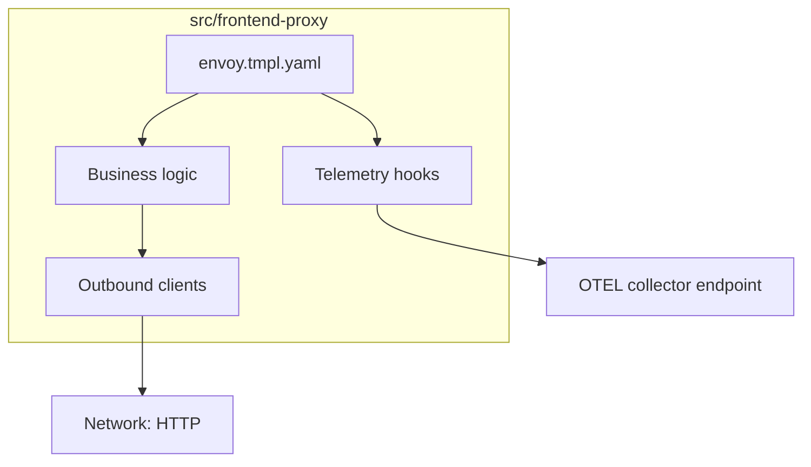
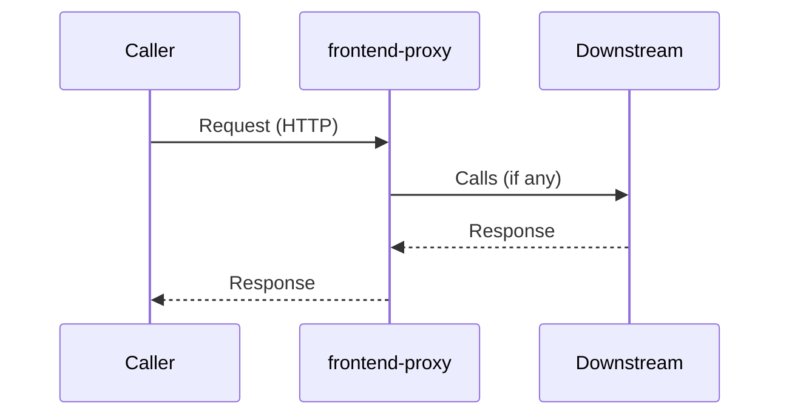
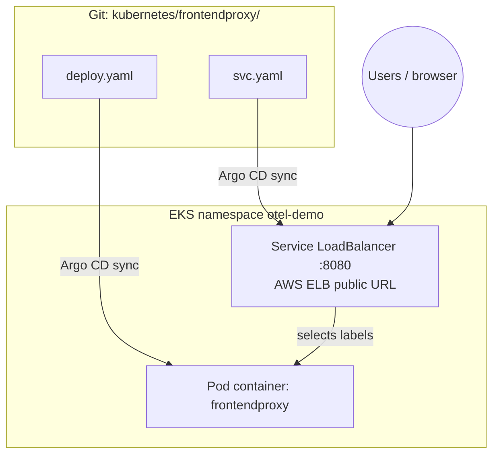
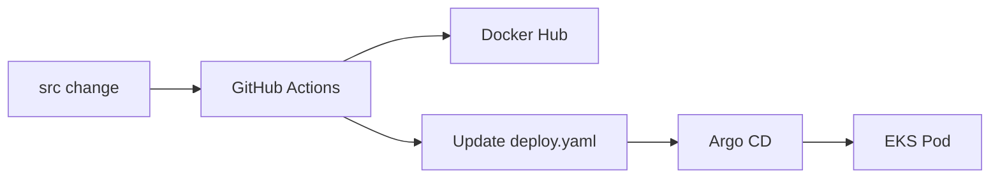

# Frontend Proxy (Envoy)

> **Mentor note:** Study this file with the source tree open. Diagrams first, then code, then YAML.  
> **Shared YAML deep-dive:** [_KUBERNETES_YAML_HELM_ARGOCD.md](./_KUBERNETES_YAML_HELM_ARGOCD.md) · **Map:** [_SERVICE_MAP.md](./_SERVICE_MAP.md) · **Index:** [README.md](./README.md)

---

## 1. Why this service exists

Public reverse proxy / single entry on :8080.

| | |
|--|--|
| **Language** | Envoy |
| **Source** | `src/frontend-proxy/` |
| **Entry** | `envoy.tmpl.yaml` |
| **K8s folder** | `kubernetes/frontendproxy/` |
| **Container name** | `frontendproxy` |
| **Protocol** | HTTP |
| **Docker port** | 8080 |
| **K8s port** | 8080 |

---

## 2. Where it sits in the architecture



### Callers / callees

| Direction | Services |
|-----------|----------|
| **Who calls me** | `browser`, `load-generator` |
| **Who I call** | `frontend`, `image-provider`, `flagd-ui`, `load-generator UI` |

---

## 3. Source code architecture (how to read the code)

1. Open `src/frontend-proxy/` and locate `envoy.tmpl.yaml`.
2. Find listen/bind port (env `*_PORT` or hardcoded) — in Docker often **8080**, in K8s usually **8080**.
3. Find outbound clients (gRPC stubs, HTTP, Kafka, Redis) matching the callees table.
4. Find OpenTelemetry setup (`OTEL_*` env, auto-instrumentation, or SDK init).
5. Shared API contracts live in `pb/demo.proto` for gRPC services.



---

## 4. Request scenario

**All user traffic enters here; routes by path to UI, images, flag UI, loadgen.**



---

## 5. Kubernetes: how this service is deployed



### Files

| File | Purpose |
|------|---------|
| `kubernetes/frontendproxy/deploy.yaml` | Deployment (Pods) |
| `kubernetes/frontendproxy/svc.yaml` | **LoadBalancer** Service (public ELB on port 8080) |

### Deployment essentials (read `deploy.yaml`)

| Field | This service |
|-------|----------------|
| `metadata.name` | `opentelemetry-demo-frontendproxy` (typical) |
| `spec.replicas` | Usually `1` |
| `spec.selector` / pod labels | Must match Service selector |
| `containers[].name` | `frontendproxy` |
| `containers[].image` | CI sets `DOCKER_USERNAME/frontend-proxy:<run_id>` (or upstream `ghcr.io/...`) |
| `containerPort` | 8080 |
| `initContainers` | No |
| `serviceAccountName` | `opentelemetry-demo` |

### Environment variables present in deploy.yaml

| Env var | Notes |
|---------|-------|
| `OTEL_SERVICE_NAME` | See deploy.yaml / shared OTEL guide |
| `OTEL_COLLECTOR_NAME` | See deploy.yaml / shared OTEL guide |
| `OTEL_EXPORTER_OTLP_METRICS_TEMPORALITY_PREFERENCE` | See deploy.yaml / shared OTEL guide |
| `ENVOY_PORT` | See deploy.yaml / shared OTEL guide |
| `FLAGD_HOST` | See deploy.yaml / shared OTEL guide |
| `FLAGD_PORT` | See deploy.yaml / shared OTEL guide |
| `FLAGD_UI_HOST` | See deploy.yaml / shared OTEL guide |
| `FLAGD_UI_PORT` | See deploy.yaml / shared OTEL guide |
| `FRONTEND_HOST` | See deploy.yaml / shared OTEL guide |
| `FRONTEND_PORT` | See deploy.yaml / shared OTEL guide |
| `GRAFANA_HOST` | Envoy upstream (may be undeployed in this fork) |
| `GRAFANA_PORT` | See deploy.yaml |
| `IMAGE_PROVIDER_HOST` | See deploy.yaml / shared OTEL guide |
| `IMAGE_PROVIDER_PORT` | See deploy.yaml / shared OTEL guide |
| `JAEGER_HOST` | Envoy upstream (may be undeployed in this fork) |
| `JAEGER_PORT` | See deploy.yaml |
| `LOCUST_WEB_HOST` | See deploy.yaml / shared OTEL guide |
| `LOCUST_WEB_PORT` | See deploy.yaml / shared OTEL guide |
| `OTEL_COLLECTOR_HOST` | See deploy.yaml / shared OTEL guide |
| `OTEL_COLLECTOR_PORT_GRPC` | See deploy.yaml / shared OTEL guide |
| `OTEL_COLLECTOR_PORT_HTTP` | See deploy.yaml / shared OTEL guide |
| `OTEL_RESOURCE_ATTRIBUTES` | See deploy.yaml / shared OTEL guide |

Boilerplate `OTEL_*` meaning: see [_KUBERNETES_YAML_HELM_ARGOCD.md](./_KUBERNETES_YAML_HELM_ARGOCD.md).

### Service (LoadBalancer) — public entry point

```yaml
# kubernetes/frontendproxy/svc.yaml
apiVersion: v1
kind: Service
metadata:
  name: opentelemetry-demo-frontendproxy
spec:
  type: LoadBalancer          # ← changed from ClusterIP for public EKS access
  ports:
    - port: 8080
      name: tcp-service
      targetPort: 8080
      protocol: TCP
  selector:
    opentelemetry.io/name: opentelemetry-demo-frontendproxy
```

**Why LoadBalancer here only?** This is the shop’s HTTP front door. All other
services stay `ClusterIP` (internal). AWS creates an ELB hostname; open:

```bash
kubectl get svc opentelemetry-demo-frontendproxy -n otel-demo \
  -o jsonpath='http://{.status.loadBalancer.ingress[0].hostname}:8080{"\n"}'
```

### DNS name used inside the cluster

```text
opentelemetry-demo-frontendproxy:8080
```

In-cluster callers still use ClusterIP DNS for this Service. External users use
the ELB hostname from `.status.loadBalancer.ingress`.

---

## 6. GitOps / CI for this service

| | |
|--|--|
| **CI workflow** | microservices-ci |
| **Image update** | reusable job patches `image:` for container `frontendproxy` in `deploy.yaml` |
| **Deploy** | Argo CD Application `otel-demo` syncs `kubernetes/` (excludes `complete-deploy.yaml`) |



---

## 7. Interview talking points

- Role: Public reverse proxy / single entry on :8080.
- Protocol: HTTP — Docker port 8080 vs K8s 8080.
- Dependencies: callers `browser, load-generator`; callees `frontend, image-provider, flagd-ui, load-generator UI`.
- Manifests: `kubernetes/frontendproxy/` — has Service.
- Discovery: Kubernetes DNS `opentelemetry-demo-frontendproxy:8080`.
- Observability: `OTEL_EXPORTER_OTLP_ENDPOINT` points at collector Service name.
- GitOps: CI never runs `kubectl apply`; it only updates Git for Argo.
- Chaos/demo: many services use `FLAGD_HOST` / `FLAGD_PORT` for Open Feature.

---

## 8. Quick quiz

**Q1.** Who calls `frontend-proxy` in the shop?  
**A:** browser, load-generator.

**Q2.** What Kubernetes DNS would another Pod use (if any)?  
**A:** `opentelemetry-demo-frontendproxy:8080`.

**Q3.** Does Argo deploy from `complete-deploy.yaml` or per-service folders?  
**A:** Per-service folders under `kubernetes/`; `complete-deploy.yaml` is excluded.

---

## 9. Related reading

- [README.md](./README.md) — learning path  
- [_SERVICE_MAP.md](./_SERVICE_MAP.md) — place-order sequence  
- [_KUBERNETES_YAML_HELM_ARGOCD.md](./_KUBERNETES_YAML_HELM_ARGOCD.md) — YAML line-by-line  
- [../INTERVIEW_QUESTIONS.md](../INTERVIEW_QUESTIONS.md)  
