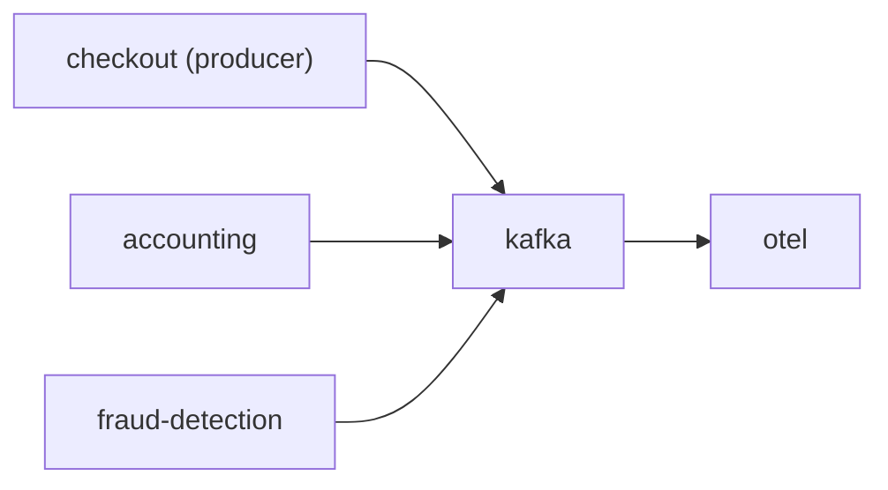
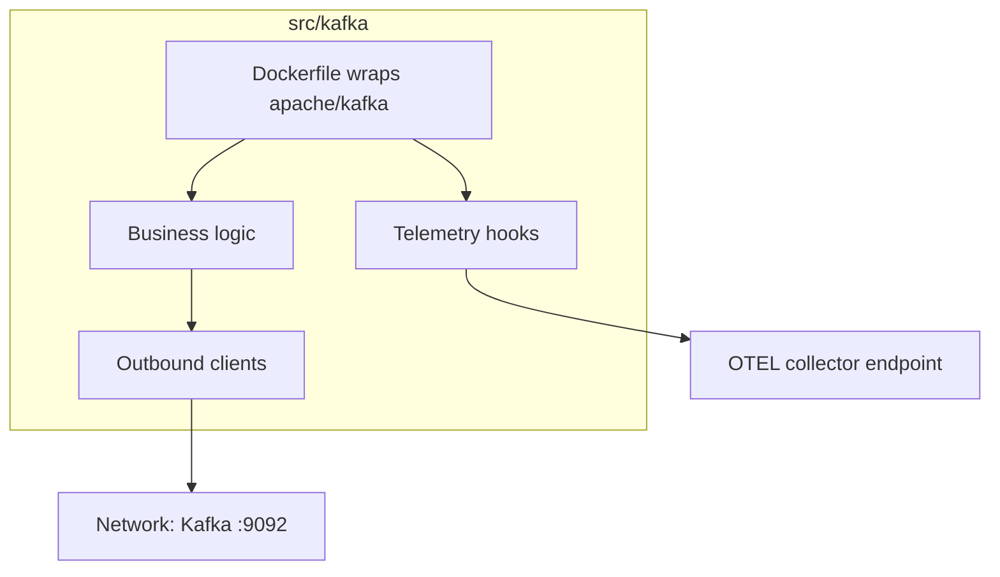
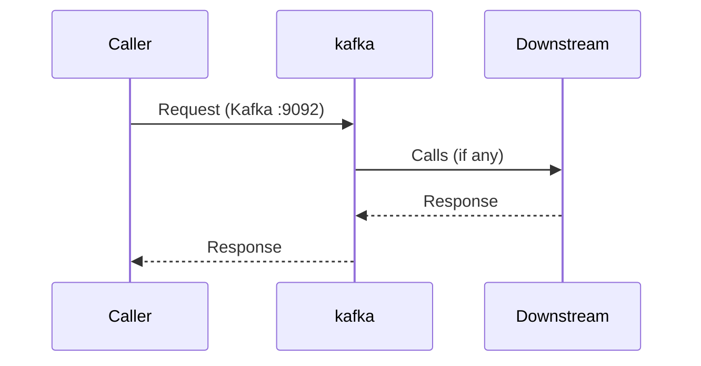
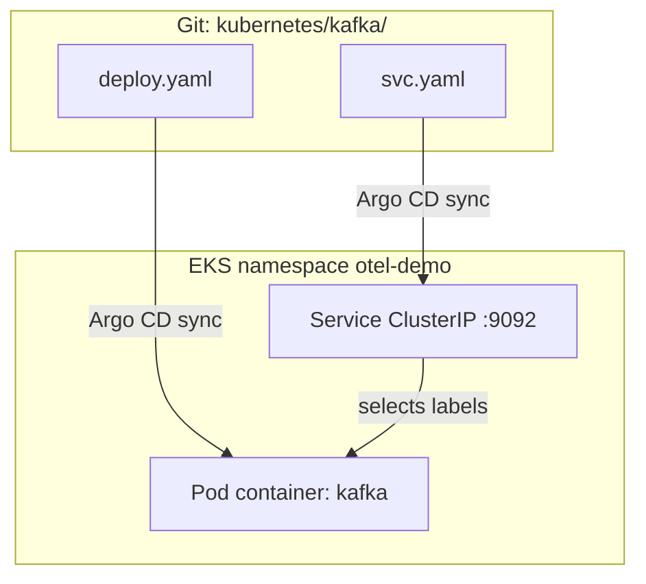
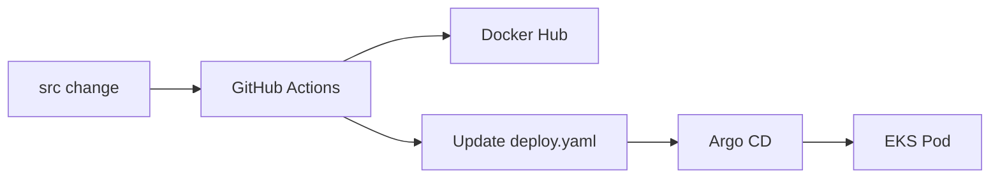

# Kafka

> **Mentor note:** Study this file with the source tree open. Diagrams first, then code, then YAML.  
> **Shared YAML deep-dive:** [_KUBERNETES_YAML_HELM_ARGOCD.md](./_KUBERNETES_YAML_HELM_ARGOCD.md) · **Map:** [_SERVICE_MAP.md](./_SERVICE_MAP.md) · **Index:** [README.md](./README.md)

---

## 1. Why this service exists

Message bus for order events.

| | |
|--|--|
| **Language** | Apache Kafka 3.7 (+ Java agent) |
| **Source** | `src/kafka/` |
| **Entry** | `Dockerfile wraps apache/kafka` |
| **K8s folder** | `kubernetes/kafka/` |
| **Container name** | `kafka` |
| **Protocol** | Kafka :9092 |
| **Docker port** | 9092 |
| **K8s port** | 9092 |

---

## 2. Where it sits in the architecture



### Callers / callees

| Direction | Services |
|-----------|----------|
| **Who calls me** | `checkout (producer)`, `accounting`, `fraud-detection` |
| **Who I call** | `otel` |

---

## 3. Source code architecture (how to read the code)

1. Open `src/kafka/` and locate `Dockerfile wraps apache/kafka`.
2. Find listen/bind port (env `*_PORT` or hardcoded) — in Docker often **9092**, in K8s usually **9092**.
3. Find outbound clients (gRPC stubs, HTTP, Kafka, Redis) matching the callees table.
4. Find OpenTelemetry setup (`OTEL_*` env, auto-instrumentation, or SDK init).
5. Shared API contracts live in `pb/demo.proto` for gRPC services.



---

## 4. Request scenario

**checkout PlaceOrder → produce → consumers.**



---

## 5. Kubernetes: how this service is deployed



### Files

| File | Purpose |
|------|---------|
| `kubernetes/kafka/deploy.yaml` | Deployment (Pods) |
| `kubernetes/kafka/svc.yaml` | ClusterIP Service |

### Deployment essentials (read `deploy.yaml`)

| Field | This service |
|-------|----------------|
| `metadata.name` | `opentelemetry-demo-kafka` (typical) |
| `spec.replicas` | Usually `1` |
| `spec.selector` / pod labels | Must match Service selector |
| `containers[].name` | `kafka` |
| `containers[].image` | CI sets `DOCKER_USERNAME/kafka:<run_id>` (or upstream `ghcr.io/...`) |
| `containerPort` | 9092 |
| `initContainers` | No |
| `serviceAccountName` | `opentelemetry-demo` |

### Environment variables present in deploy.yaml

| Env var | Notes |
|---------|-------|
| `OTEL_SERVICE_NAME` | See deploy.yaml / shared OTEL guide |
| `OTEL_COLLECTOR_NAME` | See deploy.yaml / shared OTEL guide |
| `OTEL_EXPORTER_OTLP_METRICS_TEMPORALITY_PREFERENCE` | See deploy.yaml / shared OTEL guide |
| `KAFKA_ADVERTISED_LISTENERS` | See deploy.yaml / shared OTEL guide |
| `OTEL_EXPORTER_OTLP_ENDPOINT` | See deploy.yaml / shared OTEL guide |
| `KAFKA_HEAP_OPTS` | See deploy.yaml / shared OTEL guide |
| `OTEL_RESOURCE_ATTRIBUTES` | See deploy.yaml / shared OTEL guide |

Boilerplate `OTEL_*` meaning: see [_KUBERNETES_YAML_HELM_ARGOCD.md](./_KUBERNETES_YAML_HELM_ARGOCD.md).

### Service (ClusterIP) — if present

```yaml\n# kubernetes/kafka/svc.yaml — key ideas:\n# type: ClusterIP\n# port/targetPort: 9092\n# selector: opentelemetry.io/name: opentelemetry-demo-kafka\n```

### DNS name used by other services

```text
opentelemetry-demo-kafka:9092
```

Example from another Deployment env: `PRODUCT_CATALOG_SERVICE_ADDR` / `CART_SERVICE_ADDR` style values use `opentelemetry-demo-<component>:8080`.

---

## 6. GitOps / CI for this service

| | |
|--|--|
| **CI workflow** | microservices-ci (needs OTEL_JAVA_AGENT_VERSION) |
| **Image update** | reusable job patches `image:` for container `kafka` in `deploy.yaml` |
| **Deploy** | Argo CD Application `otel-demo` syncs `kubernetes/` (excludes `complete-deploy.yaml`) |



---

## 7. Interview talking points

- Role: Message bus for order events.
- Protocol: Kafka :9092 — Docker port 9092 vs K8s 9092.
- Dependencies: callers `checkout (producer), accounting, fraud-detection`; callees `otel`.
- Manifests: `kubernetes/kafka/` — has Service.
- Discovery: Kubernetes DNS `opentelemetry-demo-kafka:9092`.
- Observability: `OTEL_EXPORTER_OTLP_ENDPOINT` points at collector Service name.
- GitOps: CI never runs `kubectl apply`; it only updates Git for Argo.
- Chaos/demo: many services use `FLAGD_HOST` / `FLAGD_PORT` for Open Feature.

---

## 8. Quick quiz

**Q1.** Who calls `kafka` in the shop?  
**A:** checkout (producer), accounting, fraud-detection.

**Q2.** What Kubernetes DNS would another Pod use (if any)?  
**A:** `opentelemetry-demo-kafka:9092`.

**Q3.** Does Argo deploy from `complete-deploy.yaml` or per-service folders?  
**A:** Per-service folders under `kubernetes/`; `complete-deploy.yaml` is excluded.

---

## 9. Related reading

- [README.md](./README.md) — learning path  
- [_SERVICE_MAP.md](./_SERVICE_MAP.md) — place-order sequence  
- [_KUBERNETES_YAML_HELM_ARGOCD.md](./_KUBERNETES_YAML_HELM_ARGOCD.md) — YAML line-by-line  
- [../INTERVIEW_QUESTIONS.md](../INTERVIEW_QUESTIONS.md)  
