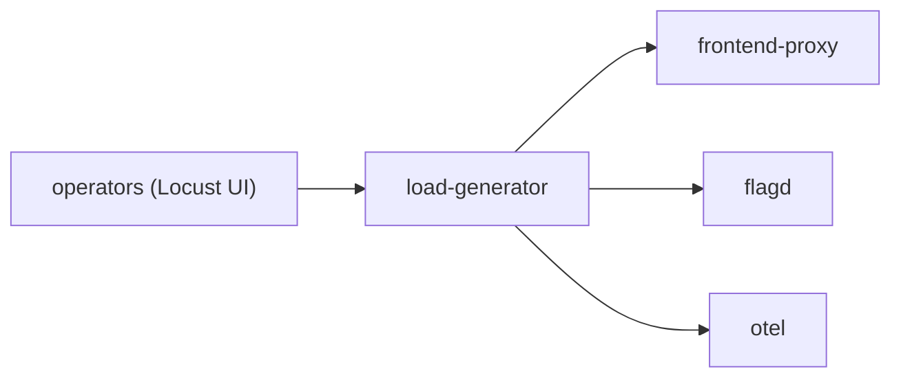
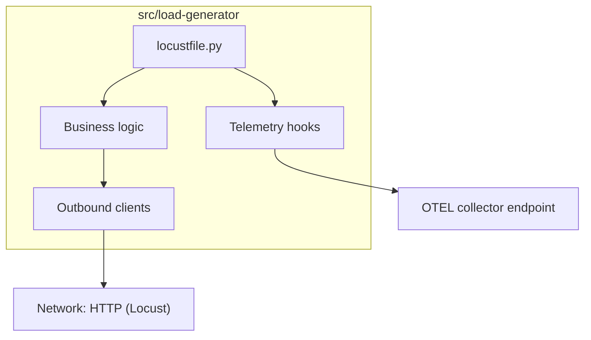
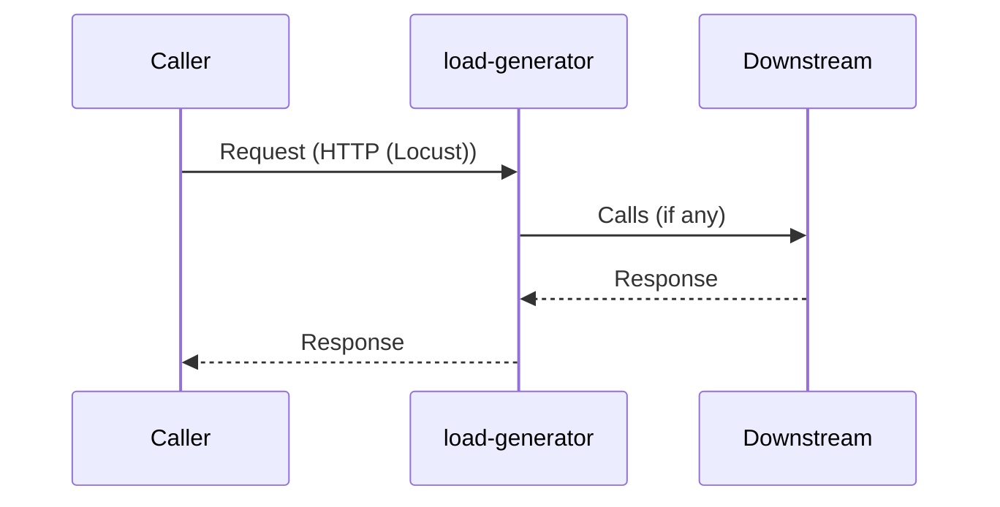
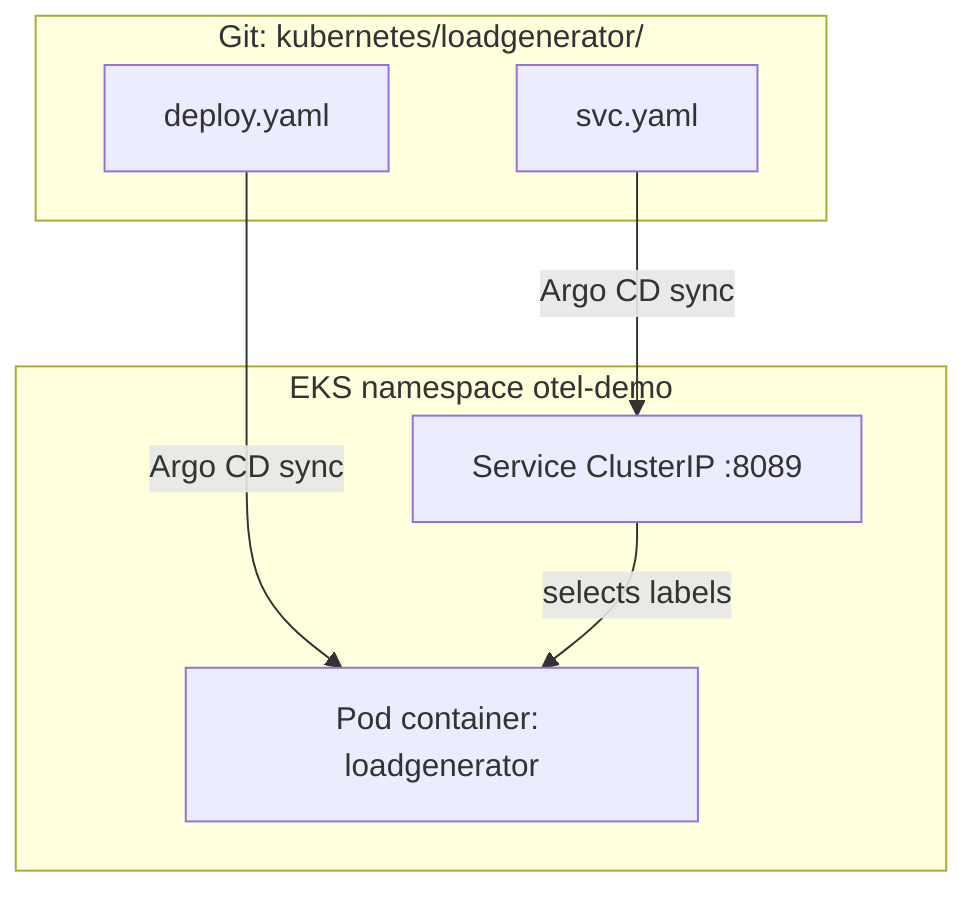
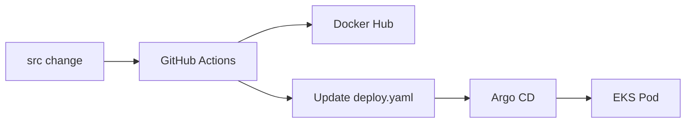

# Load Generator

> **Mentor note:** Study this file with the source tree open. Diagrams first, then code, then YAML.  
> **Shared YAML deep-dive:** [_KUBERNETES_YAML_HELM_ARGOCD.md](./_KUBERNETES_YAML_HELM_ARGOCD.md) · **Map:** [_SERVICE_MAP.md](./_SERVICE_MAP.md) · **Index:** [README.md](./README.md)

---

## 1. Why this service exists

Synthetic traffic against the shop via frontend-proxy.

| | |
|--|--|
| **Language** | Python / Locust |
| **Source** | `src/load-generator/` |
| **Entry** | `locustfile.py` |
| **K8s folder** | `kubernetes/loadgenerator/` |
| **Container name** | `loadgenerator` |
| **Protocol** | HTTP (Locust) |
| **Docker port** | 8089 |
| **K8s port** | 8089 |

---

## 2. Where it sits in the architecture



### Callers / callees

| Direction | Services |
|-----------|----------|
| **Who calls me** | `operators (Locust UI)` |
| **Who I call** | `frontend-proxy`, `flagd`, `otel` |

---

## 3. Source code architecture (how to read the code)

1. Open `src/load-generator/` and locate `locustfile.py`.
2. Find listen/bind port (env `*_PORT` or hardcoded) — in Docker often **8089**, in K8s usually **8089**.
3. Find outbound clients (gRPC stubs, HTTP, Kafka, Redis) matching the callees table.
4. Find OpenTelemetry setup (`OTEL_*` env, auto-instrumentation, or SDK init).
5. Shared API contracts live in `pb/demo.proto` for gRPC services.



---

## 4. Request scenario

**Locust users → LOCUST_HOST (frontend-proxy) → full shop path.**



---

## 5. Kubernetes: how this service is deployed



### Files

| File | Purpose |
|------|---------|
| `kubernetes/loadgenerator/deploy.yaml` | Deployment (Pods) |
| `kubernetes/loadgenerator/svc.yaml` | ClusterIP Service |

### Deployment essentials (read `deploy.yaml`)

| Field | This service |
|-------|----------------|
| `metadata.name` | `opentelemetry-demo-loadgenerator` (typical) |
| `spec.replicas` | Usually `1` |
| `spec.selector` / pod labels | Must match Service selector |
| `containers[].name` | `loadgenerator` |
| `containers[].image` | CI sets `DOCKER_USERNAME/load-generator:<run_id>` (or upstream `ghcr.io/...`) |
| `containerPort` | 8089 |
| `initContainers` | No |
| `serviceAccountName` | `opentelemetry-demo` |

### Environment variables present in deploy.yaml

| Env var | Notes |
|---------|-------|
| `OTEL_SERVICE_NAME` | See deploy.yaml / shared OTEL guide |
| `OTEL_COLLECTOR_NAME` | See deploy.yaml / shared OTEL guide |
| `OTEL_EXPORTER_OTLP_METRICS_TEMPORALITY_PREFERENCE` | See deploy.yaml / shared OTEL guide |
| `LOCUST_WEB_PORT` | See deploy.yaml / shared OTEL guide |
| `LOCUST_USERS` | See deploy.yaml / shared OTEL guide |
| `LOCUST_SPAWN_RATE` | See deploy.yaml / shared OTEL guide |
| `LOCUST_HOST` | See deploy.yaml / shared OTEL guide |
| `LOCUST_HEADLESS` | See deploy.yaml / shared OTEL guide |
| `LOCUST_AUTOSTART` | See deploy.yaml / shared OTEL guide |
| `LOCUST_BROWSER_TRAFFIC_ENABLED` | See deploy.yaml / shared OTEL guide |
| `PROTOCOL_BUFFERS_PYTHON_IMPLEMENTATION` | See deploy.yaml / shared OTEL guide |
| `FLAGD_HOST` | See deploy.yaml / shared OTEL guide |
| `FLAGD_PORT` | See deploy.yaml / shared OTEL guide |
| `OTEL_EXPORTER_OTLP_ENDPOINT` | See deploy.yaml / shared OTEL guide |
| `OTEL_RESOURCE_ATTRIBUTES` | See deploy.yaml / shared OTEL guide |

Boilerplate `OTEL_*` meaning: see [_KUBERNETES_YAML_HELM_ARGOCD.md](./_KUBERNETES_YAML_HELM_ARGOCD.md).

### Service (ClusterIP) — if present

```yaml\n# kubernetes/loadgenerator/svc.yaml — key ideas:\n# type: ClusterIP\n# port/targetPort: 8089\n# selector: opentelemetry.io/name: opentelemetry-demo-loadgenerator\n```

### DNS name used by other services

```text
opentelemetry-demo-loadgenerator:8089
```

Example from another Deployment env: `PRODUCT_CATALOG_SERVICE_ADDR` / `CART_SERVICE_ADDR` style values use `opentelemetry-demo-<component>:8080`.

---

## 6. GitOps / CI for this service

| | |
|--|--|
| **CI workflow** | microservices-ci |
| **Image update** | reusable job patches `image:` for container `loadgenerator` in `deploy.yaml` |
| **Deploy** | Argo CD Application `otel-demo` syncs `kubernetes/` (excludes `complete-deploy.yaml`) |



---

## 7. Interview talking points

- Role: Synthetic traffic against the shop via frontend-proxy.
- Protocol: HTTP (Locust) — Docker port 8089 vs K8s 8089.
- Dependencies: callers `operators (Locust UI)`; callees `frontend-proxy, flagd, otel`.
- Manifests: `kubernetes/loadgenerator/` — has Service.
- Discovery: Kubernetes DNS `opentelemetry-demo-loadgenerator:8089`.
- Observability: `OTEL_EXPORTER_OTLP_ENDPOINT` points at collector Service name.
- GitOps: CI never runs `kubectl apply`; it only updates Git for Argo.
- Chaos/demo: many services use `FLAGD_HOST` / `FLAGD_PORT` for Open Feature.

---

## 8. Quick quiz

**Q1.** Who calls `load-generator` in the shop?  
**A:** operators (Locust UI).

**Q2.** What Kubernetes DNS would another Pod use (if any)?  
**A:** `opentelemetry-demo-loadgenerator:8089`.

**Q3.** Does Argo deploy from `complete-deploy.yaml` or per-service folders?  
**A:** Per-service folders under `kubernetes/`; `complete-deploy.yaml` is excluded.

---

## 9. Related reading

- [README.md](./README.md) — learning path  
- [_SERVICE_MAP.md](./_SERVICE_MAP.md) — place-order sequence  
- [_KUBERNETES_YAML_HELM_ARGOCD.md](./_KUBERNETES_YAML_HELM_ARGOCD.md) — YAML line-by-line  
- [../INTERVIEW_QUESTIONS.md](../INTERVIEW_QUESTIONS.md)  
