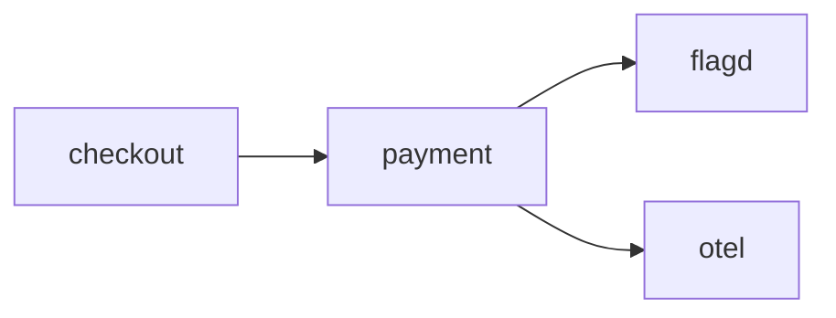
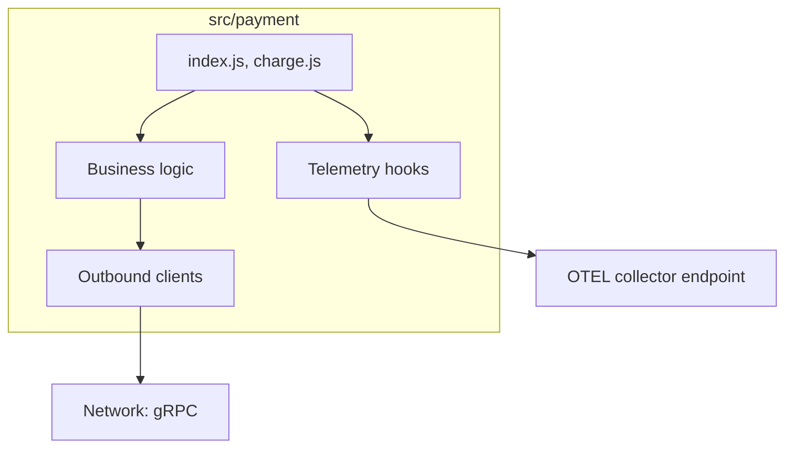
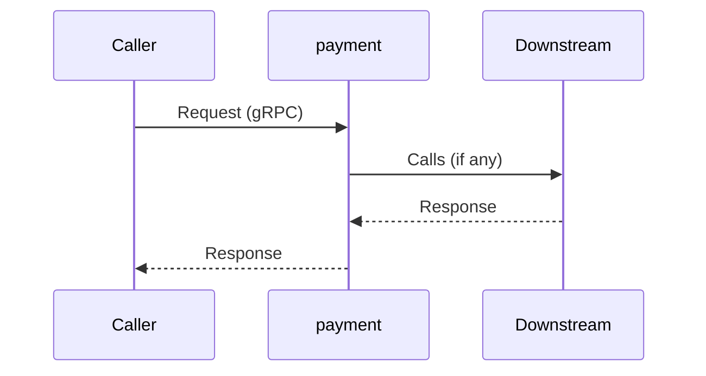
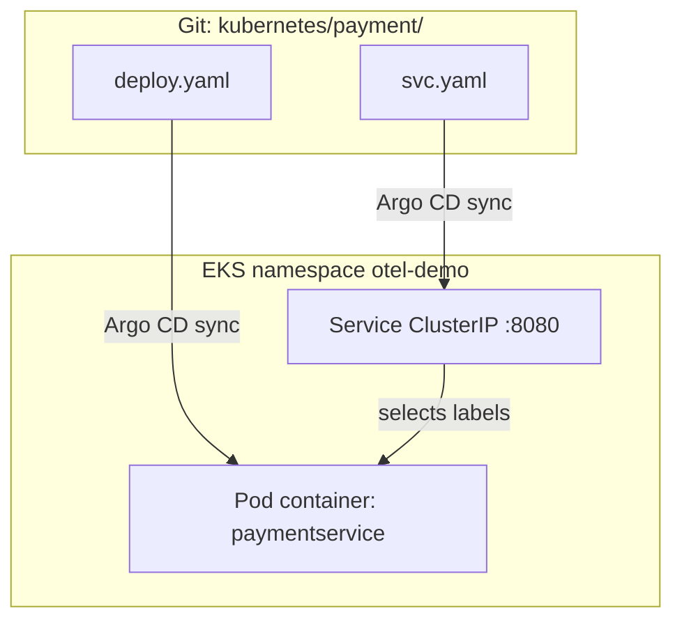
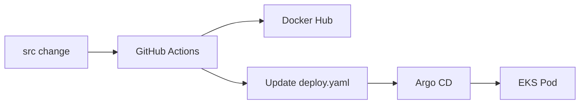

# Payment Service

> **Mentor note:** Study this file with the source tree open. Diagrams first, then code, then YAML.  
> **Shared YAML deep-dive:** [_KUBERNETES_YAML_HELM_ARGOCD.md](./_KUBERNETES_YAML_HELM_ARGOCD.md) · **Map:** [_SERVICE_MAP.md](./_SERVICE_MAP.md) · **Index:** [README.md](./README.md)

---

## 1. Why this service exists

Fake card charge over gRPC (demo only).

| | |
|--|--|
| **Language** | Node.js |
| **Source** | `src/payment/` |
| **Entry** | `index.js, charge.js` |
| **K8s folder** | `kubernetes/payment/` |
| **Container name** | `paymentservice` |
| **Protocol** | gRPC |
| **Docker port** | 50051 |
| **K8s port** | 8080 |

---

## 2. Where it sits in the architecture



### Callers / callees

| Direction | Services |
|-----------|----------|
| **Who calls me** | `checkout` |
| **Who I call** | `flagd`, `otel` |

---

## 3. Source code architecture (how to read the code)

1. Open `src/payment/` and locate `index.js, charge.js`.
2. Find listen/bind port (env `*_PORT` or hardcoded) — in Docker often **50051**, in K8s usually **8080**.
3. Find outbound clients (gRPC stubs, HTTP, Kafka, Redis) matching the callees table.
4. Find OpenTelemetry setup (`OTEL_*` env, auto-instrumentation, or SDK init).
5. Shared API contracts live in `pb/demo.proto` for gRPC services.



---

## 4. Request scenario

**Checkout PlaceOrder → payment.Charge.**



---

## 5. Kubernetes: how this service is deployed



### Files

| File | Purpose |
|------|---------|
| `kubernetes/payment/deploy.yaml` | Deployment (Pods) |
| `kubernetes/payment/svc.yaml` | ClusterIP Service |

### Deployment essentials (read `deploy.yaml`)

| Field | This service |
|-------|----------------|
| `metadata.name` | `opentelemetry-demo-paymentservice` (typical) |
| `spec.replicas` | Usually `1` |
| `spec.selector` / pod labels | Must match Service selector |
| `containers[].name` | `paymentservice` |
| `containers[].image` | CI sets `DOCKER_USERNAME/payment:<run_id>` (or upstream `ghcr.io/...`) |
| `containerPort` | 8080 |
| `initContainers` | No |
| `serviceAccountName` | `opentelemetry-demo` |

### Environment variables present in deploy.yaml

| Env var | Notes |
|---------|-------|
| `OTEL_SERVICE_NAME` | See deploy.yaml / shared OTEL guide |
| `OTEL_COLLECTOR_NAME` | See deploy.yaml / shared OTEL guide |
| `OTEL_EXPORTER_OTLP_METRICS_TEMPORALITY_PREFERENCE` | See deploy.yaml / shared OTEL guide |
| `PAYMENT_SERVICE_PORT` | See deploy.yaml / shared OTEL guide |
| `FLAGD_HOST` | See deploy.yaml / shared OTEL guide |
| `FLAGD_PORT` | See deploy.yaml / shared OTEL guide |
| `OTEL_EXPORTER_OTLP_ENDPOINT` | See deploy.yaml / shared OTEL guide |
| `OTEL_RESOURCE_ATTRIBUTES` | See deploy.yaml / shared OTEL guide |

Boilerplate `OTEL_*` meaning: see [_KUBERNETES_YAML_HELM_ARGOCD.md](./_KUBERNETES_YAML_HELM_ARGOCD.md).

### Service (ClusterIP) — if present

```yaml\n# kubernetes/payment/svc.yaml — key ideas:\n# type: ClusterIP\n# port/targetPort: 8080\n# selector: opentelemetry.io/name: opentelemetry-demo-paymentservice\n```

### DNS name used by other services

```text
opentelemetry-demo-paymentservice:8080
```

Example from another Deployment env: `PRODUCT_CATALOG_SERVICE_ADDR` / `CART_SERVICE_ADDR` style values use `opentelemetry-demo-<component>:8080`.

---

## 6. GitOps / CI for this service

| | |
|--|--|
| **CI workflow** | microservices-ci |
| **Image update** | reusable job patches `image:` for container `paymentservice` in `deploy.yaml` |
| **Deploy** | Argo CD Application `otel-demo` syncs `kubernetes/` (excludes `complete-deploy.yaml`) |



---

## 7. Interview talking points

- Role: Fake card charge over gRPC (demo only).
- Protocol: gRPC — Docker port 50051 vs K8s 8080.
- Dependencies: callers `checkout`; callees `flagd, otel`.
- Manifests: `kubernetes/payment/` — has Service.
- Discovery: Kubernetes DNS `opentelemetry-demo-paymentservice:8080`.
- Observability: `OTEL_EXPORTER_OTLP_ENDPOINT` points at collector Service name.
- GitOps: CI never runs `kubectl apply`; it only updates Git for Argo.
- Chaos/demo: many services use `FLAGD_HOST` / `FLAGD_PORT` for Open Feature.

---

## 8. Quick quiz

**Q1.** Who calls `payment` in the shop?  
**A:** checkout.

**Q2.** What Kubernetes DNS would another Pod use (if any)?  
**A:** `opentelemetry-demo-paymentservice:8080`.

**Q3.** Does Argo deploy from `complete-deploy.yaml` or per-service folders?  
**A:** Per-service folders under `kubernetes/`; `complete-deploy.yaml` is excluded.

---

## 9. Related reading

- [README.md](./README.md) — learning path  
- [_SERVICE_MAP.md](./_SERVICE_MAP.md) — place-order sequence  
- [_KUBERNETES_YAML_HELM_ARGOCD.md](./_KUBERNETES_YAML_HELM_ARGOCD.md) — YAML line-by-line  
- [../INTERVIEW_QUESTIONS.md](../INTERVIEW_QUESTIONS.md)  
